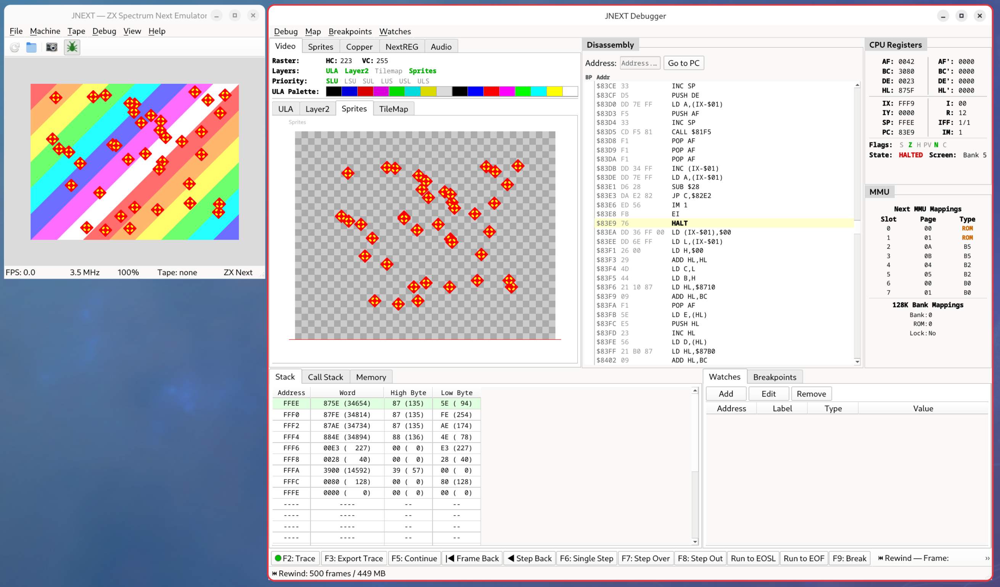

# JNEXT — ZX Spectrum Next Emulator

**A developer's emulator for the ZX Spectrum Next, derived directly from the official FPGA VHDL sources.**

JNEXT is a real-time software emulator of the ZX Spectrum Next computer, written in C++17. It uses the official ZX Next FPGA core VHDL sources as the authoritative hardware reference, translating gate-level behavior into accurate software emulation.

**Status:** Beta — actively developed. Issues and pull requests are welcome.



---

## About this project

JNEXT was fully developed by Claude (Anthropic's AI), with human guidance and supervision from Jorge Gonzalez Villalonga. The complete prompt history, design documents, daily task files, and development documentation are available in the repository. This makes JNEXT not just an emulator, but also a practical case study in developing a large, complex piece of software using AI-assisted programming.

---

## Emulated machines

| Machine                    | Description                               |
|----------------------------|-------------------------------------------|
| ZX Spectrum 48K            | Original rubber-key Spectrum              |
| ZX Spectrum 128K           | 128K with AY sound and memory paging      |
| ZX Spectrum +3             | Amstrad +3 with extended paging           |
| Pentagon 128               | Russian Pentagon clone                    |
| ZX Spectrum Next (Issue 2) | Full Next hardware with all extended features |

## Emulated hardware

- **Z80N CPU** — Standard Z80 plus all 26 Next extended instructions; 98.8% pass rate on FUSE opcode test suite
- **ULA** — Standard 48K, Timex hi-colour (8×1 attributes), Timex hi-res (512×192); per-scanline border, floating bus, memory contention
- **Layer 2** — 256×192, 320×256, and 640×256 @ 8-bit colour; hardware X/Y scroll
- **Hardware sprites** — 128 sprites, 16×16, 8-bit/4-bit colour, ×1/×2/×4/×8 scaling, composite anchoring
- **Tilemap** — 40×32 and 80×32 modes, 4bpp/1bpp patterns, hardware scroll
- **Copper co-processor** — WAIT/MOVE instruction set, per-scanline register writes
- **6-mode layer compositor** — SLU/LSU/SUL/LUS/USL/ULS priority order
- **8 palettes** — ULA/Layer2/Sprite/Tilemap × first/second; 9-bit RGB (512 colours)
- **AY-3-8910 × 3** — TurboSound with tone, noise, envelope, and stereo panning
- **DAC** — 4-channel 8-bit Soundrive/Specdrum/Covox
- **Beeper** — EAR/MIC with real-time audio output
- **DMA** — Z80-DMA compatible + ZXN burst mode
- **DivMMC** — 8KB SRAM, automap, SD card image mounting
- **UART** — Dual-channel with 512/64-byte FIFOs
- **CTC** — 4-channel counter/timer with daisy-chain
- **SPI / I2C / RTC** — SPI master, bit-bang I2C, DS1307 RTC via host clock
- **IM1/IM2** — All 14 Next interrupt levels
- **Kempston and Sinclair joystick** emulation
- **Keyboard** with compound key mapping (arrows, delete, etc.)

---

## Features

### Qt6 GUI

- File loading — NEX, SNA, SZX, TAP, TZX, WAV via File menu or toolbar
- Machine type selection — 48K, 128K, +3, Pentagon, Next
- CPU speed control — 0.5×, 1×, 2×, 4×, or custom percentage
- Tape controls — Open, eject, rewind; fast load or real-time playback
- SD card mounting — Mount `.img` disk images for DivMMC
- PNG screenshot — File > Save Screenshot or Ctrl+S
- Video recording — Record to MP4 via FFmpeg (File > Start/Stop Recording)
- RZX playback and recording — File menu
- CRT scanline filter — View menu toggle
- Fullscreen — True fullscreen with letterbox aspect ratio (F11)
- Scalable display — 2×, 3×, 4× integer scaling, Hi-DPI pixel-perfect rendering
- Status bar — FPS, CPU speed, machine type, tape status, rewind state

### Debugger

The integrated debugger opens in a separate window and provides full introspection into the running emulator:

- **CPU registers** — All Z80/Z80N registers, flags (S/Z/H/P/V/N/C), halt, interrupt mode, ULA active screen
- **MMU panel** — Next 8-slot MMU table with page numbers and type; 128K bank mappings
- **Disassembly** — Scrollable Z80+Z80N disassembly, PC highlighting, breakpoint gutter, follow-PC mode, run-to-cursor, symbol names from MAP files
- **Memory hex editor** — Full 64K view, hex+ASCII, inline editing, page/bank selector
- **Stack panel** — SP-relative word view, SP row highlighted
- **Call stack** — CALL/RST/INT/RET tracking with symbol resolution
- **Breakpoints** — Execution, read, write, and I/O watchpoints; unified panel view
- **Watch expressions** — Byte, word, or long at arbitrary addresses with custom labels
- **Video subpanels** — ULA (primary+shadow), Layer 2 (active+shadow), Sprites, Tilemap; per-scanline view up to current raster position; checkerboard for transparent pixels
- **Sprite viewer** — All 128 hardware sprites with full attribute table
- **Copper disassembly** — Decoded WAIT/MOVE instructions with current PC indicator
- **NextREG panel** — All 256 registers with names, hex values, editable inline
- **Audio panel** — AY register state for all 3 TurboSound chips, per-source mute controls
- **Trace log** — Circular instruction trace buffer, export to file
- **Symbol table** — Load Z88DK MAP files; symbols shown inline in disassembly and watches
- **Backwards execution (rewind)** — Frame snapshot ring buffer; Step Back, Frame Back, rewind slider; configurable buffer size

Debugger keyboard shortcuts:

| Key        | Action           |
|------------|------------------|
| F5         | Run / Continue   |
| F6         | Step Into        |
| F7         | Step Over        |
| F8         | Step Out         |
| F9         | Pause / Break    |
| Shift+F6   | Frame Back       |
| Shift+F7   | Step Back        |

### Magic breakpoint and magic port

- **Magic breakpoint** — `ED FF` (ZEsarUX) or `DD 01` (CSpect) opcodes trigger debugger pause when enabled; act as NOP otherwise. Enable via `--magic-breakpoint` or Debug menu.
- **Magic debug port** — Writes to a configurable port are logged to stderr in hex, decimal, ASCII, or line-buffered mode. Enable via `--magic-port PORT --magic-port-mode MODE`.

### Command-line interface

```
./build/gui-release/jnext [options]
```

| Option                        | Description                                                          |
|-------------------------------|----------------------------------------------------------------------|
| `--machine-type TYPE`         | `48k`, `128k`, `plus3`, `pentagon`, `next` (default)                 |
| `--load FILE`                 | Load NEX, SNA, SZX, TAP, TZX, or WAV (auto-detected by extension)   |
| `--roms-directory DIR`        | ROM directory (default: `/usr/share/fuse`)                           |
| `--speed PERCENT`             | Emulator speed: 50=half, 100=normal, 200=2×, 400=4×                 |
| `--headless`                  | Run without display or audio, at maximum speed                       |
| `--tape-realtime`             | Real-time tape loading instead of fast load                          |
| `--sd-card FILE`              | Mount an SD card image (.img)                                        |
| `--record FILE`               | Record video+audio to MP4 via FFmpeg                                 |
| `--rzx-play FILE`             | Play back an RZX recording                                           |
| `--rzx-record FILE`           | Record to RZX                                                        |
| `--rewind-buffer-size N`      | Enable backwards execution with N-frame ring buffer                  |
| `--magic-breakpoint`          | Enable magic breakpoint opcodes (ED FF / DD 01)                      |
| `--magic-port PORT`           | Enable magic debug port at PORT                                      |
| `--magic-port-mode MODE`      | Magic port output mode: `hex`, `dec`, `ascii`, `line`                |
| `--delayed-screenshot FILE`   | Save a PNG screenshot after a delay                                  |
| `--delayed-screenshot-time N` | Delay in seconds before screenshot (default: 10)                     |
| `--delayed-automatic-exit N`  | Exit after N seconds                                                 |
| `--log-level SPEC`            | Per-subsystem log levels, e.g. `cpu=trace,video=warn`                |
| `--version`                   | Print version and exit                                               |

---

## Building

### Requirements (Linux)

**Fedora / RHEL:**
```sh
sudo dnf install SDL2-devel cmake gcc-c++ qt6-qtbase-devel libpng-devel zlib-devel
```

**Debian / Ubuntu:**
```sh
sudo apt install libsdl2-dev cmake g++ qt6-base-dev libpng-dev zlib1g-dev
```

_Windows and macOS builds are pending._

### Build steps

```sh
git clone --recursive https://github.com/jorgegv/jnext.git
cd jnext

# Full Qt6 GUI build (recommended)
make gui-release

# SDL-only build (no GUI, no debugger)
make release
```

Executables are placed in `build/gui-release/jnext` and `build/release/jnext` respectively.

### Available make targets

| Target             | Description                                      |
|--------------------|--------------------------------------------------|
| `make gui-release` | Build Qt6 GUI release (optimised)                |
| `make gui-debug`   | Build Qt6 GUI debug (sanitisers + debug symbols) |
| `make release`     | Build SDL-only release                           |
| `make debug`       | Build SDL-only debug                             |
| `make gui-clean`   | Remove GUI build directories                     |
| `make clean`       | Remove all build directories                     |
| `make regression`  | Run the full automated regression test suite     |
| `make version`     | Show current version                             |
| `make bump`        | Bump minor version, commit, and tag              |
| `make bump-patch`  | Bump patch version, commit, and tag              |
| `make bump-major`  | Bump major version, commit, and tag              |

### ROM files

JNEXT does not ship ROM files. By default it loads them from `/usr/share/fuse/` (installed by the FUSE emulator package):

| Machine  | ROM files                           |
|----------|-------------------------------------|
| 48K      | `48.rom`                            |
| 128K     | `128-0.rom`, `128-1.rom`            |
| +3       | `plus3-0.rom` through `plus3-3.rom` |
| Pentagon | `128p-0.rom`, `128p-1.rom`          |

Override the ROM directory with `--roms-directory DIR`.

---

## Quick start

```sh
# Run with the default ZX Next machine type
./build/gui-release/jnext

# Run as ZX Spectrum 48K
./build/gui-release/jnext --machine-type 48k

# Load and run a NEX file
./build/gui-release/jnext --load game.nex

# Load a TAP file (will auto-type LOAD "")
./build/gui-release/jnext --load game.tap

# Load a snapshot
./build/gui-release/jnext --load game.sna

# Run at double speed
./build/gui-release/jnext --speed 200

# Enable backwards execution with a 60-frame buffer
./build/gui-release/jnext --rewind-buffer-size 60

# Headless screenshot for CI testing
./build/gui-release/jnext --headless --machine-type 48k \
    --delayed-screenshot /tmp/test.png \
    --delayed-screenshot-time 3 --delayed-automatic-exit 5
```

### Keyboard mapping

| PC Key            | Spectrum key            |
|-------------------|-------------------------|
| Letter/number keys | Corresponding key      |
| Left Ctrl         | Caps Shift              |
| Left/Right Shift  | Symbol Shift            |
| Backspace         | Delete (Caps Shift + 0) |
| Arrow keys        | Cursor keys (5/6/7/8)   |
| Enter             | Enter                   |

---

## Automated testing

A full regression test suite runs the FUSE Z80 opcode tests (1340/1356 pass, 98.8%) and screenshot comparison tests in headless mode:

```sh
make regression
```

---

## Libraries and third-party software

| Library                                    | License | Description                                                              |
|--------------------------------------------|---------|--------------------------------------------------------------------------|
| [SDL2](https://www.libsdl.org/)            | zlib    | Cross-platform multimedia library (audio + input)                        |
| [Qt6](https://www.qt.io/)                  | LGPLv3  | GUI framework                                                            |
| [spdlog](https://github.com/gabime/spdlog) | MIT     | Fast C++ logging library (vendored as git submodule)                     |
| FUSE Z80 core                              | GPLv2   | Z80 CPU core adapted from the [FUSE](http://fuse-emulator.sourceforge.net/) emulator |
| [ZOT](https://github.com/antirez/zot)      | MIT     | TZX/TAP tape player library by antirez (vendored in `third_party/zot/`)  |

---

## References and acknowledgments

- **ZX Spectrum Next FPGA core** — The official VHDL sources serve as the authoritative hardware specification for this emulator.
- **[FUSE](http://fuse-emulator.sourceforge.net/)** — The Z80 CPU core is adapted from FUSE. ROM files are loaded from the FUSE package installation.
- **[ZesarUX](https://github.com/chernandezba/zesarux)** — Used as a behavioural reference during development.

---

## License

Copyright (C) 2026 Jorge Gonzalez Villalonga

JNEXT is free software: you can redistribute it and/or modify it under the terms of the **GNU General Public License** as published by the Free Software Foundation, either version 3 of the License, or (at your option) any later version.

JNEXT is distributed in the hope that it will be useful, but WITHOUT ANY WARRANTY; without even the implied warranty of MERCHANTABILITY or FITNESS FOR A PARTICULAR PURPOSE. See the [LICENSE](LICENSE) file for the full license text.
