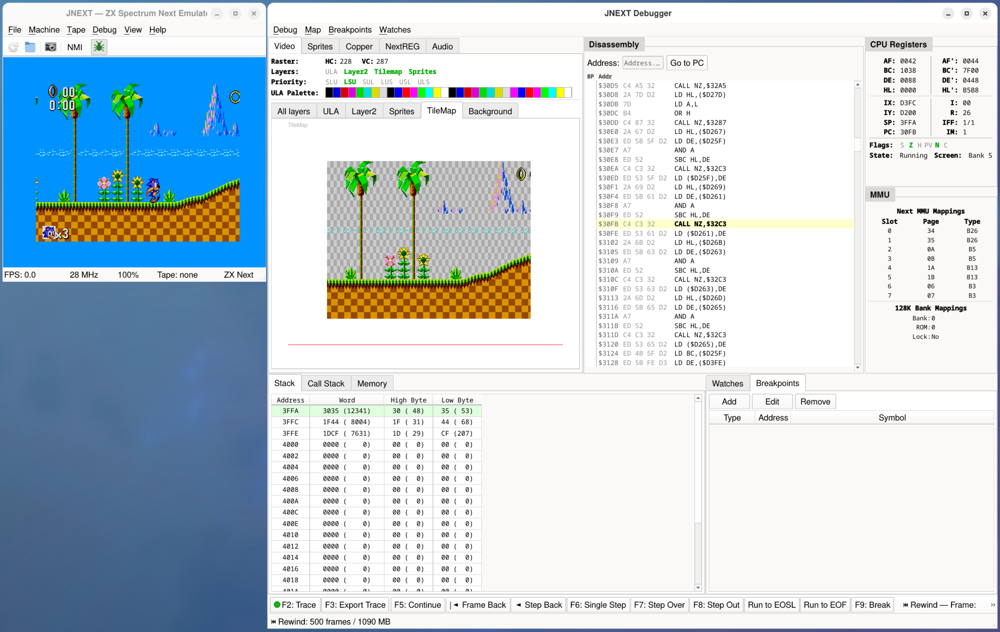
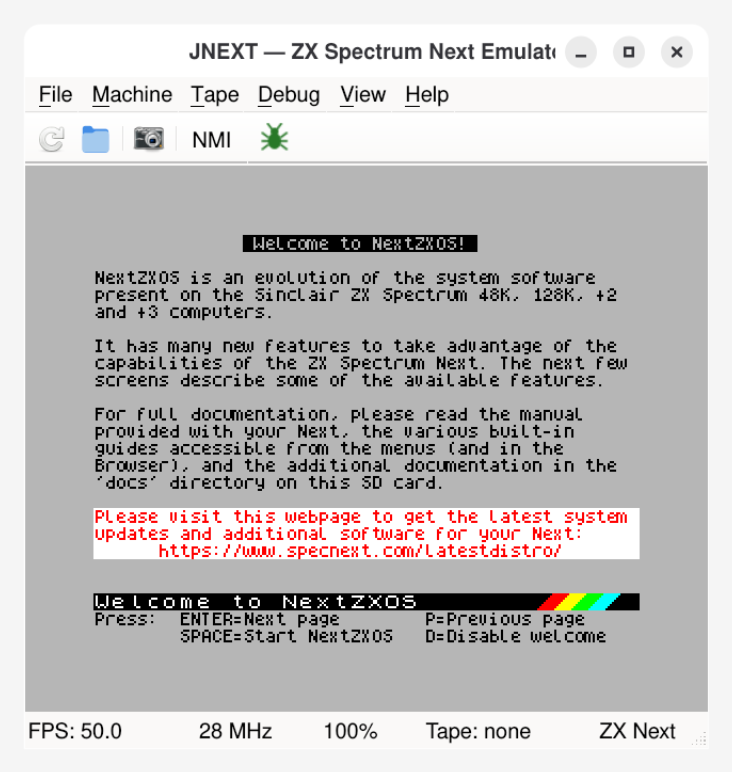

# JNEXT — a ZX Spectrum Next emulator for developers

<p align="left">
  <a href="https://github.com/jorgegv/jnext/actions/workflows/ci.yml">
    
  </a>
  <a href="https://github.com/jorgegv/jnext/releases/latest">
    
  </a>
  <a href="LICENSE">
    
  </a>
  
  
</p>

**JNEXT is a real-time ZX Spectrum Next emulator, built for
the people who write Next software.**

A comfortable machine to develop on: a debugger that shows you everything
the hardware is doing — every layer, every sprite, every register, and the
ability to step *backwards* — plus a headless mode that puts your program
under CI.

<p align="center">
  <a href="doc/SCREENSHOT.png">
    
  </a>
  <a href="doc/JNEXT-NEXTZXOS-BOOT.png">
    
  </a>
</p>
<p align="center"><sub>Click either image for full size.</sub></p>

## Why this one

- **A debugger that sees the whole machine.** Z80/Z80N disassembly, memory,
  the 8-slot MMU, all 256 NextREGs, 128 sprites, the Copper, the tilemap, the
  layer compositor, the AY chips — plus **backwards execution**: step back,
  frame back, scrub a rewind slider.
- **Every layer, on its own.** See the ULA, Layer 2, sprites and the tilemap
  rendered separately, next to the composite the hardware would show you
- **Headless and scriptable.** Deterministic PNG screenshots (frame-accurate,
  per-layer, with a pinnable RTC), keypress injection, a T-state profiler, RZX
  and MP4 recording: enough to put a Next program under CI.
- **It boots the real thing.** NextZXOS cold-boots through the authentic chain
  (FPGA boot ROM → TBBLUE.FW → NextZXOS) off an SD-card image, like real
  hardware — all machine and peripheral ROMs come from the SD card, not from
  the emulator.
- **The VHDL is the specification.** Where the hardware's behaviour is
  ambiguous, it is resolved against the official FPGA core sources and pinned
  there by a unit test — so the emulator's answer is the silicon's answer.

## What it emulates

- **Machines** — 48K, 128K, +3 and ZX Spectrum Next (Issue 2)
- **CPU** — Z80N, with IM1/IM2 interrupts
- **Video** — ULA (48K + Timex modes), Layer 2, 128 hardware sprites, tilemap,
  Copper, and the layer compositor
- **Audio** — 3 × AY-3-8910 (TurboSound), DAC, beeper
- **Storage and peripherals** — DivMMC, Multiface, DMA, UART, CTC,
  SPI / I²C / RTC, keyboard and USB gamepads
- **Formats** — NEX, SNA, SZX, TAP, TZX, WAV, RZX

**Status: Beta** — Extreme cycle-exactness is explicitly
*not* a goal; "good enough to develop games on" is. Some things are still
rough or missing; they are listed, not hidden:

- [GitHub issues](https://github.com/jorgegv/jnext/issues) — known issues and pending features
- [KNOWN-FUNCTIONALITY-GAPS-AND-PLAN.md](doc/issues/KNOWN-FUNCTIONALITY-GAPS-AND-PLAN.md)
  — historical 2026-04 gap audit (frozen 2026-07-24; anything pending lives in GitHub issues)
- [SUBSYSTEM-TESTS-STATUS.md](test/SUBSYSTEM-TESTS-STATUS.md) — live
  per-subsystem unit-test dashboard: exactly what is verified against the VHDL

Linux, Windows (x64), and macOS are supported.

## Install

**Installing a package is the recommended way to get JNEXT.** Download the one
for your system from the
[latest release](https://github.com/jorgegv/jnext/releases/latest):

| System                   | Install                                                                |
|--------------------------|------------------------------------------------------------------------|
| **Fedora / RHEL**        | `sudo dnf install ./jnext-*.x86_64.rpm`                                |
| **Ubuntu 24.04**         | `sudo apt install ./jnext_*_ubuntu24.04_amd64.deb`                     |
| **Ubuntu 26.04**         | `sudo apt install ./jnext_*_ubuntu26.04_amd64.deb`                     |
| **Flatpak (any distro)** | `flatpak install ./jnext-*-x86_64.flatpak`                             |
| **Windows (x64)**        | Download `jnext-*-windows-x64.zip`, unzip, run `jnext.exe`             |
| **macOS**                | Download `jnext-*-Darwin.dmg`, open it, drag **jnext** to Applications |

The Linux packages put a `jnext` command on your `PATH`.

> **Note (Flatpak only):** the Flatpak build ships without LTO — its runtime's
> compiler miscompiles the GUI startup under LTO. This only reduces top turbo-speed
> throughput; normal (100 %) speed is unaffected. For maximum turbo performance use
> the native RPM/DEB packages, which keep LTO.

The **Windows** build is a self-contained, portable zip — no installer, with
all the Qt and SDL runtime DLLs bundled. Unzip it anywhere and run `jnext.exe`;
delete the folder to uninstall. The executable is **deliberately not
code-signed** — an Authenticode certificate is a recurring annual cost — so on
first launch Windows SmartScreen warns about an unrecognized publisher. Click
**More info → Run anyway**; or clear the download's Mark of the Web first, by
right-clicking the downloaded zip and ticking **Properties → Unblock**. Details,
and what a signature would and would not prove:
**[user guide § Windows](doc/user-guide/02-installing/02-windows.html)**.

### Which Windows package?

All Windows packages are self-contained portable zips — no installer, no
redistributables, every runtime DLL bundled, and the SD-card image
self-provisioning built in. Pick by your Windows version:

| Package                       | What you get              | Runs on                  |
|-------------------------------|---------------------------|--------------------------|
| `jnext-*-windows-x64.zip`     | full GUI + debugger (Qt6) | Windows 10 1703 or later |
| `jnext-*-windows-x64-qt5.zip` | full GUI + debugger (Qt5) | Windows 7 SP1 or later   |
| 32-bit (i686) Qt5             | full GUI + debugger (Qt5) | Windows 7 SP1 or later — **planned, not yet published** |

Details and the audited compatibility floors:
[packaging/README.md](packaging/README.md) and
[doc/design/WINDOWS-COMPAT-PLAN.md](doc/design/WINDOWS-COMPAT-PLAN.md).

The **macOS** build is a `.dmg`; open it and drag **jnext** to Applications. The
app is ad-hoc signed but **deliberately not notarised** — notarisation requires
a paid Apple Developer Program membership — so Gatekeeper blocks the first
launch. Try to open it once, then allow it under **System Settings → Privacy &
Security → Open Anyway**; or clear the download flag with `xattr -dr
com.apple.quarantine /Applications/jnext.app`. The old Control-click → **Open**
bypass no longer covers this case on macOS 15 and later. Details, and how to
check the bundle is intact:
**[user guide § macOS](doc/user-guide/02-installing/03-macos.html)**.

Prefer to build it yourself? See **[BUILD.md](BUILD.md)** — it also covers
building the packages above (`make package-rpm` / `package-deb` /
`package-flatpak` / `package-win` / `package-macos`).

## Run

```sh
# First launch boots NextZXOS; jnext offers to download an SD-card image
jnext

# Run a program — a bare filename is all it takes
jnext game.tap
```

Everything you can do with it — every CLI option, the GUI, the debugger, the
SD card and ROMs — is in **[USAGE.md](USAGE.md)**, or in `man jnext` once
installed from a package: both are generated from the same source, so they
never disagree.

## Documentation

**The user guide is the place to start.** It ships rendered in this repository,
so there is nothing to install and nothing to build — serve it and read it:

```sh
make read-userguide
```

That prints a `http://localhost:8000/` URL; open it in your browser. (Or open
`doc/user-guide/index.html` directly.) Chapters 1-5 cover running programs;
6 and 7 are for developers — every debugger panel and function, and how to
automate JNEXT the way its own test suite does.

| Document                                                       | What's in it                                                                             |
|----------------------------------------------------------------|------------------------------------------------------------------------------------------|
| [User guide](doc/user-guide/index.html)                        | Task-oriented manual: installing, running programs, the debugger, automation (`make read-userguide`) |
| [BUILD.md](BUILD.md)                                           | Building from source and building packages: prerequisites, targets, CMake options, tests |
| [USAGE.md](USAGE.md)                                           | Every CLI option, SD card and ROMs, the GUI, the debugger, keyboard map (= `man jnext`)  |
| [FEATURES.md](FEATURES.md)                                     | Full feature list                                                                        |
| [TODO.md](TODO.md)                                             | Pointer to GitHub issues, where pending features and known issues live                   |
| [ChangeLog](ChangeLog)                                         | What changed in each release                                                             |
| [CREDITS.md](CREDITS.md)                                       | Third-party libraries, references and acknowledgments                                    |
| [EMULATOR-DESIGN-PLAN.md](doc/design/EMULATOR-DESIGN-PLAN.md)  | The development plan: real status, implemented features, roadmap                         |
| [CURRENT-REGRESSION-STATE.md](doc/CURRENT-REGRESSION-STATE.md) | Current state of the screenshot regression suite                                         |

## Contributing

Contributions are welcome — shared effort is how software gets better, and every
good fix or feature makes the program better for everyone who uses it.

Bug reports, feature requests and pull requests are all appreciated. Pull
requests are reviewed strictly against a fixed protocol — a PR that does not
comply is not merged. In short, every PR must:

- ship **discriminative tests** for its change (they fail without the change and
  pass with it);
- **not modify existing tests** (without owner approval);
- use only **license-clean fixtures**;
- match the project's **code style**;
- **not add dependencies** (without owner approval).

A **bugfix** PR also needs a full bug description (or a linked bug issue); a
**feature** PR also needs an explicit use case and a design document under
`doc/`.

Full rules: **[PULL-REQUEST-PROTOCOL.md](doc/PULL-REQUEST-PROTOCOL.md)**.

## About this project

JNEXT is being fully developed using Claude (Anthropic's AI), with human guidance
and supervision. The complete prompt history, design documents, daily task
files and development documentation are in the repository — which makes JNEXT
not just an emulator, but a practical case study in building a large, complex
piece of software with AI-assisted programming.

## License

Copyright (C) 2026 Jorge Gonzalez Villalonga, aka ZXjogv

JNEXT is free software: you can redistribute it and/or modify it under the
terms of the **GNU General Public License** as published by the Free Software
Foundation, either version 3 of the License, or (at your option) any later
version.

JNEXT is distributed in the hope that it will be useful, but WITHOUT ANY
WARRANTY; without even the implied warranty of MERCHANTABILITY or FITNESS FOR
A PARTICULAR PURPOSE. See the [LICENSE](LICENSE) file for the full license
text.
