# Current Regression State

Visual reference for every screenshot regression test in `test/00regression/`. Each entry shows the canonical reference screenshot the test runs are compared against. The full test suite is defined in [test/00regression/regression_tests.conf](../test/00regression/regression_tests.conf) and run by [test/00regression/regression.sh](../test/00regression/regression.sh); see [doc/testing/REGRESSION-TEST-SUITE.md](testing/REGRESSION-TEST-SUITE.md) for execution details.

**33 screenshot tests** + `rewind-func` functional test + `fuse_z80_test` (1356 opcode cases) + `z80n_test`. To regenerate references after intentional rendering changes: `bash test/00regression/generate-references.sh [test_name…]`.

---

## Boot-screen tests

### `boot-48k`
48K Spectrum power-on screen — `© 1982 Sinclair Research Ltd` banner.

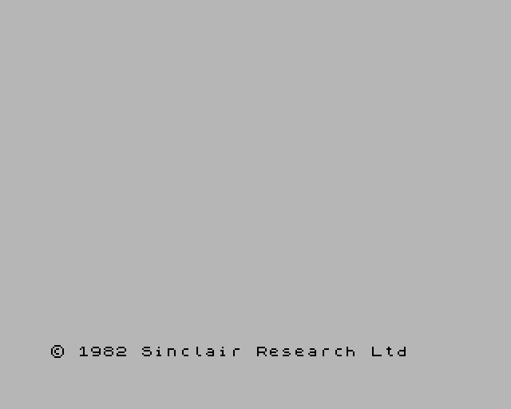

### `boot-128k`
128K Spectrum boot menu — Tape Loader / 128 BASIC / Calculator / 48 BASIC / Tape Tester.

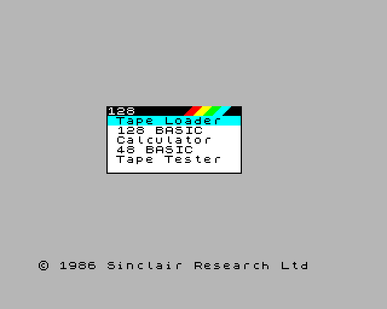

### `boot-plus3`
+3 Spectrum boot screen — `+3 BASIC / Loader / Calculator / 48 BASIC` menu.

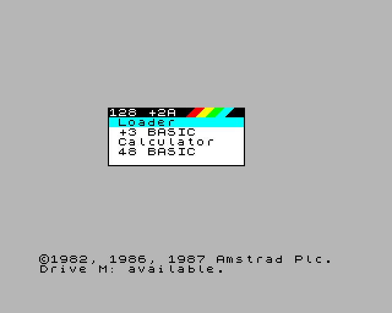

---

## ULA / palette / video-feature demos

### `palette-demo`
ULANext 256-colour palette demo (8 banks × 32 colours).

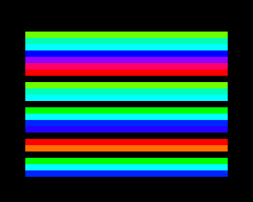

### `copper-demo`
Copper per-scanline colour-modulation demo (timing-sensitive).

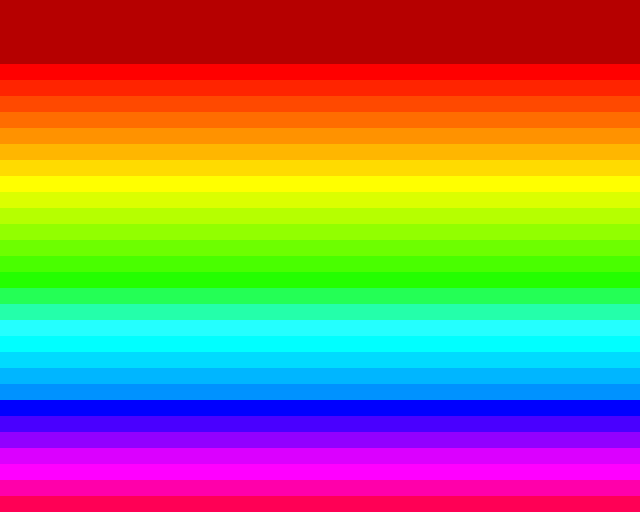

### `floating-bus`
48K floating-bus pattern test (port reads while ULA is fetching).

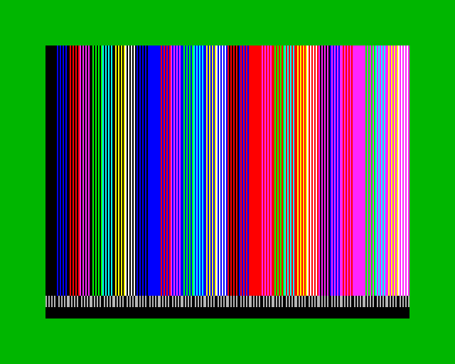

### `tilemap-demo`
Next tilemap layer display demo.

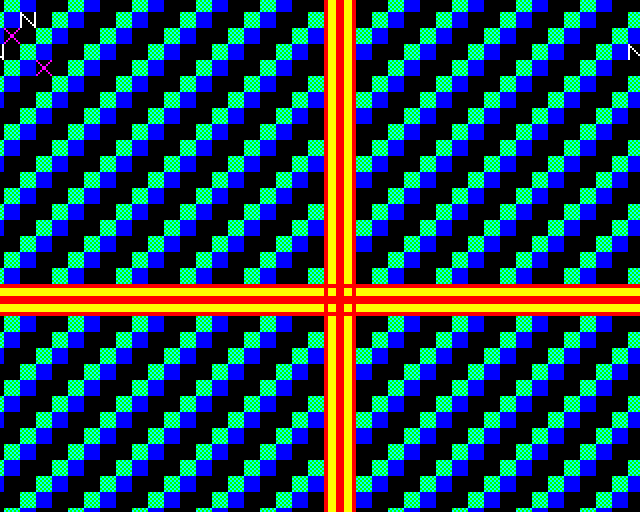

### `contention-test`
48K memory-contention timing test (cycles-vs-T-states observable).

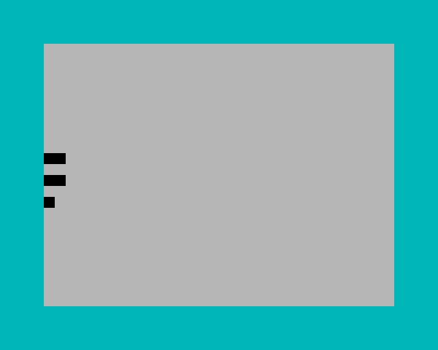

---

## Layer 2

### `layer2-320x256`
Layer 2 mid-resolution (320×256) bitmap mode.

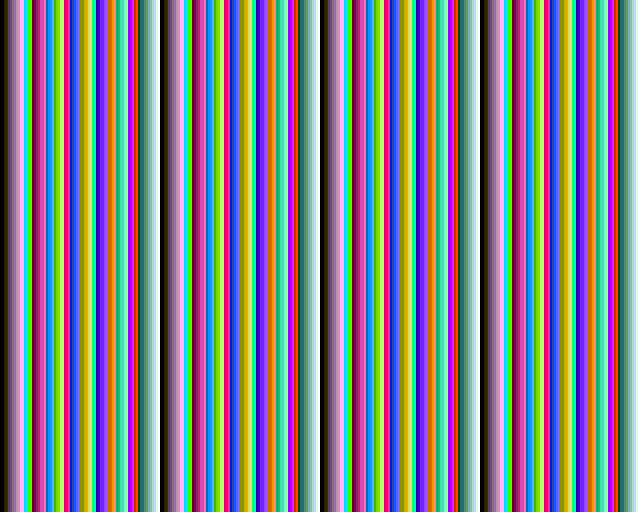

### `layer2-640x256`
Layer 2 hi-resolution (640×256) bitmap mode (HI_RES byte-interleaved).


---

## Hardware sprites

### `sprite-scaling`
Hardware sprite 1×/2×/4× horizontal+vertical scaling.

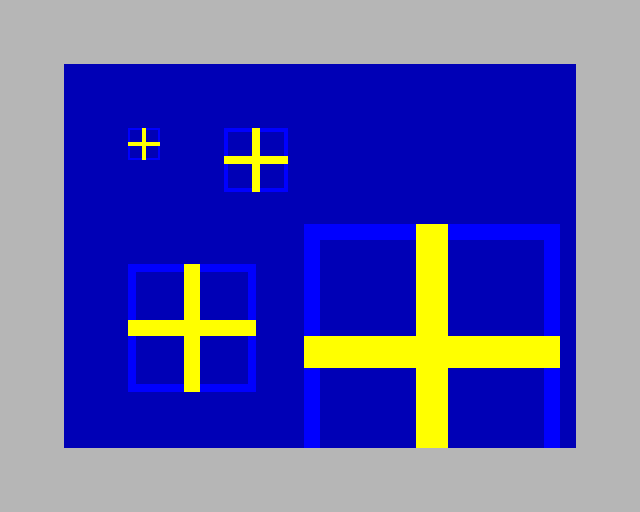

### `sprite-anchor`
Sprite anchor + relative-positioning chains.

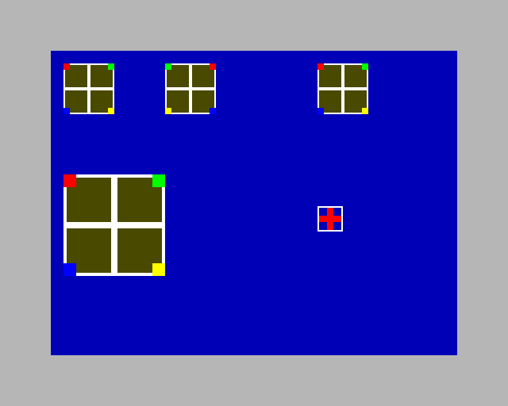

---

## Per-scanline / animation end-to-end demos

### `beast-demo`
"Beast" demo (steady-state animation past init phase, ~2 s in).

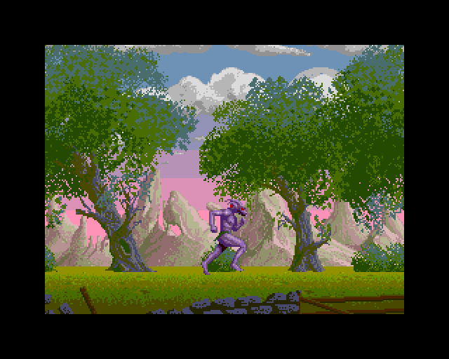

### `parallax-demo`
Parallax scrolling demo (steady-state animation).

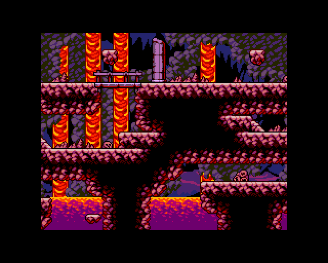

---

## Tape loading

### `tap-demo`
TAP loader exercise — 48K BASIC auto-load + beeper-driven demo.


---

## Magic features (Multiface-style instrumentation)

### `magic-bp-demo`
Magic-breakpoint feature: visual trigger when an MMU page hit fires.

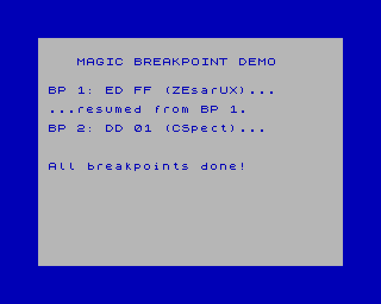

### `magic-port-demo`
Magic-port feature: visual trigger when a watched I/O port is read/written.

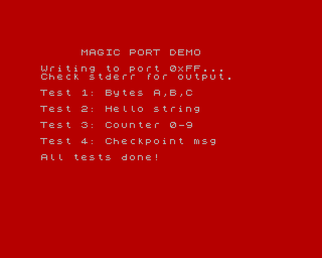

---

## David Crespo's nexlib regression suite (`dapr-*`)

Pre-built NEX files exercising the public Next library APIs.

### `dapr-l2empty`
nexlib test01 — empty Layer 2 surface (cleared bitmap).


### `dapr-layer2`
nexlib test02 — Layer 2 surface with content.


### `dapr-sprite`
nexlib test03 — hardware sprites placement.

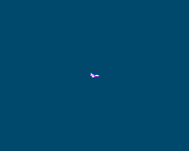

### `dapr-tilemap_00`
nexlib test04 — tilemap mode 0 (40 × 32, 8×8 tiles).

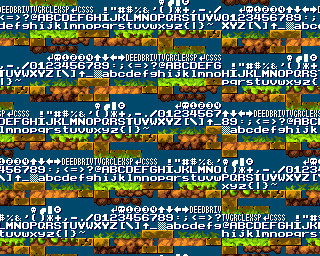

### `dapr-tilemap_01`
nexlib test04 — tilemap mode 1 (variant 1).

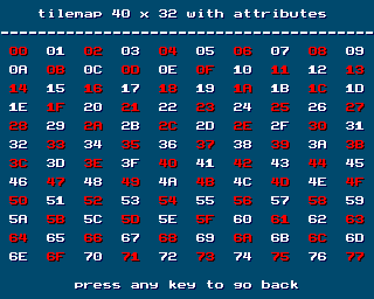

### `dapr-tilemap_02`
nexlib test04 — tilemap mode 2 (variant 2).

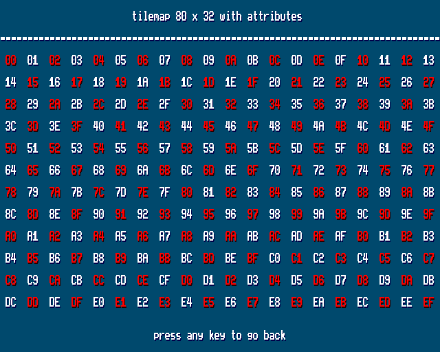

### `dapr-print`
nexlib test05 — text print routine output.

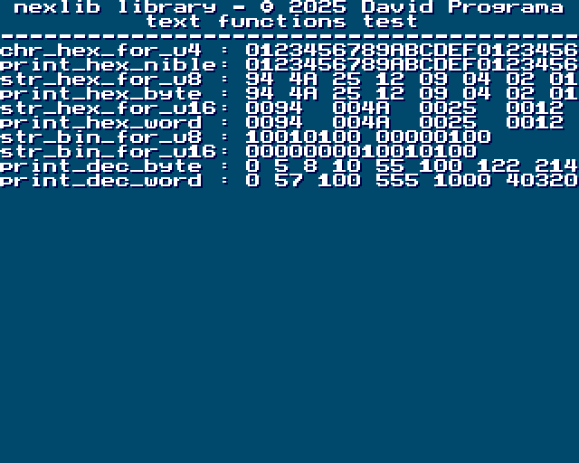

### `dapr-tilemapper_00`
nexlib test10 — tilemapper editor mode 0.

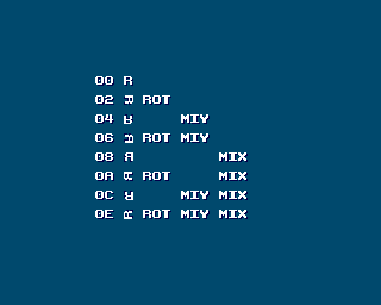

### `dapr-tilemapper_01`
nexlib test10 — tilemapper editor mode 1.

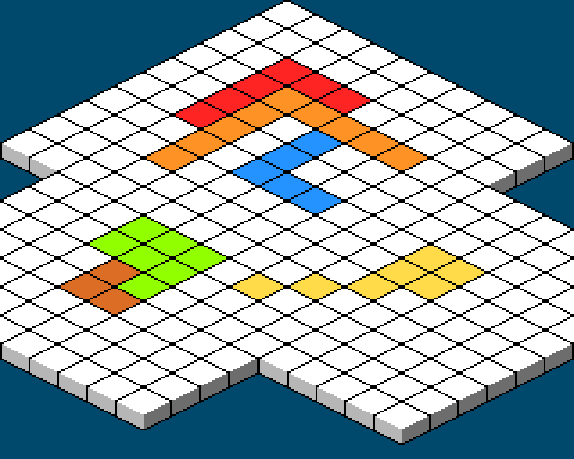

---

## Game smoke tests

Synthetic keypresses drive each game past its splash/menu screens so the screenshot captures a meaningful post-intro frame. Catch end-to-end regressions of the full Z80 + memory + video pipeline against real-world ZX Spectrum Next titles. Games marked with `--esxdos-stub` are pristine NEX builds that depend on esxdos (RST $08) for save-game I/O — the shim returns benign errors so boot proceeds without the NextZXOS firmware that `--load` bypasses.

### `celeste`
Celeste Classic — original NEX with `--esxdos-stub`. Synthetic `Z` keypress at frame 100 starts the game; captures the first playable scene.

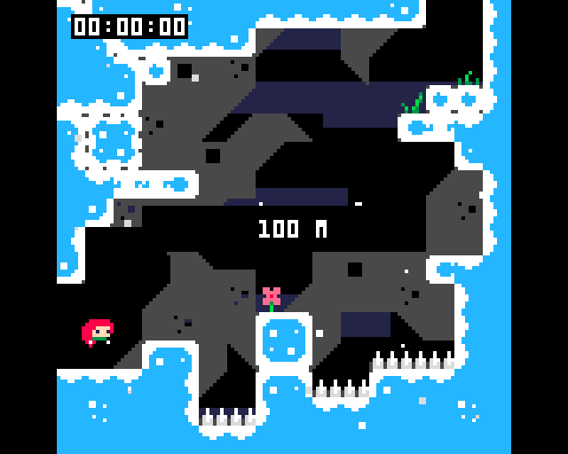

### `celeste2`
Celeste Classic — second build of the same engine, original NEX with `--esxdos-stub`. Same params as `celeste` (Z keypress at frame 100, screenshot at frame 150); the level layout differs from celeste1 so this is a separate end-to-end coverage point.

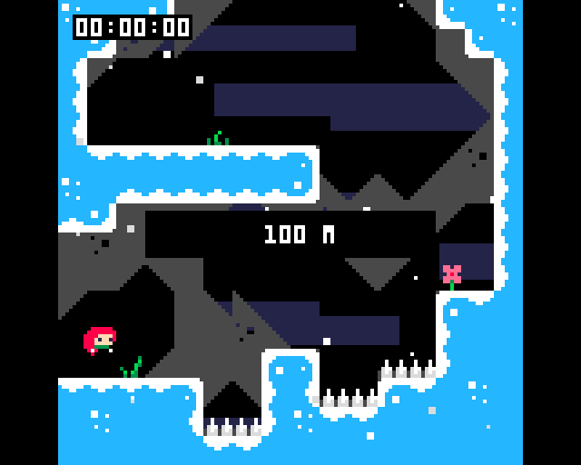

### `beanbros`
Bean Bros — original NEX with `--esxdos-stub` (defensive; the game makes no esxdos calls). Three `ENTER` keypresses (frames 50/100/150) drive past the menu/intro; captures the first level intro frame.

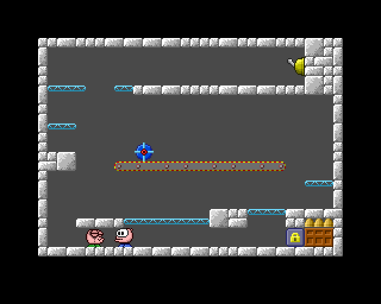

### `shift`
Shift — two `SPACE` keypresses (frames 50/100) skip the intro; captures the Test 01 prompt.

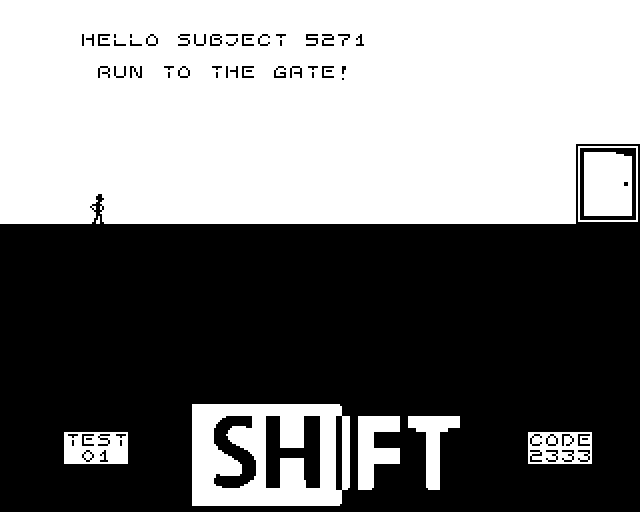

### `trainyard`
Trainyard Express — original NEX with `--esxdos-stub`. Boots through the splash and player-data init to the "Welcome to Trainyard Express!" instructions screen at frame 400, with the in-game Kempston-mouse cursor rendered (and the host cursor blanked over the viewport per the GUI policy).

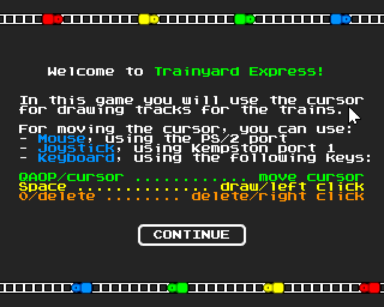

### `santaspressie`
Santa's Pressie — NEX extracted from `/games/Next/Santa's Pressie/` on the NextZXOS SD image. Wait 250 frames through the developer splash, send synthetic ENTER, screenshot at frame 280 captures the "GET READY!" first-level prompt with full HUD (presents-delivered counter, mountain backdrop, houses, gift sprites).

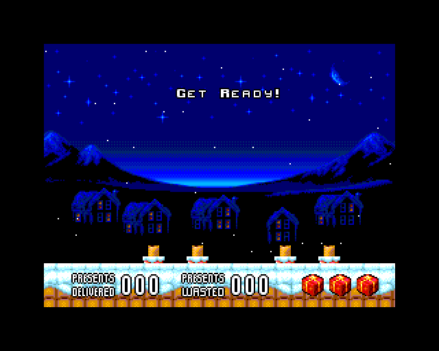

### `odemo`
odemo — five `SPACE` keypresses (frames 50/250/350/450/550) drive past five intro screens; captures the in-game castle level at frame 700. **Functional regression for the Layer 2 320×256 bank-stride +16 fix** (NR $12 = 14 exercises sub_banks 2-4, which would render as animated noise if the `compute_ram_addr` shift is broken).

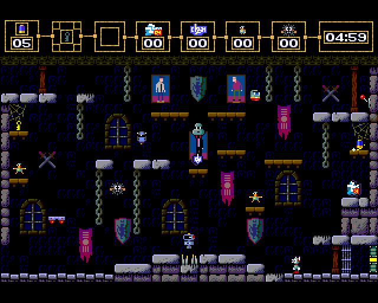

---

## Non-screenshot tests bundled into `regression.sh`

### `rewind-func`
Functional rewind-buffer test (no screenshot — `build/test/rewind_test` binary). Verifies frame-snapshot capture + restore round-trip.

### `fuse_z80_test`
1356 Z80 opcode test cases from the FUSE emulator suite — register / flag / timing exhaustive coverage. Currently 1356/1356 PASS.

### `z80n_test`
Z80N (Spectrum Next-extended) opcode test suite.

---

## Updating references

After an intentional rendering change, regenerate the affected reference(s):

```bash
# Single test
bash test/00regression/generate-references.sh layer2-640x256

# Multiple tests
bash test/00regression/generate-references.sh palette-demo copper-demo

# Full suite (use sparingly; review every diff before committing)
bash test/00regression/generate-references.sh
```

Then commit the regenerated `*-reference.png` files alongside the source change that motivated them, with a clear "regenerate refs after X" line in the commit message.
