# Current Regression State

Visual reference for every screenshot regression test in `test/00regression/`. Each entry shows the canonical reference screenshot the test runs are compared against. The full test suite is defined in [test/00regression/regression_tests.conf](../test/00regression/regression_tests.conf) and run by [test/00regression/regression.sh](../test/00regression/regression.sh); see [doc/testing/REGRESSION-TEST-SUITE.md](testing/REGRESSION-TEST-SUITE.md) for execution details.

**64 screenshot tests** + `rewind-func` functional test + `fuse_z80_test` (1356 opcode cases) + `z80n_test`. To regenerate references after intentional rendering changes: `bash test/00regression/generate-references.sh [test_name…]`.

This document is checked against the conf by `make regression-doc-check`, which
is a prerequisite of `make regression`: a conf row with no entry here, an entry
here with no conf row, or a screenshot count that disagrees is a hard failure
(GH #159). Adding a screenshot test means adding its entry here in the same
change.

---

## NextZXOS native boot

### `boot-nextzxos-splash`
Mid-boot TBBlue splash with the firmware ROM-loading log.

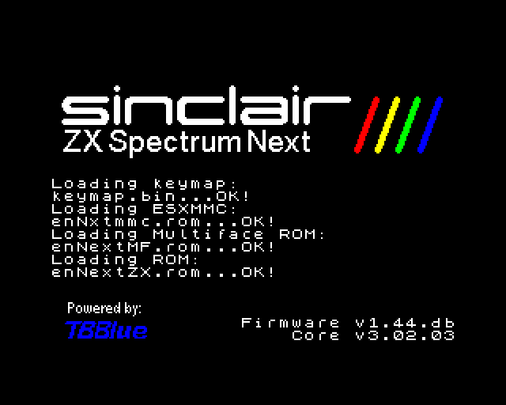

### `boot-nextzxos-welcome`
NextZXOS welcome screen after a full native boot from the canonical SD image.


### `boot-nextzxos-menu`
NextZXOS main menu after SPACE skips the welcome tour.

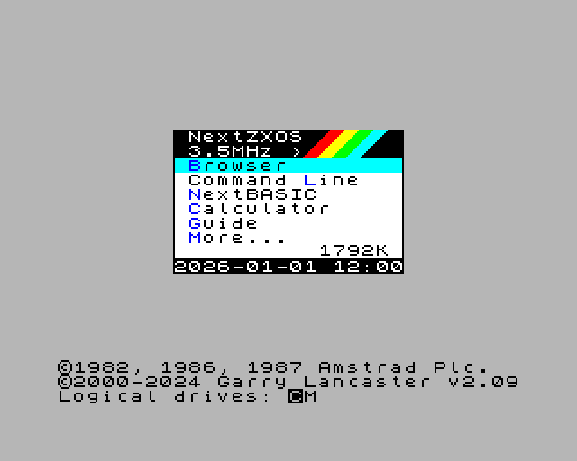

### `boot-nextzxos-dotls`
`.ls` dot command run from the NextZXOS Browser command line — the SD card root listing (17 entries, `TBBLUE.FW`, `TBBLUE.TBU`, the `MACHINES`/`NEXTZXOS`/`DOT` directories). Exercises the DivMMC + esxDOS file API end to end against the pristine provisioned image.

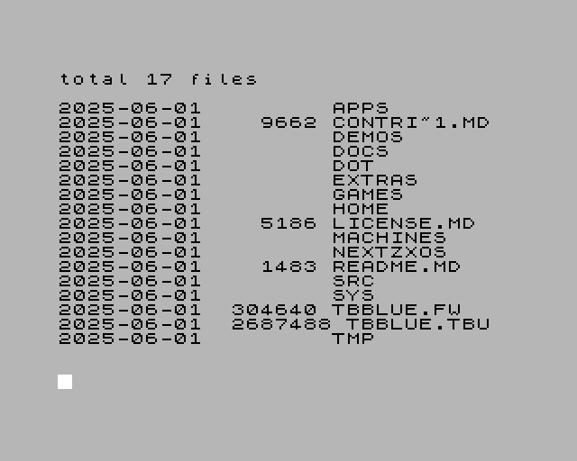

### `boot-nextzxos-cpm`
CP/M started from the NextZXOS menu — the `.COM` import log (31 files imported, ending on `Press SPACE to exit to NextZXOS`). Runs against a private copy of the SD image (`@private-sd`), because CP/M start-up writes to it.

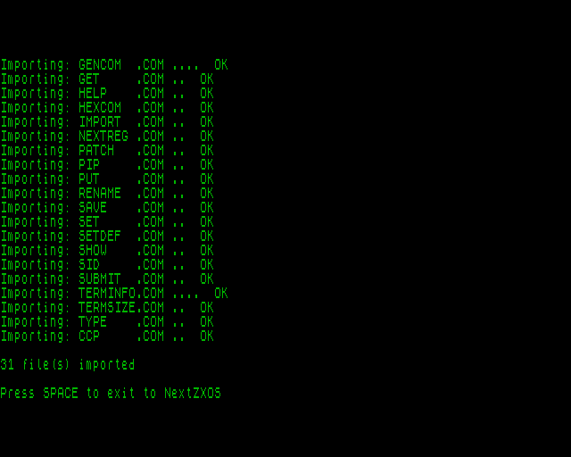

---

## Boot-screen tests

### `boot-48k`
48K Spectrum power-on screen — `© 1982 Sinclair Research Ltd` banner.


### `boot-128k`
128K Spectrum boot menu — Tape Loader / 128 BASIC / Calculator / 48 BASIC / Tape Tester.


### `boot-plus3`
+3 Spectrum boot screen — `+3 BASIC / Loader / Calculator / 48 BASIC` menu.


---

## ULA / palette / video-feature demos

### `palette-demo`
ULANext 256-colour palette demo (8 banks × 32 colours).


### `copper-demo`
Copper per-scanline colour-modulation demo (timing-sensitive).


### `show512`
All 512 ZX Next colours at once, as 8×8 squares in a Layer 2 field between a
magenta text header and a magenta footer ("Ordered by sum of channel values").
The Copper flips the Layer 2 palette select halfway down the field, so the top
and bottom halves draw from different 256-colour banks. Guards GH #181: the
`WAIT(line=95, h=52)` boundary must land on framebuffer row 128 — pre-fix it
landed on row 127, painting that one row from the wrong bank.

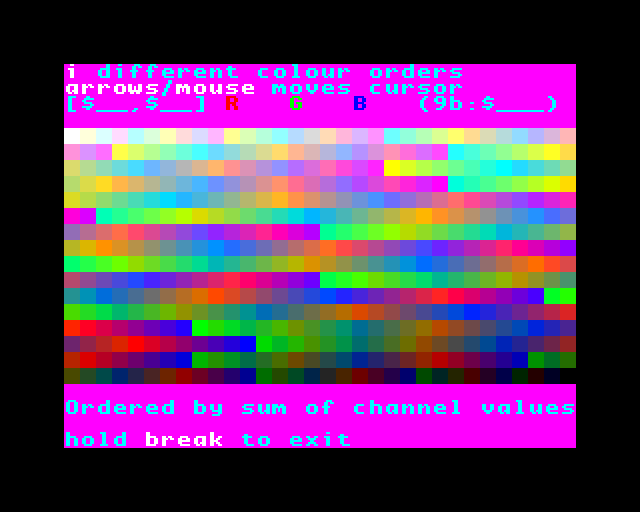

### `floating-bus`
48K floating-bus pattern test (port reads while ULA is fetching).


### `tilemap-demo`
Next tilemap layer display demo.


### `contention-test`
48K memory-contention timing test (cycles-vs-T-states observable).


### `lores-demo`
LoRes 128×96 8-bit mode — a colour-ramp grid filling the LoRes area over a green border, so the LoRes-vs-border boundary and the NR 0x32/0x33 origin are both observable. LoRes is not a layer: it substitutes the ULA-slot pixel (GH #63).

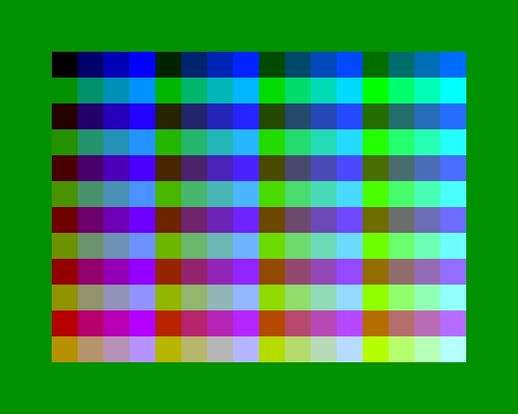

---

## Layer 2

### `layer2-320x256`
Layer 2 mid-resolution (320×256) bitmap mode.


### `layer2-640x256`
Layer 2 hi-resolution (640×256) bitmap mode (HI_RES byte-interleaved).


---

## Hardware sprites

### `sprite-scaling`
Hardware sprite 1×/2×/4× horizontal+vertical scaling.


### `sprite-anchor`
Sprite anchor + relative-positioning chains.


---

## Per-scanline / animation end-to-end demos

### `beast-demo`
"Beast" demo (steady-state animation past init phase, ~2 s in).


### `parallax-demo`
Parallax scrolling demo (steady-state animation).


---

## Per-layer screenshot capture (`--delayed-screenshot-layers`)

Same demo (`beast.nex`) and same frame (100) as `beast-demo` above, captured one
layer at a time. Excluded layers are composed as if their hardware enable bit were
clear, so the four images are disjoint slices of the `beast-demo` reference —
excluding `ula` removes the border too (the ULA draws it), leaving the NR 0x4A
fallback colour, which beast sets to black.

### `layers-beast-ula`
ULA only: the per-scanline sky gradient and the moon.

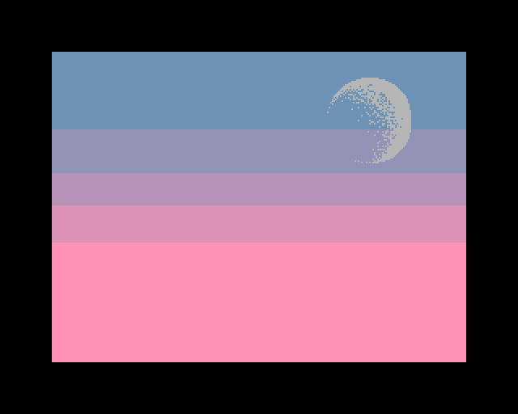

### `layers-beast-l2`
Layer 2 only: the trees and the grass.

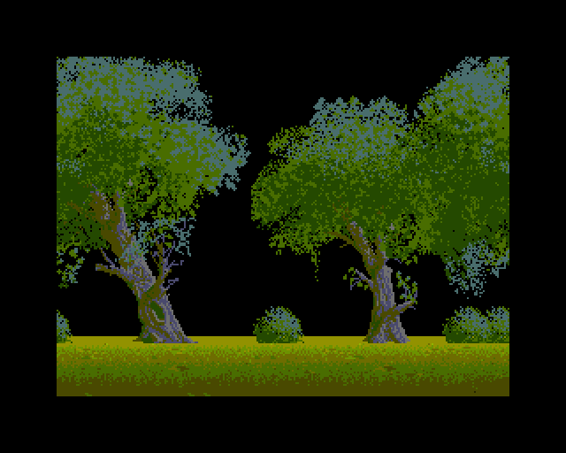

### `layers-beast-sprites`
Sprites only: the beast and the foreground rocks/fence.

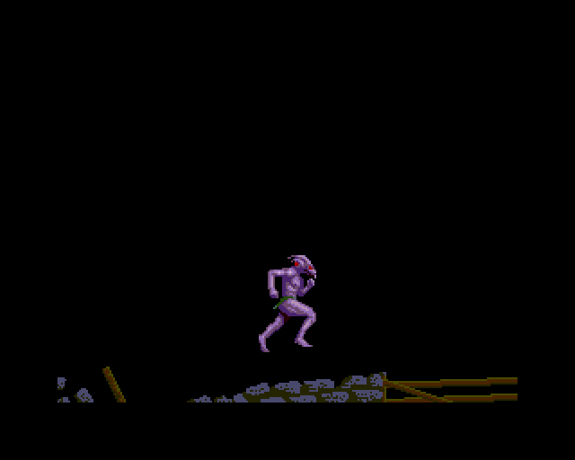

### `layers-beast-tiles`
Tilemap only: the clouds and the mountain range.

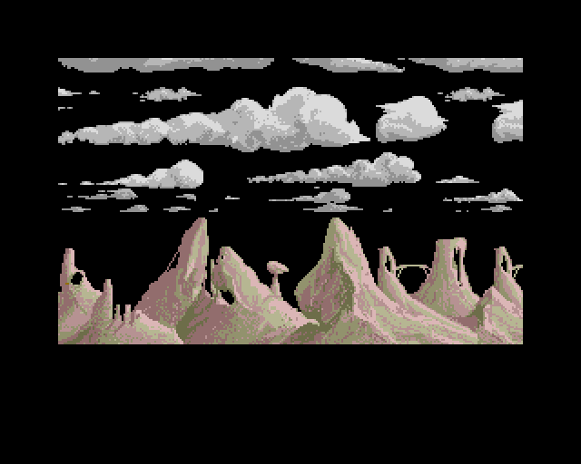

---

## ULA stencil mode (NR 0x68 bit 0)

`stencil_test.nex` is the only fixture in the suite that turns stencil mode on
(no other committed NEX writes NR 0x68 bit 0 at all). Bright ULA stripes under a
red-tile checkerboard; NR 0x4A is forced to black so a dropped layer is obvious.
Per VHDL `zxnext.vhd:7130` the stencil AND-branch needs `ula_en` **and** `tm_en`,
so masking either layer away must fall through to the ordinary merge and show the
survivor — `stencil-layers-tiles` is the row that catches a compositor which only
gates stencil on `tm_en` (it renders the whole frame black instead).

### `stencil-demo`
All layers: the red tiles act as a colour filter over the ULA stripes (ULA `AND` TM);
where a tile is transparent, stencil transparency lets the black fallback through.

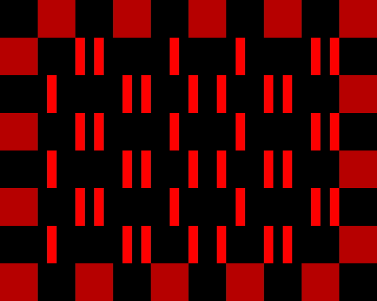

### `stencil-layers-tiles`
Tilemap only: the AND-branch must switch off with the ULA masked, showing the red
checkerboard.

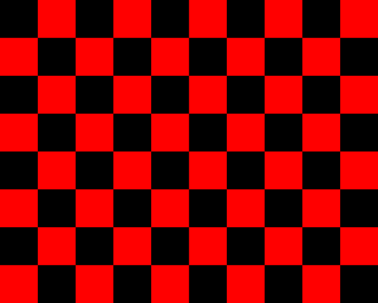

### `stencil-layers-ula`
ULA only: the AND-branch switches off with the tilemap masked, showing the bright
stripes and the border.

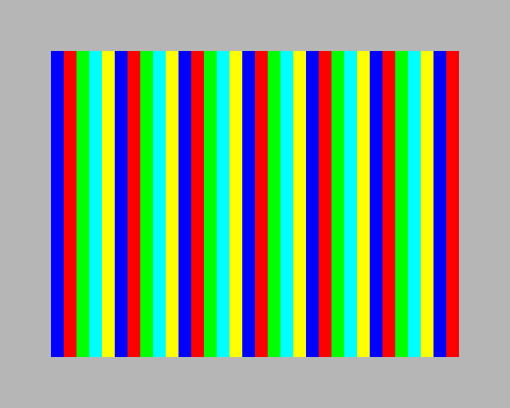

---

## Tape loading

### `tap-demo`
TAP loader exercise — 48K BASIC auto-load + beeper-driven demo.


### `tap-demo-128k`
TAP loader in 128K MENU mode — default Tape Loader entry runs `LOAD""` + fast-load trap; beeper-driven demo.


### `tap-demo-plus3`
TAP loader in +3 ENTER mode — default Loader entry drops to 48K BASIC + `LOAD""` past the disk-probe pause; beeper-driven demo.

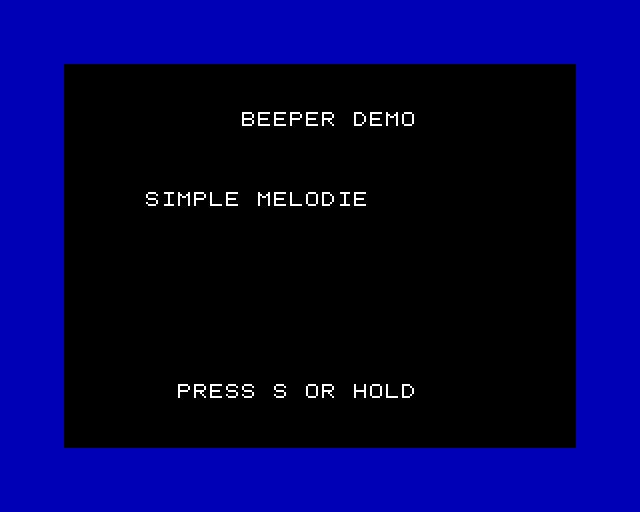

### `tap-rom-charset-next`
Next-mode `--load` TAP with ROM-1 char-set fallback — `out (0x7FFD),0x10` selects ROM 1, then plots the canonical Spectrum font 0..127 (Task 20 SRAM pages 2..7 fallback fix).

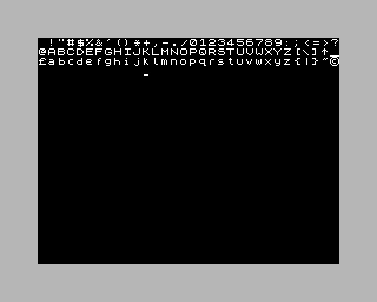

### `xevious-deciload`
Xevious (Probe Software conversion) loaded from a real TZX with the ZX0 DeciLoad turbo loader, in `--tape-realtime` mode — so the whole turbo pulse train is decoded through the EAR path rather than the fast-load ROM trap. Captures the control-select / high-score menu.

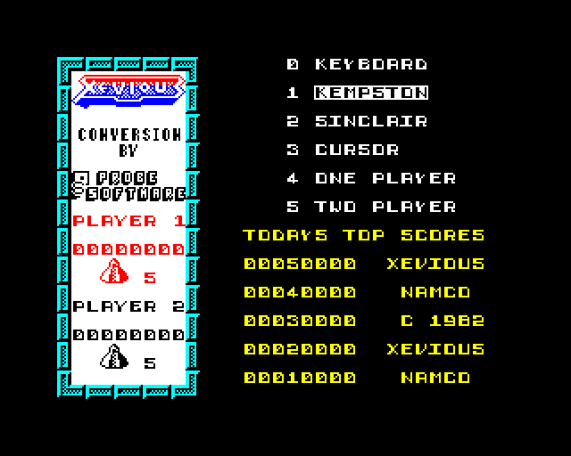

### `dizzy-wav-deciload`
The same DeciLoad turbo loader driven from a **WAV** rather than a TZX (Dizzy, Codemasters). WAV playback is always real-time — there is no fast-load path — so this is the end-to-end proof of the sample-to-EAR conversion. Captures the title screen.

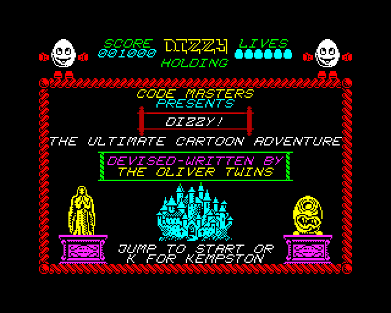

---

## Multicolour engine tape demos (BIFROST\*, NIRVANA)

Einar Saukas's multicolour engines redraw the ULA attribute byte under the beam,
so every 8×8 cell shows several colours at once. They are the strictest tape-side
raster test in the suite: a contention or interrupt-timing error does not shift a
colour, it tears the picture. Each is run on all three legacy machines, because
the engines are timed against the ULA of the machine they run on.

### `bifrost-screen1`
BIFROST\* ENGINE demo on 48K, first screen — the animated multicolour tile gallery beside the `BIFROST* ENGINE DEMO / with z88dk!` banner and the `PRESS ANY KEY` prompt.


### `bifrost-screen1-128k`
The same first screen loaded on 128K.


### `bifrost-screen1-plus3`
The same first screen loaded on +3.

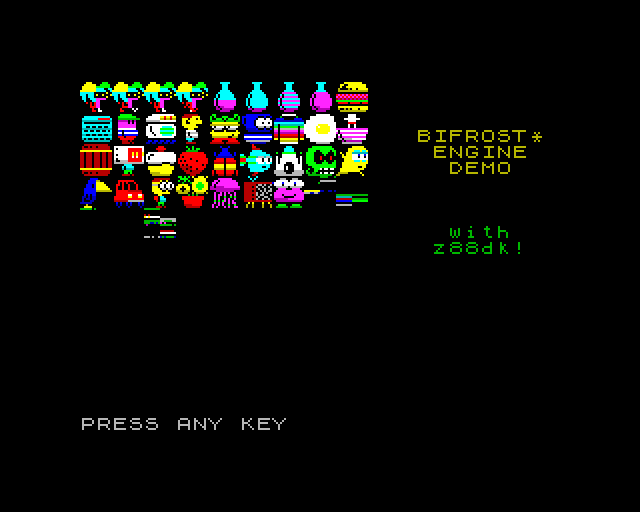

### `bifrost-screen2`
48K, after a synthetic SPACE at frame 500 — the `Demonstrating static tiles` screen, a full multicolour tile field.


### `bifrost-screen2-128k`
The static-tile screen on 128K.


### `bifrost-screen2-plus3`
The static-tile screen on +3.

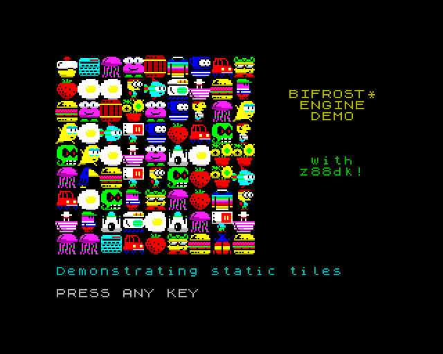

### `nirvana`
NIRVANA ENGINE demo on 48K — multicolour sprites over a brick playfield inside a blue frame, `NIRVANA ENGINE` / `(c)2013 Einar Saukas` headers top and bottom.

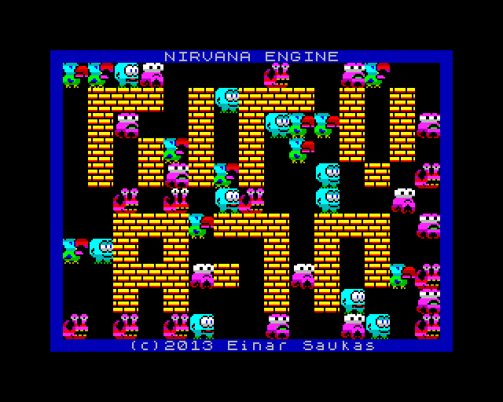

### `nirvana-128k`
NIRVANA ENGINE on 128K.

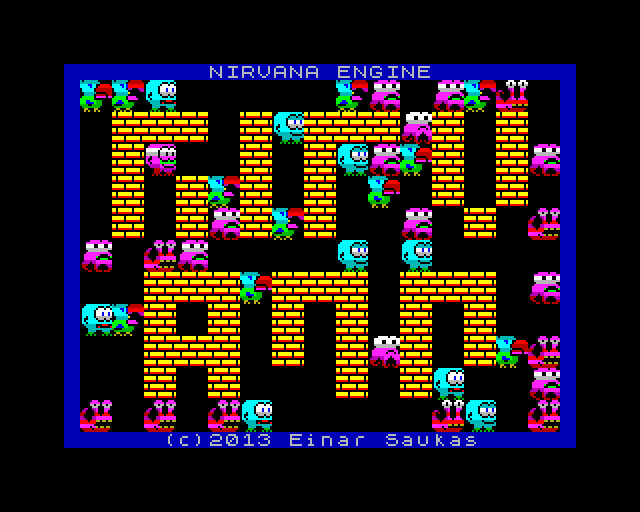

### `nirvana-plus3`
NIRVANA ENGINE on +3.

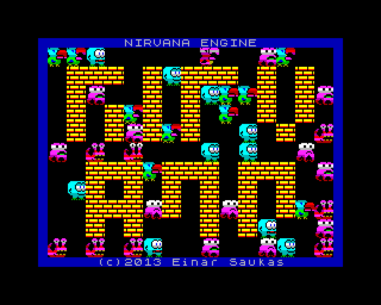

### `nirvanap`
NIRVANA+ ENGINE demo on 48K — the borderless variant, denser sprite field over a white brick playfield, single `NIRVANA+ ENGINE (c) Einar Saukas` header line.

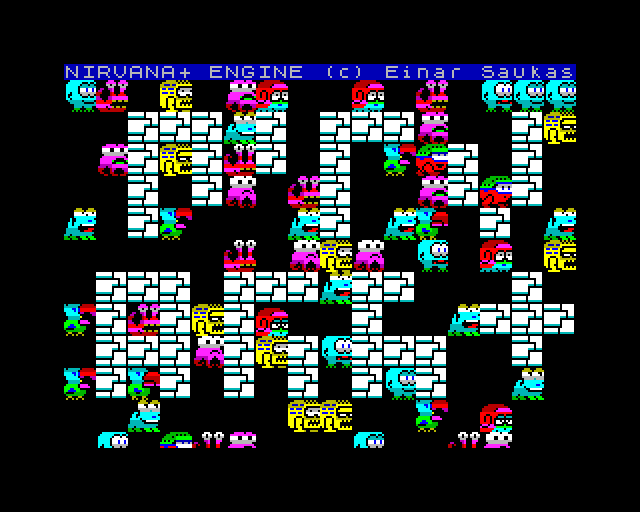

### `nirvanap-128k`
NIRVANA+ ENGINE on 128K.

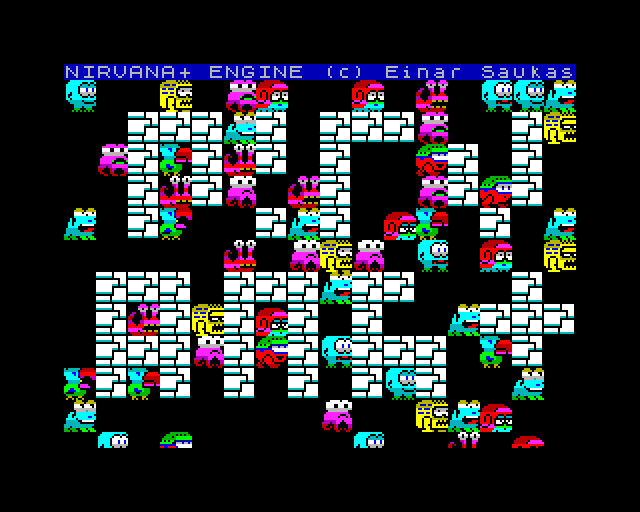

### `nirvanap-plus3`
NIRVANA+ ENGINE on +3.

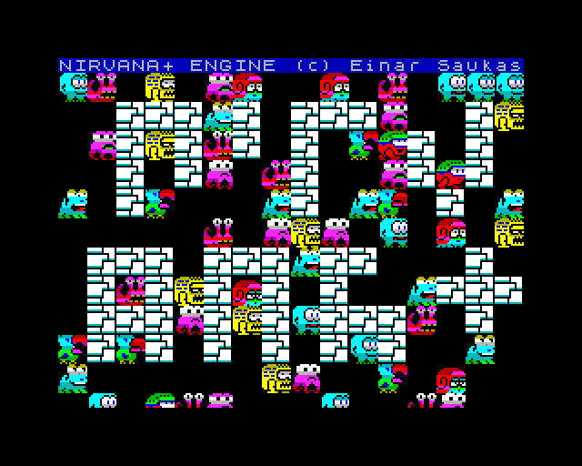

---

## Magic features (Multiface-style instrumentation)

### `magic-bp-demo`
Magic-breakpoint feature: visual trigger when an MMU page hit fires.


### `magic-port-demo`
Magic-port feature: visual trigger when a watched I/O port is read/written.


---

## David Crespo's nexlib regression suite (`dapr-*`)

Pre-built NEX files exercising the public Next library APIs.

### `dapr-l2empty`
nexlib test01 — empty Layer 2 surface (cleared bitmap).


### `dapr-layer2`
nexlib test02 — Layer 2 surface with content.


### `dapr-sprite`
nexlib test03 — hardware sprites placement.


### `dapr-tilemap_00`
nexlib test04 — tilemap mode 0 (40 × 32, 8×8 tiles).


### `dapr-tilemap_01`
nexlib test04 — tilemap mode 1 (variant 1).


### `dapr-tilemap_02`
nexlib test04 — tilemap mode 2 (variant 2).


### `dapr-print`
nexlib test05 — text print routine output.


### `dapr-tilemapper_00`
nexlib test10 — tilemapper editor mode 0.


### `dapr-tilemapper_01`
nexlib test10 — tilemapper editor mode 1.


### `dapr-videoint`
nexlib test09 — video-interrupt handler. Tilemap playfield overwritten by the ISR's live status text (`ISR=`, `SCAN=`, `SP=`, `MAIN=`) at several raster positions, so a wrong line-interrupt raster position moves the text rather than merely changing a colour.

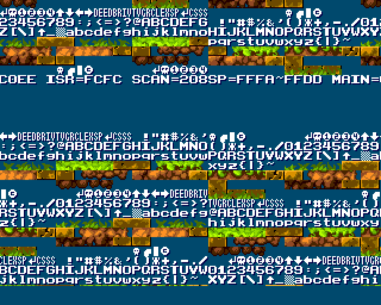

---

## Game smoke tests

Synthetic keypresses drive each game past its splash/menu screens so the screenshot captures a meaningful post-intro frame. Catch end-to-end regressions of the full Z80 + memory + video pipeline against real-world ZX Spectrum Next titles. Games marked with `--esxdos-stub` are pristine NEX builds that depend on esxdos (RST $08) for save-game I/O — the shim returns benign errors so boot proceeds without the NextZXOS firmware that `--load` bypasses.

### `celeste`
Celeste Classic — original NEX with `--esxdos-stub`. Synthetic `Z` keypress at frame 100 starts the game; captures the first playable scene.


### `celeste2`
Celeste Classic — second build of the same engine, original NEX with `--esxdos-stub`. Same params as `celeste` (Z keypress at frame 100, screenshot at frame 150); the level layout differs from celeste1 so this is a separate end-to-end coverage point.


### `beanbros`
Bean Bros — original NEX with `--esxdos-stub` (defensive; the game makes no esxdos calls). Three `ENTER` keypresses (frames 50/100/150) drive past the menu/intro; captures the first level intro frame.


### `shift`
Shift — two `SPACE` keypresses (frames 50/100) skip the intro; captures the Test 01 prompt.


### `trainyard`
Trainyard Express — original NEX with `--esxdos-stub`. Boots through the splash and player-data init to the "Welcome to Trainyard Express!" instructions screen at frame 400, with the in-game Kempston-mouse cursor rendered (and the host cursor blanked over the viewport per the GUI policy).


### `santaspressie`
Santa's Pressie — NEX extracted from `/games/Next/Santa's Pressie/` on the NextZXOS SD image. Wait 250 frames through the developer splash, send synthetic ENTER, screenshot at frame 400 captures the first level with Santa's sleigh entering from the left, chimneys lined up below, full HUD (presents-delivered / wasted counters, mountain backdrop, gift sprites).


### `odemo`
odemo — five `SPACE` keypresses (frames 50/250/350/450/550) drive past five intro screens; captures the in-game castle level at frame 700. **Functional regression for the Layer 2 320×256 bank-stride +16 fix** (NR $12 = 14 exercises sub_banks 2-4, which would render as animated noise if the `compute_ram_addr` shift is broken).


---

## Non-screenshot tests bundled into `regression.sh`

### `rewind-func`
Functional rewind-buffer test (no screenshot — `build/test/rewind_test` binary). Verifies frame-snapshot capture + restore round-trip.

### `fuse_z80_test`
1356 Z80 opcode test cases from the FUSE emulator suite — register / flag / timing exhaustive coverage. Currently 1356/1356 PASS.

### `z80n_test`
Z80N (Spectrum Next-extended) opcode test suite.

---

## Updating references

After an intentional rendering change, regenerate the affected reference(s):

```bash
# Single test
bash test/00regression/generate-references.sh layer2-640x256

# Multiple tests
bash test/00regression/generate-references.sh palette-demo copper-demo

# Full suite (use sparingly; review every diff before committing)
bash test/00regression/generate-references.sh
```

Then commit the regenerated `*-reference.png` files alongside the source change that motivated them, with a clear "regenerate refs after X" line in the commit message.
