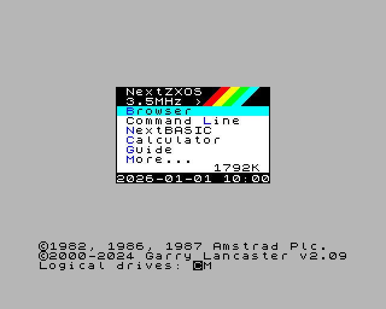

# 3. First run

Start JNEXT from your application menu, or from a terminal:

```sh
jnext
```

With no arguments it starts a ZX Spectrum Next and boots NextZXOS — but before
it can do that, it needs an SD card.

## Why JNEXT needs an SD-card image

A real ZX Spectrum Next keeps almost nothing in the machine itself. NextZXOS,
the 48K / 128K / +3 BASIC ROMs, the DivMMC and Multiface firmware — all of it
lives on the SD card, and the machine loads it from there at boot. JNEXT works
the same way: it boots from an *SD-card image*, a single file that stands in
for that card.

This is why even `--machine 48k` needs one. The 48K BASIC ROM is a file on the
card.

## Letting JNEXT fetch one

You do not have to find an image yourself. On the first run, with no SD card
configured, JNEXT offers to download the official ZX Spectrum Next
distribution image:

```
No SD-card image was found at ~/.jnext/.

Download the NextZXOS official distribution image and install it there? [y/N]
```

In the graphical version the same question appears as a dialog titled **jnext —
SD card image**. Answer yes and JNEXT will:

1. Download the official distribution archive and unpack the SD-card image from
   it, showing progress as it goes.
2. Prepare a working copy of that image, keeping the downloaded original
   untouched.
3. Boot from the working copy.

Both files are kept in `~/.jnext/sdcard/`, and together they take about 2 GB of
disk space. The download happens once; every later run reuses it and starts
immediately.

Answering no leaves JNEXT with nothing to boot from, so it explains the problem
and exits.

## Using your own image

If you already have a NextZXOS SD-card image, point JNEXT at it:

```sh
jnext --sdcard /path/to/my-image.img
```

An explicit `--sdcard` always wins: it is used as-is, and no download is ever
offered or performed. In the graphical version you can also mount one from
**File > Mount SD Card Image**, and set a permanent default in Preferences
(chapter 4).

## The first boot

The machine boots in three visible stages.

**The firmware splash.** The Next's own boot firmware starts, loads the keymap
and the ROMs off the SD card, and reports the firmware and core versions.


**The NextZXOS welcome.** NextZXOS starts and introduces itself. Press **Enter**
to page through the welcome screens, **Space** to skip straight to the system,
or **D** to stop it appearing on future boots.


**The NextZXOS menu.** This is the working system: the Browser for loading
programs from the SD card, a command line, NextBASIC, and the built-in guide.
Move with the cursor keys and select with **Enter**.



If you reached this screen, everything works. The whole sequence takes a few
seconds.

## Running a program

You do not have to go through NextZXOS to run something. Give JNEXT a file and
it loads it directly:

```sh
jnext game.nex
jnext game.tap
```

Chapter 5 covers loading and running programs properly.

## If something goes wrong

**The download failed, or the image looks broken.** Ask JNEXT to fetch and
prepare it again:

```sh
jnext --sdcard-download-force
```

This only affects the image in `~/.jnext/sdcard/`; it is ignored when you pass
an explicit `--sdcard`.

**You are scripting JNEXT and it stops to ask a question.** Use
`--sdcard-download-confirm` to accept the download without prompting, or pass
`--sdcard` so there is nothing to ask about. An unattended run that is asked a
question it cannot answer will decline and exit rather than hang.

**It boots to a black screen or an error.** Check that the image you supplied
is a NextZXOS SD-card image and not, say, a raw ROM file. If you built the
image yourself, note that JNEXT enforces the FAT32 specification as strictly as
the real firmware does, and will refuse a card the real machine would also
refuse.

Anything else: chapter 8, *Known issues*, and
<https://github.com/jorgegv/jnext/issues>.
