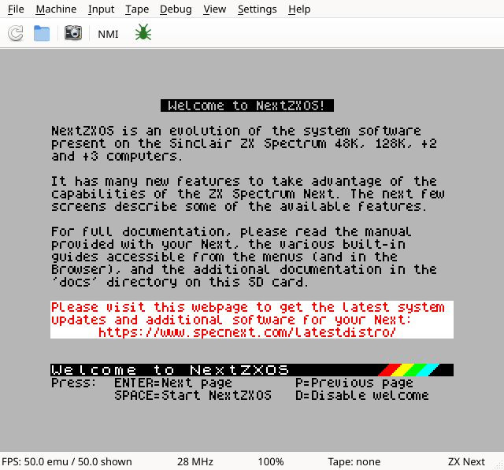
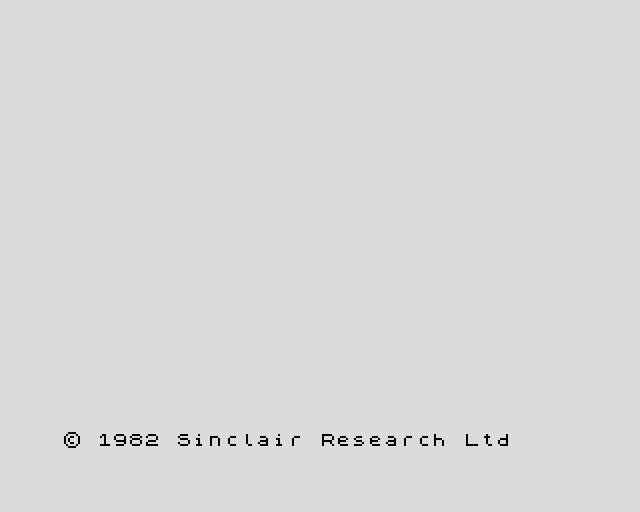
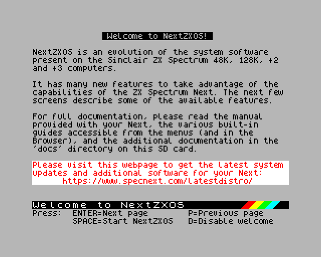

# 5. Running programs

The short version: give JNEXT a file.

```
jnext game.nex
jnext game.tap
jnext game.sna
```

The format is recognised from the extension — `.nex`, `.sna`, `.szx`, `.z80`,
`.tap`, `.tzx`, `.wav` and `.rzx` are all understood. A bare filename is
exactly the same as `--load FILE`; you cannot use both at once.

In the window, **File > Load NEX File…** (Ctrl+O) opens the same loader and
accepts every one of those formats despite its name. Tapes have their own
entry, **Tape > Open Tape File…** (Ctrl+T), covered in
[5.5](#55-recording-and-playback).



The status bar along the bottom tracks the session: frame rate, the emulated
CPU clock, the emulator speed, tape state, and the current machine.

Everything else in this chapter is about shaping that session.

---

## 5.1 Choosing a machine

JNEXT emulates four machines. Pick one with `--machine`, or from **Machine >
Machine Type** while running — switching restarts the machine, so load your
program afterwards.

| `--machine` | Machine | What you get |
|---|---|---|
| `48k` | ZX Spectrum 48K | 48K RAM, beeper only, original timing and contention |
| `128k` | ZX Spectrum 128K | Bank switching, AY sound chip, 128K timing |
| `plus3` | ZX Spectrum +2A/+3 | 128K plus the +3's extended paging model |
| `next` | ZX Spectrum Next | Everything: Layer 2, sprites, tilemap, 3 AY chips, DMA, the copper, up to 28 MHz (**default**) |

Three things actually change with the machine type:

- **Available hardware.** A 48K has no AY chip and no memory paging; a Next
  has extra video layers and a much faster CPU. Software written for one
  generally will not run on an earlier one.
- **Timing.** Each machine has its own frame length and screen timing, which
  is what makes music and raster effects run at the right speed.
- **Contention.** On real 48K/128K/+3 hardware the video circuitry steals
  memory cycles from the CPU, slowing it in a very specific pattern. JNEXT
  reproduces this, which is why timing-sensitive software behaves as it does
  on the real machine. Contention only applies at 3.5 MHz — raise the CPU
  speed and it disappears, exactly as on a real Next.

Choose the machine the software was written for. Running a 48K game on the
Next usually works, because the Next is backwards compatible, but the original
machine is the faithful choice.

**Every machine type needs an SD-card image**, including 48K: that is where
JNEXT reads the BASIC ROMs from, exactly as real Next hardware does. See
[chapter 3](03-first-run.md).

 

*A 48K start-up screen, and the Next booting NextZXOS.*

> There is no Pentagon machine option. Pentagon *timing* exists only as
> something a program can ask for from inside the emulated machine, and it
> turns memory contention off.

---

## 5.2 Input

### Keyboard

Your PC keyboard is mapped onto the Spectrum's. Letters, digits, Enter and
Space are where you expect; the rest of the Spectrum's oddities are reachable
through modifiers:

| PC key | Spectrum key |
|---|---|
| Ctrl (either) | Caps Shift |
| Shift (either) | Symbol Shift |
| Backspace | Delete |
| Arrow keys | Cursor keys |
| Esc | **Break** |
| Tab | Extend Mode |
| Key left of `1` | True Video |
| Alt + key left of `1` | Inverse Video |
| Alt + E | Edit |
| Alt + G | Graph |
| Alt + C | Caps Lock |
| `'` `;` `.` `,` | `"` `;` `.` `,` |

Two things catch people out:

- **Esc is Break**, not "get me out of fullscreen". Fullscreen is F11 and only
  F11.
- **Alt is a host modifier, never a Spectrum key.** Only the four Alt
  combinations above are used, because the menu bar claims the rest.

The machine's own front-panel keys are on function keys: **F1** hard reset,
**F4** soft reset, **F9** Multiface NMI, **F10** DivMMC. (With the debugger
open, F9 belongs to the debugger.)

### Joysticks and gamepads

Up to two USB gamepads are picked up automatically, hot-plug included, and
wired to the Next's two joystick connectors. The joystick *protocol* —
Kempston, Sinclair, Cursor or MD — is chosen by the software you are running,
just as on real hardware, so a game that expects Kempston gets Kempston
without you configuring anything.

With no gamepad, point a connector at the host cursor keys instead: arrows to
move, Space to fire. Choose it in the **Input** menu, in **Settings >
Preferences > Input**, or with `--joy1-source keys` / `--joy2-source keys`;
the choice is remembered.

Only one connector can use the cursor keys at a time, and while it does, the
arrows and Space stop working as ZX keys.

### Mouse

For software that uses a Kempston mouse, JNEXT has to confine your pointer —
otherwise it hits the edge of your screen and the emulated pointer stops.

- **Capture:** click the emulator screen, or use **Input > Capture Mouse**.
- **Release:** **Ctrl+Alt**, the same combination VirtualBox and QEMU use.

Capture is off until you ask for it, so the pointer stays yours and you can
always reach the menus. While captured, the status bar reminds you how to get
out. The click that captures is not passed through to the program.

---

## 5.3 Display

**Scale.** **View > Scale 1x/2x/3x**, or press **F2** to cycle. Scaling is
always a whole number of pixels, so the picture stays sharp.

**Fullscreen.** **F11**, or **View > Fullscreen**. The image is centred with
black bars, keeping the correct shape. F11 again returns. (Esc will not: it is
the Break key.)

**CRT filter.** **View > CRT Filter** overlays soft scanlines, for a more
period-accurate look.

**Layers.** The Next composites several video layers — the classic ULA screen,
Layer 2, the tilemap and up to 128 sprites — and the running program decides
their stacking order and transparency. There is nothing to configure; it is
simply what you see.


You can, however, pull them apart, which is useful when something looks wrong
and you want to know which layer is responsible:

```
jnext --headless demo.nex --delayed-screenshot l2.png \
    --delayed-screenshot-layers layer2
```

 

*The same frame with only Layer 2, and with only the sprites.* Excluded layers
are treated as switched off, so what remains still composites normally.
Leaving out `ula` also removes the border, since that is the ULA's job.

**Screenshots.** **File > Save Screenshot…** (Ctrl+S) or the toolbar camera
button writes a PNG. JNEXT remembers the directory. For scripted, repeatable
captures, see [chapter 7](07-automation-and-ci.md).

---

## 5.4 Sound

JNEXT emulates everything the Next can make noise with, and none of it needs
setting up:

- **Beeper** — the original single-bit speaker.
- **AY / TurboSound** — the AY sound chip that gave the 128K its music, up to
  three of them (TurboSound) on the Next, with stereo panning.
- **DAC** — 8-bit sample playback (Specdrum, Soundrive and Covox compatible).

Which of these a program can actually use is up to the program and the machine
it was written for. Stereo separation and channel balance are likewise set by
the software, not by you — they are properties of the emulated hardware.

**Volume lives on your host**, not in JNEXT: there is no volume slider. The
only audio control is a complete mute, either **Settings > Preferences >
Startup > Start muted** or `--silent` on the command line. Muting also skips
sound synthesis entirely, which speeds up runs that do not need audio. Tape
loading still works while muted.

### If the sound stutters or clicks

JNEXT paces itself against your sound card, so audio should stay clean
indefinitely. Glitches almost always mean the **host cannot keep up**.

Check the two frame-rate figures in the status bar:

```
FPS: 50.0 emu / 50.0 shown
```

`emu` is how fast the machine is being simulated; `shown` is how many of those
frames reached the screen. If `emu` sits below about 50, your host is behind,
and the audio will suffer with it. Things that help, roughly in order:

1. Close whatever else is busy on the machine.
2. Turn off the CRT filter and drop the window scale.
3. Reduce the emulated CPU speed (**Machine > CPU Speed**) if the software
   tolerates it — 28 MHz is many times the work of 3.5 MHz.
4. Use `--silent` if you do not need sound at all.

`shown` being lower than `emu` on its own is not a fault: it is expected when
you run faster than 1x, and during brief audio catch-up.

---

## 5.5 Recording and playback

### Tapes: fast or real time

Tape files (`.tap`, `.tzx`) load two ways. Either way `LOAD ""` is typed in
for you when the tape is attached.

**Fast load** is the default and is what you want almost always: JNEXT
short-circuits the ROM's loading routine and the program appears in seconds.

**Real time** replays the tape as audio, at the speed of an actual cassette —
several minutes, loading stripes, screeching and all. Use it for authenticity,
or for the occasional program with a custom loader that fast-load cannot
follow. Turn it on with **Tape > Fast Load** (uncheck it) or `--tape-realtime`.

`.wav` files are always real time; there is no ROM routine to short-circuit.

**Tape > Open Tape File…** (Ctrl+T) loads a tape, and **Eject** and **Rewind**
do what they say. The status bar shows the tape name and, while loading, the
block position.

### Video

**File > Record MPEG4 Video…** (Ctrl+F5) starts recording video with audio to
an MP4; **Stop** (Ctrl+F6) ends it. From the command line, `--record FILE`.

This needs **ffmpeg** installed and on your PATH — JNEXT feeds it the frames.

To capture only the audio, `--wav-record FILE` writes a standard WAV. It needs
neither ffmpeg nor a sound card, so it works in automated runs.

### RZX: recording what you did

An RZX file records your *input* rather than the screen, alongside a snapshot
of the machine. Replaying it reproduces the session exactly, keystroke for
keystroke — a walkthrough, a bug report, or a speedrun that stays honest.

- **File > Record RZX…**, or `--rzx-record FILE`; **Stop RZX** to finish.
- **File > Play RZX Recording…**, or `--rzx-play FILE`. Loading a `.rzx` with
  `--load` plays it too.

Because it stores input rather than pixels, an RZX is tiny compared with a
video — but it only replays correctly in an emulator that models the machine
the same way.
