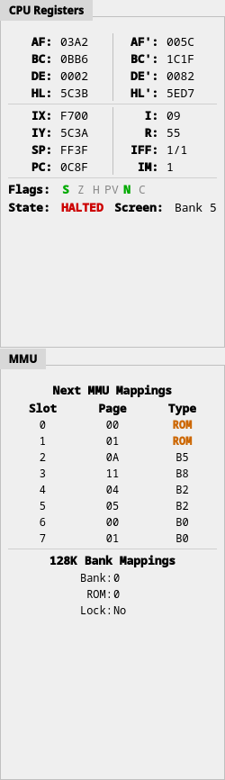
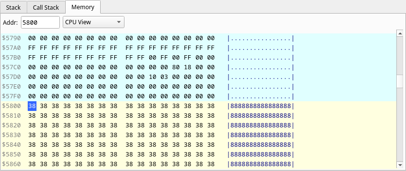
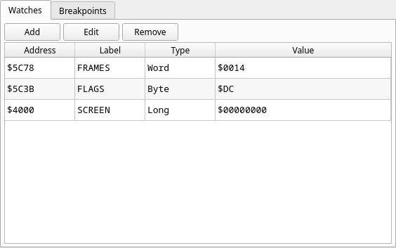
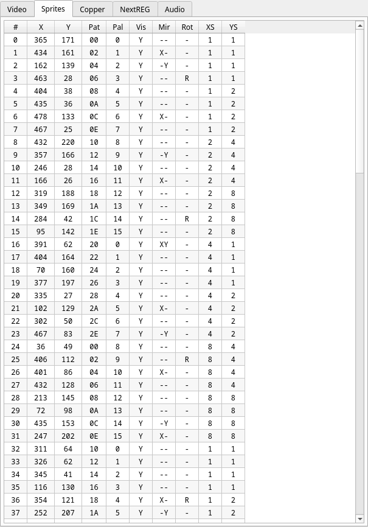
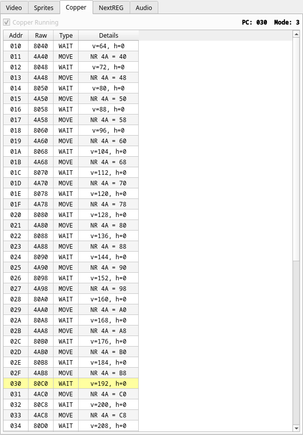
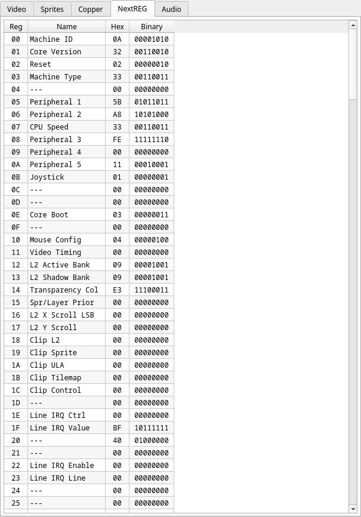

# 6. The debugger

JNEXT ships with a full source-less debugger for ZX Spectrum Next software: it
halts the machine at an instruction boundary and shows you the CPU, the memory
map, every video layer, the Copper program, the NextREG file and the AY
registers, all as the hardware sees them at that instant.

This chapter is a reference. Each panel and each function has its own section,
so you can look one up while you are debugging.

Open the debugger with **Ctrl+D**, with **View ▸ Debugger**, or with the bug
button on the emulator toolbar. The same actions close it. While it is closed
the debugger costs nothing — no breakpoint checking, no call-stack tracking, no
panel refreshes. Closing it also resumes the machine if it was paused.

The debugger opens in its own window, positioned to the right of the emulator
window and following it when you move it. It has its own menu bar —
**Debug**, **Map**, **Breakpoints** and **Watches** — and a control toolbar
along the bottom.


The layout is fixed: video-related tabs on the top left, disassembly in the
centre, CPU registers and MMU down the right, and memory/stack tabs and
watch/breakpoint tabs along the bottom. The splitters between the areas can be
dragged.

Four panels — CPU Registers, Disassembly, Stack and Call Stack — only show data
while the machine is **paused**, and are greyed out while it runs. That is
deliberate: reading them every frame would slow the emulation down for no
benefit, since the values would be a blur. The rest refresh about four times a
second while the machine is running.

---

## Panels

### CPU registers



The full Z80 state at the paused instruction:

- `AF` `BC` `DE` `HL` and the alternate set `AF'` `BC'` `DE'` `HL'`
- `IX` `IY` `SP` `PC`
- `I`, `R`, `IFF` (shown as `IFF1/IFF2`) and the interrupt mode `IM`
- **Flags** — `S Z H PV N C`, green and bold when set, grey when clear
- **State** — `Running`, or `HALTED` in red when the CPU is in a `HALT`
- **Screen** — which bank the ULA is displaying (`Bank 5` or `Bank 7`), plus the
  Timex mode when one is active (`Alt`, `HiCol`, `HiRes`)

All values are read-only here; to change memory or a NextREG use the Memory or
NextREG panels.

### MMU

Directly under the CPU registers, and the fastest way to answer "what is
actually mapped where right now".

**Next MMU Mappings** lists all eight 8K slots with the physical page number in
use and the slot type — `ROM` in orange, or `B`*n* naming the 16K bank the page
belongs to. The page shown is the one really in effect, whether it came from
NextREG `0x50`–`0x57` or from legacy 128K paging.

**128K Bank Mappings** shows the port `0x7FFD` state: the selected RAM `Bank`,
the `ROM` select bit, and whether paging is `Lock`ed (red when it is — a locked
`0x7FFD` is a classic cause of "my bank switch does nothing").

### Disassembly


Z80 plus all 26 Z80N instructions, disassembled live from memory as the CPU
sees it. Columns are the breakpoint gutter, the address, the raw opcode bytes
and the mnemonic. The line at `PC` is highlighted in yellow and set in bold;
the line you select is highlighted in blue.

- **Click the gutter** on any line to set or clear an execute breakpoint (shown
  as a red dot).
- **Address** box — type a hex address and press Enter to centre the view there.
- **Go to PC** re-centres on the current instruction.
- The scrollbar spans the whole `$0000`–`$FFFF` address space. **↑ ↓**,
  **Page Up/Down**, **Home** and **End** navigate; **Enter** runs to the
  selected line.

The right-click menu is where most of the day-to-day work happens:

| Entry | Effect |
|---|---|
| Toggle Breakpoint | Execute breakpoint on this line |
| Run to Here | Resume until this address is reached |
| Go to Address… | Jump to the address box |
| Watch *symbol* / Watch `$nnnn` | Watch this line's symbol, or a 16-bit immediate in the instruction |
| Watch `(HL)` `(DE)` `(BC)` `(IX` `(IY` `(SP)` | Watch the address the register currently holds |
| Break on Read / Break on Write | Data breakpoint on that immediate, or on the register's current value |

The register entries only appear when the instruction actually references that
register indirectly, and they capture the register's value *at the moment you
open the menu* — they are a shortcut for "watch what HL is pointing at right
now", not a moving target.

The panel does not follow `PC` while the machine runs freely, or during a
"Run to Here" — it is only redrawn when execution stops.

### Memory



A hex editor over the address space: address, sixteen bytes in two groups of
eight, and the ASCII rendering.

- The **Addr** box takes a hex address (`5800`, `$5800` or `0x5800`) and centres
  the view on it.
- The **page selector** chooses the window. `CPU View` shows the whole 64K as
  the CPU sees it; `Slot 0`–`Slot 7` restrict the view to one 8K slot and name
  the page currently mapped there, which updates as the program pages.
- In `CPU View`, rows are colour-coded: the row containing `SP` in orange,
  pixel VRAM `$4000`–`$57FF` in cyan, and attributes `$5800`–`$5AFF` in yellow.

To edit, click a byte and type two hex digits — the write happens on the second
digit and the selection advances to the next byte. Arrow keys move the
selection, **Page Up/Down**, **Home** and **End** scroll, and **Esc** clears
the selection. Writes go through the MMU exactly as a `LD (nn),A` would, so
ROM stays read-only.

### Stack


Twenty-four words from `SP` upwards, in ascending address order with the top of
stack in the first row (highlighted green). Each row shows the address, the
16-bit word in hex and decimal, and its high and low bytes separately — the
usual case being "is that a return address or two bytes of data".

### Call stack

The chain of calls that led to the current instruction: depth number, the type
(`CALL`, `RST`, `INT` or `NMI`), the caller address, and the target. Most
recent call first. With a MAP file loaded the target column shows the symbol
name instead of the address.

Call tracking only runs while the debugger is open, so the stack is built from
the moment you open it — not retroactively.

### Watches



A list of addresses whose values you want to keep an eye on: address, your
label, the size, and the live value. **Add**, **Edit** and **Remove** manage
the list; you can also add a watch from the disassembly right-click menu, or
from **Watches ▸ Add Watch…** in the menu bar. See
[Watches and watch sizes](#watches-and-watch-sizes) for what the sizes mean.

### Breakpoints


Every breakpoint in one list, sorted by address: type, address and — with a MAP
file loaded — the symbol at that address. **Add**, **Edit** and **Remove**
manage them; double-clicking a row edits it. The list and the disassembly
gutter stay in sync in both directions.

### Video


The state of the whole display pipeline, and a picture of each layer on its own.

The header shows the raster position (`HC` and `VC`, the raw hardware
counters) — only while paused — and, at all times, which layers are enabled
(green) or disabled (grey), which of the six priority orders
`SLU LSU SUL LUS USL ULS` is selected, and the 32 reachable entries of the
active ULA palette as swatches.

Below that, one tab per view:

| Tab | Shows |
|---|---|
| All layers | The full composite — the same picture as the emulator window |
| ULA | The ULA screen, with **Primary (bank 5)** / **Shadow (bank 7)** selectable |
| Layer2 | Layer 2, with **Active bank** / **Shadow bank** selectable |
| Sprites | The sprite layer alone |
| TileMap | The tilemap layer alone |
| Background | The NR `0x4A` fallback colour — the one thing on screen that belongs to no layer |

Two conventions to know. Rows the raster has **not yet reached** in the current
frame are drawn dark, so you can see exactly how much of the frame is done at
the point you stopped — pause mid-frame and the bottom of the picture is dark.
**Transparent** pixels are drawn as a light checkerboard, the way an image
editor shows them, which makes it obvious whether a layer is empty or merely
transparent.

The views replay the frame's per-scanline register changes rather than drawing
everything with the register values that happen to be live at the pause. That
is what makes raster effects — Layer 2 parallax splits, per-line palette
gradients, tilemap scroll splits — appear here as they do on screen. Only the
visible tab is rendered.

### Sprites



All 128 sprite slots, one per row: index, `X`, `Y`, pattern number, palette
offset, visible, mirror (`X`/`Y`), rotate, and the X and Y scale factors as
`1`, `2`, `4` or `8`.

### Copper



Whether the Copper is running, its program counter and mode, and 64 decoded
instructions centred on that PC. Each row shows the address, the raw 16-bit
word, and the decoded instruction:

- `WAIT` with the `v` and `h` position it is waiting for
- `MOVE` as `NR xx = yy`
- `NOP` (`0000`) and `HALT` (`FFFF`)

The row at the Copper PC is highlighted yellow.

### NextREG



All 256 NextREG registers with a name for the ones JNEXT knows about, and the
value in both hex and binary.

The **Hex** column is editable: type a new value and it is written to the
register exactly as `NEXTREG nn,n` would write it, with all the side effects
that implies. The values shown are the *live* values composed by the hardware,
not merely the last byte written — so a Layer 2 enable set through port
`0x123B` correctly shows up in NR `0x69`.

### Audio


All 16 registers of all three AY chips side by side, with the registers named
(tone periods, noise, mixer, volumes, envelope).

**Sources** lets you mute each chip, the DAC and the beeper independently — a
checked box is audible. This is a debugging aid on the output stage only: the
Z80 cannot observe it, so muting a chip to work out which one is making a noise
does not change the program's behaviour.

**Info** reports whether TurboSound is enabled, whether the chips are in AY or
YM mode, and whether the stereo layout is ABC or ACB.

---

## Functions

### Run, pause, and the step family

| Action | Key | Toolbar |
|---|---|---|
| Run / Continue | **F5** | `F5: Continue` |
| Pause / Break | **F9** | `F9: Break` |
| Single Step (into) | **F6** | `F6: Single Step` |
| Step Over | **F7** | `F7: Step Over` |
| Step Out | **F8** | `F8: Step Out` |

The same actions are in the **Debug** menu.

**Single Step** executes exactly one instruction, entering calls, traps and
interrupt handlers.

**Step Over** sets a one-shot breakpoint after the current instruction and
resumes, so a subroutine runs at full speed and you land on the following
instruction. It only does this for instructions that can come back —
`CALL nn`, `CALL cc,nn`, `RST n` and `DJNZ`. For anything else it is identical
to Single Step. Note the consequence for `DJNZ`: stepping over it runs the
whole loop.

**Step Out** resumes until a `RET`, `RETI` or `RETN` executes with `SP` at or
above its value when you pressed it — that is, until the current subroutine
returns rather than a nested one.

If a subroutine never returns (it jumps away, or is waiting on input that never
arrives) Step Over and Step Out simply keep running; press **F9** to take back
control.

### Run to cursor, run to end of frame, run to end of scanline

**Run to Here** is the run-to-cursor: select a line in the disassembly and press
**Enter**, or use the right-click menu. Execution resumes and stops when that
address is reached. If it is never reached, the machine keeps running.

**Run to EOSL** (Run to End of Scan Line) resumes until the end of the current
scanline. It is the tool for stepping through a raster effect one line at a
time: run to EOSL, look at the Video panel, repeat.

**Run to EOF** (Run to End of Frame) resumes until the end of the last visible
scanline of the frame, at which point every framebuffer row has been rendered
and the Video panel shows a complete picture. If you are already past that
point, it targets the same position in the next frame.

Both are on the toolbar and in the **Debug** menu, and both require the machine
to be paused already.

### Breakpoints: execute, read, write

JNEXT has two kinds of breakpoint.

**Execute** breakpoints fire before the instruction at that address is
executed. Set one by clicking the disassembly gutter, from the right-click
menu, or from the Breakpoints panel.

**Data** breakpoints fire on access to an address: **Read**, **Write** or
**Read/Write**. They are checked as the access happens, but the machine stops
*after* the current instruction completes — so when you land, the access has
already taken effect and `PC` is on the next instruction. Set them from the
Breakpoints panel, from **Breakpoints ▸ Add Read/Write/Read-Write
Breakpoint…**, or from the disassembly right-click menu, which pre-fills the
address from an immediate or from a register's current contents.

**Breakpoints ▸ Clear All Breakpoints** removes both kinds at once.

There are no I/O port breakpoints. To trap on port activity, use the
[magic port](#the-magic-breakpoint-and-the-magic-port) — it logs every write to
a port you choose — or put an execute breakpoint on the `OUT` itself.

### Watches and watch sizes

A watch shows the live contents of an address in one of three sizes:

| Size | Bytes | Displayed as |
|---|---|---|
| Byte | 1 | `$XX` |
| Word | 2 | `$XXXX` |
| Long | 4 | `$XXXXXXXX` |

Word and Long are assembled little-endian, low byte first, matching the Z80's
own convention — so a Word watch on a `LD (nn),HL` destination reads back `HL`.

Watches read through the CPU's current view of memory, so a watch on a banked
address follows whatever is paged in at that moment.

### Symbols from Z88DK MAP files

Load a symbol table with **Map ▸ Load MAP File**, which offers two formats:

- **Z88DK Format…** — the `.map` file `zcc` writes next to your binary. Only
  entries marked `; addr` are used; `; const` entries are compile-time
  constants and are skipped, since they are not addresses.
- **Simple Format (48K ROM)…** — plain `NAME = $ADDR` lines, one per line,
  `;` for comments.

Once loaded, symbols appear wherever an address is shown and a name is known:
the disassembly replaces a matching 16-bit immediate with the symbol name, the
Call Stack names call targets, the Breakpoints panel gains a Symbol column, and
the disassembly right-click menu offers to watch the symbol by name.

Where two symbols share an address, the first one in the file wins.

### The trace log

The trace log records the machine state *before* every instruction executed: the
master cycle count, `PC`, all main and alternate registers, `IX`, `IY`, `SP`,
the decoded flags and the raw opcode bytes. It is a ring buffer of 10 000
entries, so it always holds the last 10 000 instructions.

- **F2**, the toolbar `F2: Trace` button (its indicator turns green), or
  **Debug ▸ Trace ▸ Enable Trace** switches it on.
- **Debug ▸ Trace ▸ Clear Trace** empties it.
- **F3**, the `F3: Export Trace` button, or **Debug ▸ Trace ▸ Export Trace…**
  writes it to a text file, one instruction per line.
- `--trace` on the command line starts with it enabled.

The trace is what makes "how did we get *here*?" answerable after a breakpoint
fires. It is also a prerequisite for stepping backwards.

### Backward execution (rewind)

Rewind lets you go back to an earlier instruction or an earlier frame. It works
by snapshotting the whole machine at frame boundaries into a ring buffer, so it
is **off by default** — the snapshots are large, and a few hundred frames run
to hundreds of megabytes.

Turn it on either way:

- `--rewind-buffer-size N` on the command line, where *N* is the number of
  frames to keep (`0`, the default, means off). This also switches the trace log
  on, because stepping back needs it.
- **Debug ▸ Rewind ▸ Enable Rewind** in the debugger, with
  **Debug ▸ Rewind ▸ Rewind Buffer Size…** to set the depth. Resizing clears
  the snapshots already recorded.

Once there is history, a rewind toolbar appears at the bottom of the window:

| Action | Key | Effect |
|---|---|---|
| Step Back | **Shift+F7** | Undo the last instruction |
| Frame Back | **Shift+F6** | Jump to the start of the previous frame |
| Slider | — | Drag to any frame in the buffer and release to jump there |

A rewind lands you at the *start* of the target frame, paused, with the
emulator window redrawn to match. The status bar reports the buffer's size in
frames and megabytes, and when you are rewound it shows which frame you are on.
Press **F5** to carry on from there.

Step Back is greyed out when the trace log is off, when the buffer is empty, or
during RZX playback. If a snapshot ever fails to restore cleanly, JNEXT says so
loudly and pauses rather than continuing on a half-restored machine; reset the
machine (**Machine ▸ Reset**) to recover.

### The magic breakpoint and the magic port

Two features for putting debugging hooks in your own code.

**The magic breakpoint** is an opcode that stops the emulator. JNEXT
recognises both conventions:

- `ED FF` — the ZEsarUX / Spectaculator form
- `DD 01` — the CSpect form

Enable it with `--magic-breakpoint`, or **Debug ▸ Magic Breakpoint** in the
emulator window. When one executes, the machine pauses and the debugger opens
itself if it was closed. When the feature is disabled — and on real hardware —
both sequences behave as two-byte no-ops, so you can leave them in the source.

In C with z88dk:

```c
#define MAGIC_BP()  __asm__("defb 0xED, 0xFF")
```

**The magic port** is a port that prints to the host. Writes to it are logged
to stderr, which makes it a `printf` for code that has nowhere to print. Enable
it with `--magic-port PORT` (the full 16-bit port address is decoded, so you can
pick something unused like `0xCAFE`) and choose the format with
`--magic-port-mode`:

| Mode | Output |
|---|---|
| `hex` | `41` — one hex byte per line (the default) |
| `dec` | `65` — one decimal byte per line |
| `ascii` | Raw characters |
| `line` | Buffered until CR or LF, then the whole line |

`line` is usually what you want for text messages. The magic port is
write-only: reads from it are not intercepted and follow normal port decoding.

```
jnext --magic-port 0xCAFE --magic-port-mode line --load mygame.nex
```

Working examples of both are in `demo/magic_bp_demo/` and
`demo/magic_port_demo/` in the JNEXT source tree.

---

For the full list of command-line options mentioned here, see **jnext**(1) or
[USAGE.md](https://github.com/jorgegv/jnext/blob/main/USAGE.md).
