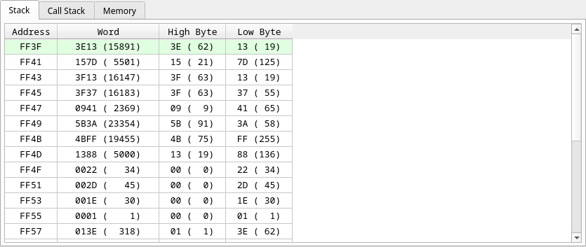

# Stack

Twenty-four words from `SP` upwards, in ascending address order with the top of
stack in the first row (highlighted green). Each row shows the address, the
16-bit word in hex and decimal, and its high and low bytes separately — the
usual case being "is that a return address or two bytes of data".
