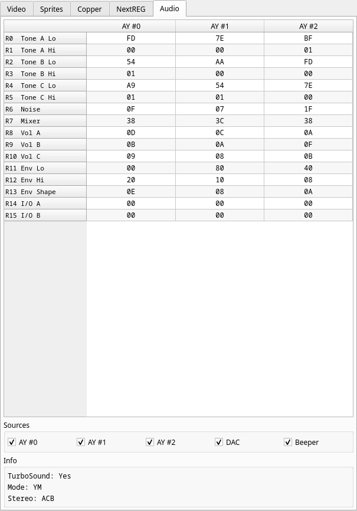

# Audio

All 16 registers of all three AY chips side by side, with the registers named
(tone periods, noise, mixer, volumes, envelope).

**Sources** lets you mute each chip, the DAC and the beeper independently — a
checked box is audible. This is a debugging aid on the output stage only: the
Z80 cannot observe it, so muting a chip to work out which one is making a noise
does not change the program's behaviour.

**Info** reports whether TurboSound is enabled, whether the chips are in AY or
YM mode, and whether the stereo layout is ABC or ACB.

---
