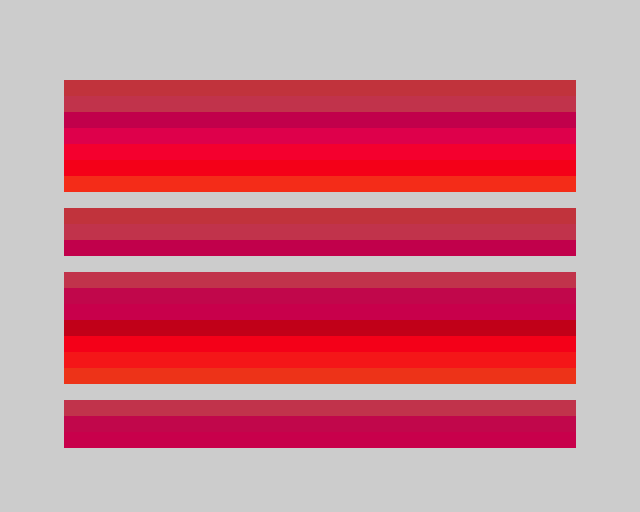

# 7. Automation and CI

JNEXT tests itself by running programs headless, capturing screenshots at
fixed points and comparing them against checked-in references. **The same
machinery works on your program.** Nothing here is a private test hook: every
flag used by JNEXT's own suite is a documented command-line option.

This chapter shows how to build that loop for your own software. The worked
example at the end is lifted from JNEXT's suite in `test/00regression/`, so
you can read the real thing alongside it.

## 7.1 Headless mode

`--headless` runs the emulator with no window and no audio device, as fast as
the host allows:

```console
$ jnext --headless --machine next --load myprog.nex \
      --delayed-screenshot shot.png \
      --delayed-screenshot-frames 150 \
      --delayed-automatic-exit-frames 200
```

That is the whole shape of an automated run: load something, capture at a
known point, exit at a known point.

## 7.2 Determinism

A screenshot is only useful as a test if the same input always produces the
same image. Three things make that true.

**Count frames, not seconds.** `--delayed-screenshot-time` is wall-clock and
therefore depends on how fast the host is. `--delayed-screenshot-frames`
counts *emulated* frames, so a slow CI runner and a fast desktop capture the
identical machine state. The same applies to the exit bound:
`--delayed-automatic-exit-frames` overrides `--delayed-automatic-exit` when
both are given. **Use the frame forms for anything you intend to compare.**

**Pin the clock.** Anything that draws the date or time — the NextZXOS menu,
most obviously — changes between runs. `--rtc` freezes it:

```console
$ jnext --headless --rtc "2026-01-01 00:00:00" ...
```

**Inject keys by frame.** `--delayed-keypress-frames N KEY` presses a key
after exactly *N* emulated frames, and repeats:

```console
$ jnext --headless --load myprog.nex \
      --delayed-keypress-frames 100 space \
      --delayed-keypress-frames 160 enter \
      --delayed-screenshot level2.png --delayed-screenshot-frames 250 \
      --delayed-automatic-exit-frames 300
```

*KEY* is case-insensitive: a single character, or `ENTER`, `RETURN`, `SPACE`,
`UP`, `DOWN`, `LEFT`, `RIGHT`, or a `sym+`/`caps+` compound (`sym+m` is `.`).
Keys are held briefly and released, so leave a gap of at least ~15 frames
between presses.

`--delayed-screenshot-layers` narrows a capture to `ula`, `layer2`, `sprites`
or `tiles`, which makes a failure say *which* layer changed rather than just
"the frame changed". Excluding `ula` also removes the border — the ULA is what
draws it.

## 7.3 Exit codes, and the capture that was never taken

`jnext` exits 0 on success and non-zero on error. One case deserves calling
out, because it is the one that silently ruins a CI pipeline everywhere else:

> **A screenshot that was requested and never taken is an error.** If the
> automatic exit fires before the capture comes due, JNEXT logs an error and
> exits non-zero. It never writes nothing and reports success, and it never
> writes a stale frame in place of the one you asked for.

You can see it directly:

```console
$ jnext --headless --load myprog.nex \
      --delayed-screenshot never.png --delayed-screenshot-frames 5000 \
      --delayed-automatic-exit-frames 100
...
[platform] [error] --delayed-screenshot: NO screenshot was written to
  'never.png' (layers: all); --delayed-automatic-exit fired 4899 frame(s)
  before the capture was due. Exiting non-zero.
$ echo $?
1
```

Without that guarantee, a script whose program hangs early gets no PNG, a zero
exit status, and — if the comparison step is written defensively — a green
build. The contract means a broken run fails loudly at the emulator, before
your test logic ever has to be clever about it.

Give the exit bound headroom over the capture point (the example above uses
`frames + 50`) so a slightly slower boot does not trip this.

## 7.4 A worked example

Three files: a manifest of tests, a runner, and a directory of references.
This mirrors JNEXT's own layout — `test/00regression/regression_tests.conf`,
`test/00regression/scripts/screenshots.sh`, and `test/00regression/img/`.

### The manifest

`tests.conf` — one line per capture. JNEXT's own manifest has exactly these
columns:

```
# name          machine  program      frames  [extra jnext args]
title-screen    next     myprog.nex   150
level-two       next     myprog.nex   250     --delayed-keypress-frames 100 space
```

### The runner

`screentest.sh`:

```bash
#!/usr/bin/env bash
# Screenshot regression runner. Usage:
#   ./screentest.sh            compare against the references
#   ./screentest.sh --update   (re)generate the references
set -euo pipefail

JNEXT=${JNEXT:-jnext}
CONF=tests.conf
REF_DIR=ref
OUT_DIR=out
TOLERANCE=${TOLERANCE:-0}
UPDATE=false
[[ "${1:-}" == "--update" ]] && UPDATE=true

mkdir -p "$REF_DIR" "$OUT_DIR"
fail=0

while read -r name machine program frames extra; do
    [[ -z "$name" || "$name" == \#* ]] && continue

    out="$OUT_DIR/$name.png"
    ref="$REF_DIR/$name-reference.png"
    rm -f "$out"

    # shellcheck disable=SC2086  # extra args are deliberately word-split
    timeout --kill-after=5s 120s \
        "$JNEXT" --headless \
            --machine "$machine" \
            --load "$program" \
            --rtc "2026-01-01 00:00:00" \
            --delayed-screenshot "$out" \
            --delayed-screenshot-frames "$frames" \
            --delayed-automatic-exit-frames $(( frames + 50 )) \
            $extra >/dev/null 2>&1

    printf '  %-20s ' "[$name]"

    if $UPDATE; then
        cp "$out" "$ref"; echo "UPDATED"; continue
    fi

    diff_px=$(compare -metric AE "$out" "$ref" /dev/null 2>&1 || true)
    diff_px=$(awk '{printf "%d", $1+0}' <<< "$diff_px")

    if [[ "$diff_px" -le "$TOLERANCE" ]]; then
        echo "PASS (identical)"
    else
        echo "FAIL (differs, AE=$diff_px)"
        compare "$out" "$ref" "$OUT_DIR/$name-diff.png" 2>/dev/null || true
        fail=$(( fail + 1 ))
    fi
done < "$CONF"

exit $(( fail > 0 ))
```

`compare` is ImageMagick. The awk step exists because `compare -metric AE`
prints its count in scientific notation on some builds; JNEXT's own suite uses
the same guard (`png_diff` in `test/00regression/test-functions.inc`).

If the emulator produced no PNG at all, `compare` fails and the run is counted
as a failure — which is exactly right, and is why the never-silently-missed
contract of §7.3 matters.

### Using it

Capture the references once, from a build you have looked at and believe:

```console
$ ./screentest.sh --update
  [title-screen]       UPDATED
```

Commit `ref/` alongside your source. From then on, every run compares:

```console
$ ./screentest.sh
  [title-screen]       PASS (identical)
$ echo $?
0
```

And when the rendering changes:

```console
$ ./screentest.sh
  [title-screen]       FAIL (differs, AE=2734140000)
$ echo $?
1
```

`out/title-screen-diff.png` is written on failure, with the differing pixels
in red:



**Never regenerate a reference to make a test pass.** Regenerate only when you
have decided the new output is correct, and look at the diff first. JNEXT
treats this as a hard rule for its own suite; the `--update` mode exists for
deliberate changes, not for silencing failures.

### Wiring it into a build

A make target:

```make
# Run the screenshot tests
test: myprog.nex
	./screentest.sh
```

And a GitHub Actions job:

```yaml
jobs:
  screenshots:
    runs-on: ubuntu-latest
    steps:
      - uses: actions/checkout@v4
      - run: sudo apt-get install -y imagemagick
      # ...install jnext, build myprog.nex...
      - run: ./screentest.sh
      - uses: actions/upload-artifact@v4
        if: failure()
        with:
          name: screenshot-diffs
          path: out/
```

Uploading `out/` on failure is worth the two lines: a red build then comes
with the actual picture of what changed.

### One thing CI needs first

Tests that run the `next` machine need a NextZXOS SD-card image. On a fresh
runner there is none, and the first test would race to fetch it. Provision it
once, before any test:

```bash
jnext --headless --sdcard-download-confirm --delayed-automatic-exit 2
```

This is what JNEXT's suite does in
`test/00regression/scripts/01-sdcard-provision.sh`. Tests for the `48k`,
`128k` and `plus3` machines still need the image for their ROMs, so provision
it regardless of which machine you target.

## 7.5 Beyond screenshots

Screenshots are the general-purpose check, but they are not the only one.

- **`--magic-port`** turns a chosen I/O port into a debug channel: your
  program writes to it, JNEXT prints to stderr. With `--magic-port-mode line`
  it buffers until a CR/LF, which makes it a `printf` your test can grep. JNEXT
  uses exactly this in `test/00regression/scripts/magic-port-func.sh`.
- **`--magic-breakpoint`** lets a program halt the emulator from inside itself
  (see chapter 6).
- **`--delayed-snapshot`** saves machine state rather than a picture, at a
  frame you choose — useful when what you want to assert is memory, not
  pixels.
- **`--wav-record`** captures the mixed audio, including headless, so a sound
  change can be regression-tested too.
- **RZX** (`--rzx-record` / `--rzx-play`) replays a whole recorded session
  input-for-input.

The full option list is in [`jnext(1)`](../../USAGE.md).
