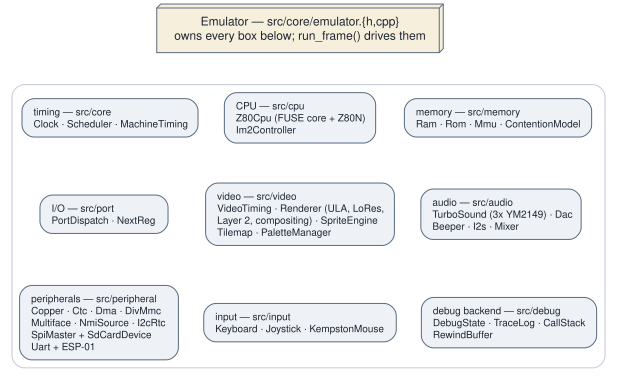

# 2.2 The emulator core

`Emulator` (`src/core/emulator.h`, `src/core/emulator.cpp`) is the whole
machine. It is a single non-copyable, non-movable object that owns every
subsystem **by value**, and it is the only thing a frontend needs to hold.

*What `Emulator` owns, and the seams through which its parts reach one another.*

## What it owns

Everything, and in a specific order. The member declaration order in
`emulator.h` is an initialisation contract — `ram_` and `rom_` must precede
`mmu_`, and `mmu_` and `port_` must precede `cpu_`, because the constructor
initialiser list is `mmu_(ram_, rom_), cpu_(mmu_, port_)`. It is also a
*destruction* contract in one place: the emulated ESP-01's four members carry
a long comment explaining that reverse-order destruction is what guarantees
the worker thread is joined before anything it holds a pointer to dies.

Grouped roughly, the object holds:

- **Timing** — `Clock` (the 28 MHz master counter and CPU divisors),
  `Scheduler` (a min-heap of `(cycle, EventType, callback)`), `MachineTiming`,
  `VideoTiming`.
- **Execution** — `Z80Cpu`, `Im2Controller`, `ContentionModel`.
- **Memory** — `Ram`, `Rom`, `Mmu`.
- **I/O** — `PortDispatch`, `NextReg`.
- **Video** — `PaletteManager`, `Layer2`, `SpriteEngine`, `Tilemap`,
  `Renderer` (which itself owns the `Ula` and `Lores`).
- **Audio** — `Beeper`, `TurboSound`, `Dac`, `I2s`, `Mixer`.
- **Peripherals** — `Copper`, `Ctc`, `Dma`, `SpiMaster`, `I2cController`,
  `I2cRtc`, `Uart`, `DivMmc`, `Multiface`, `NmiSource`, `SdCardDevice`, and
  (behind a pointer, off by default) the emulated ESP-01.
- **Input** — `Keyboard`, `Joystick`, `KempstonMouse`, `Md6ConnectorX2`,
  `MembraneStick`, `IoMode`, `EmuFnKeys`, `PhantomTypist`.
- **Host-facing state that is not machine state** — `DebugState`, `TraceLog`,
  `CallStack`, the tape and snapshot loaders, the video/RZX recorders, the
  rewind ring, the profiler, and the 640 × 256 framebuffer.

Accessors (`mmu()`, `nextreg()`, `copper()`, …) hand out references. That is
how the debugger panels, the unit suites and the frontends all reach
subsystems: there is no separate façade. In particular the design plan's
`DebuggerInterface` class **does not exist** — the Qt debugger talks to
`Emulator` accessors and `DebugState` directly.

## How subsystems reach each other

Four mechanisms, in rough order of how much of the code they account for.

**Direct calls through owned members.** The overwhelming majority.
`run_frame()` calls `ctc_.tick()`, `nmi_source_.tick()`,
`renderer_.render_frame(...)`. There is no message bus; the design's "direct
method calls for performance" rule held.

**Two virtual seams, both declared in `src/cpu/z80_cpu.h`.** `MemoryInterface`
(`read`/`write`) and `IoInterface` (`in`/`out`/`nextreg_opcode_write`) are the
only abstract base classes in the hot path. `Mmu` implements the first,
`PortDispatch` the second, and `Z80Cpu` holds references to both. They exist
so a test can construct a CPU against a stub memory and I/O map without
building an entire machine — which is exactly what the CPU suites do.

**Callbacks registered at `init()` time.** `Emulator::init()` is a very long
function whose bulk is wiring — over two hundred `std::function` registrations.
`PortDispatch::register_handler(mask, value, read, write)` installs the I/O
map by address-line masking (most-specific match wins, and a handler may
`decline_write()` to fall through when its hardware enable gate is off, which
mirrors the VHDL's parallel decodes). `NextReg::set_write_handler(reg, fn)` and
`set_read_handler(reg, fn)` install the NextREG file's per-register behaviour.
Peripherals raise interrupts through `Im2Controller` callbacks the same way.
Every one of these lambdas captures `this`, which is why `init()` must be
re-run after any reconstruction of the object.

**Host-boundary callbacks with no SDL or Qt type.** A small set of
`std::function` members let the core notify a frontend without knowing what a
frontend is: `on_joystick_source_changed`, `on_input_state_restored`, and the
polled `take_hard_reset_request()`. They are empty by default, so headless and
the unit suites simply never fire them.

## Three ways the machine restarts

The distinction matters and is easy to get wrong.

| | What it does | Trigger |
|---|---|---|
| `soft_reset()` | Re-runs `init(config_, preserve_memory=true)`. Clears flip-flop state but keeps RAM, the ROM-in-SRAM window, the boot-ROM overlay and the free-running clock/scheduler. Models tbblue's `RESET_SOFT` / NR 0x02 bit 0. | NR 0x02 bit 0, F4 |
| `reset()` | Re-runs `init(config_)` in place: clears RAM, reloads ROM. **Not** the machine's reset button — `config_mode` is preserved, so it would fall through to 48K BASIC rather than re-booting NextZXOS. It survives as the reinit the file loaders use. | file loaders, test setup |
| Cold boot | `emu.~Emulator(); new (&emu) Emulator();` at the same address, then `init(cfg)` — `emulator_cold_boot()` in `src/platform/emulator_boot.h`. This is what the reset button, F1 and NR 0x02 bit 1 actually do. | frontend, after `take_hard_reset_request()` |

Placement-new at a stable address is deliberate: host code holding `&emu` or
references into it stays valid. It is also why a live worker thread inside the
object would be a silent-corruption hazard rather than a crash, and why the
ESP is owned here rather than by a frontend.

A program's own hard-reset request cannot be serviced from inside
`run_frame()` — you cannot destroy the object you are executing in — so the
emulator only *records* it and the frontend polls
`take_hard_reset_request()` after each frame.
