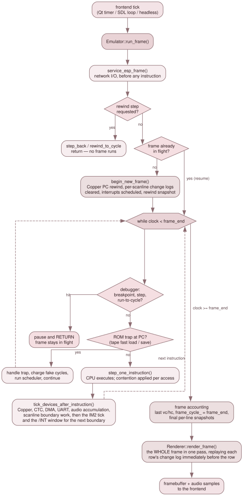

# 2.3 A frame, end to end

Follow one frame from the frontend's tick to the image it gets back. Almost
every surprising thing in the video, debug and rewind code follows from the
order of the steps below.



*One call to `Emulator::run_frame()`.*

## The tick

A frontend calls `Emulator::run_frame()` once per displayed frame — from a
`QTimer` in `QtApp` paced by `frame_period_ms()` and the speed multiplier, from
`SdlApp`'s own paced loop, or from a bare uncapped loop in `HeadlessApp`. When
it returns, the frontend reads the framebuffer with `get_framebuffer()` and
presents it.

## Frame start

`run_frame()` (`src/core/emulator.cpp:7270`) begins with two things that must
happen before anything else: `service_esp_frame()`, which applies the replay
gate and mirrors the ESP worker's state into the hot-path flag; and the rewind
step modes, which return early if the debugger asked to go *backwards*.

Then `frame_end = frame_cycle_ + timing_.master_cycles_per_frame`, and:

```cpp
if (!frame_in_progress_) { begin_new_frame(); frame_in_progress_ = true; }
```

That guard is load-bearing. The debugger pauses by returning from inside the
loop below, so the next call must **resume** the half-executed frame. Re-running
`begin_new_frame()` mid-frame rewinds the Copper's PC (its WAITs then never
match again for the rest of the frame) and re-baselines the per-scanline change
logs the compositor replays — the frame renders flat.

`begin_new_frame()` (`:6917`) does, in order:

1. Take a rewind snapshot, if enabled. This is *why* snapshots are taken at
   frame boundaries: the scheduler queue is empty here, so it does not need
   serialising.
2. Commit the frame-edge NextREG latches — NR 0x03 machine timing, NR 0x05
   50/60 Hz and scandouble — re-deriving every timing surface if the effective
   mode changed.
3. Reset the frame-relative FUSE T-state counter (contention derives `(hc, vc)`
   from it) after folding the outgoing frame into the monotonic base that
   real-time tape playback uses.
4. Schedule the **ULA frame interrupt** at
   `VideoTiming::frame_int_master_cycle_offset()` and the **line interrupt**
   via `reschedule_line_interrupt()`.
5. Begin an RZX playback/record frame; notify the Copper of vsync.
6. Baseline about fifteen per-scanline change logs and snapshots — palette,
   Layer 2 scroll and bank, sprite attributes, ULA scroll/palette-select/Timex
   mode/border, tilemap scroll and fetch state and NR 0x6B, the attribute mux,
   NR 0x15, NR 0x68, NR 0x14, NR 0x4A, NR 0x1A, LoRes.
7. `schedule_frame_events()` — one `SCANLINE` event per line, plus one `VSYNC`.

## The inner loop

```cpp
while (clock_.get() < frame_end) { … }
```

Each iteration:

**Debugger checks first.** Already paused, PC breakpoint hit, step-into, or
run-to-cycle satisfied — any of them `return`s, leaving `frame_in_progress_`
true and `frame_cycle_` untouched.

**Tape ROM traps.** Only while ROM is paged into slot 0: fast-load intercepts
`LD-BYTES` at `0x0556` for TAP and TZX, and `--tape-save` intercepts
`SA-BYTES` at `0x04C2` (with a ROM-identity check — other ROMs execute at that
address too). A trap fires, charges a small cycle cost and `continue`s.

**`step_one_instruction()`** (`:7594`) — the one shared per-instruction body.
It picks exactly one of four things to do:

- If the DMA genuinely holds the bus, run a burst of up to 16 bytes and charge
  the cycles to the CPU.
- If the CPU is *parked* (a load-only NEX with header PC = 0), advance a
  NOP-sized step and execute nothing.
- If a NEX boot hold is counting down, likewise.
- Otherwise execute one Z80 instruction.

It also records the trace entry, ticks `Im2Controller`, polls the /INT line in
both IM2 and pulse modes, counts RZX instructions, ticks real-time tape, and
advances the master clock. It is shared verbatim with
`execute_single_instruction()`: the debugger's single-step used to keep its own
copy of this cluster, had silently lost `im2_.tick()` and both /INT polls, and
so delivered no interrupts while stepping.

**Data-breakpoint check**, which returns early if one fired.

**`tick_devices_after_instruction(master_cycles)`** (`:8045`) — the shared
post-instruction cluster, in this order: the Copper stepped at 28 MHz
granularity across the window the instruction consumed; the deferred CPU
NextREG writes drained (so a same-register collision ends with the CPU's
value, as in the VHDL); the NR 0x07 and NR 0x08 bit-6 commit edges; CTC, UART
and MD6 ticks; the I/O-mode injectors; the NMI source pipeline and the /NMI
falling edge; PSG ticking and audio integration; and finally
`scheduler_.run_until(clock_.get())`.

That last call is where the scheduled events actually fire — so **`on_scanline`
and the interrupt callbacks run at instruction boundaries**, at the first
instruction that carries the clock past their timestamp.

`Emulator::on_scanline(line)` (`:9092`) renders nothing. It snapshots the
previous row's fallback colour, ULA-enable, stencil/blend mode, transparent
RGB, ULA clip, LoRes registers and border; latches the current row's tilemap
scroll and fetch state; and re-tags every per-scanline change log with the new
framebuffer row. Raw scanline is converted to framebuffer row by subtracting
`video_timing_.vblank_top()`, which is per-machine.

## Frame end

Out of the loop: the end-of-frame raster position is saved, `frame_cycle_`
advances to `frame_end`, `frame_in_progress_` clears, and any boot hold counts
down. The last visible row (255) gets its snapshots, since no `on_scanline`
will fire for it.

Then the picture is made — **once, here**:

```cpp
renderer_.render_frame(framebuffer_.data(), mmu_, ram_, palette_,
                       layer2_, &sprites_, &tilemap_);
```

Rendering is skipped in replay mode, and may be skipped when the frontend has
hinted that nobody will consume this frame (`set_render_enabled(false)` — the
Qt GUI at 400 % emulates far more frames than it presents). The hint is
overridden when video recording or the debugger is active, and headless never
sets it. A skipped frame still runs `run_sprite_side_effects()` and
`advance_flash()`, because sprite collision and line-budget overtime are
software-visible through port 0x303B and must be computed every emulated frame.

Finally: the video recorder captures the frame, RZX recording closes it, and
the phantom typist and keyboard auto-type/scan state machines tick once.

## What the frontend gets

A complete 640 × 256 ARGB8888 image. Nothing incremental, nothing per-scanline
— which is the reason the per-scanline change-log machinery in
[2.4 The video pipeline](04-the-video-pipeline.md) has to exist.
