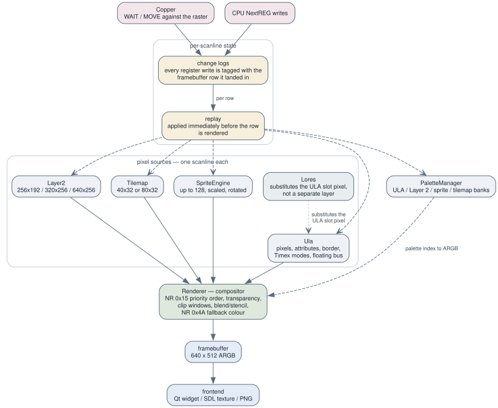

# 2.4 The video pipeline

The video code is shaped by one decision: **the picture is composited once, at
the end of the frame**, not scanline by scanline as the CPU runs. Everything
below follows from that. Per-layer detail — addressing modes, palettes, sprite
attributes, tilemap fetch — belongs to
[3.3 Video](../03-subsystems/03-video.md); this page is about how the pieces
fit together.

*Layers, per-scanline replay, and the compositor.*

## Who renders what

`Renderer` (`src/video/renderer.h`, `renderer.cpp`) is the compositor. It owns
the `Ula` and `Lores` directly; `Layer2`, `SpriteEngine`, `Tilemap` and
`PaletteManager` are owned by `Emulator` and passed in.

`Renderer::render_frame()` walks rows 0..255 and calls `render_row()` for each.
`render_row()` clears the per-layer 640-cell ARGB line buffers to transparent,
then asks each layer to paint its row:

1. **Layer 2** — only when enabled, and only inside the display area unless it
   is in a wide (320 × 256 / 640 × 256) mode. It also fills a per-pixel
   priority flag from the palette's priority bit.
2. **Tilemap** — full framebuffer width, with per-pixel "below ULA" and
   "text mode" flags for the merge stage.
3. **Sprites** — gated on the per-line-replayed NR 0x15 bit 0, not the
   engine's live flag.
4. **ULA** — emits native 640 including the border, and marks which cells are
   border for the compositor's priority exceptions.

Then three ULA-slot passes run in VHDL order: `apply_lores()` substitutes the
LoRes pixel into the ULA slot (LoRes is **not** a layer — it replaces the ULA
pixel before palette lookup), NR 0x68 bit 7 blanks the whole ULA output if the
row's snapshot says it is disabled, and `apply_ula_clip()` masks the NR 0x1A
clip window.

Finally `composite_scanline()` dispatches on the row's NR 0x15 layer priority
into a `composite_scanline_mode<PRIO>` template — eight specialisations, so
the per-pixel `switch` folds away. Modes 0-5 are the six orderings in the
`LayerPriority` enum; 6 and 7 are blending. Transparency is decided against
the row's NR 0x14 reference colour, and anything still transparent falls
through to the row's NR 0x4A fallback colour.

## The change-log and replay mechanism

Because compositing happens after the CPU has finished the frame, the live
value of any register at that moment is the frame's **last** value. A demo
that changes the palette on every scanline would render one flat colour. Two
mechanisms fix that, and it is worth telling them apart.

**Per-line snapshot arrays.** For state that is read once per row, an array of
256 entries is filled as the frame runs: `Emulator::on_scanline()` calls
`renderer_.snapshot_fallback_for_line(row)` and its siblings, and
`render_row()` reads `fallback_per_line_[row]`. This covers NR 0x4A, the ULA
enable, NR 0x68 stencil and blend, NR 0x14, the NR 0x1A clip, the LoRes
registers, the ULA border, and the tilemap scroll and fetch bases.

**Change logs with rewind/replay.** For state whose *object* must be
time-travelled — a whole palette, the sprite attribute table, the attribute
plane — each owning class keeps a baseline plus an ordered log of
`(line, change)` entries. The lifecycle is fixed and identical everywhere:

| Phase | Call | When |
|---|---|---|
| Baseline | `start_frame()` | `Emulator::begin_new_frame()` |
| Tag | `set_current_line(fb_row)` | `Emulator::on_scanline()` |
| Record | the class's own NextREG/port write handler appends to the log *and* mutates live state | during emulation |
| Rewind | `rewind_to_baseline()` | top of `Renderer::render_frame()` |
| Replay | `apply_changes_for_line(row)` | before each `render_row(row)` |
| Drain | `flush_remaining_changes()` | end of `render_frame()` |

The classes carrying one are `PaletteManager`, `Layer2` (scroll and bank),
`SpriteEngine` (attributes), `Ula` (Timex screen mode, scroll, active-palette
select), `Tilemap` (NR 0x6B), `Mmu`'s `AttributeMux` (Nirvana-class mid-frame
attribute writes), and `Renderer` itself (NR 0x15 priority and sprite enable).

Three details bite newcomers:

- **The tag is a framebuffer row, not a raw scanline.** `on_scanline` converts
  with `line - video_timing_.vblank_top()`, which is per-machine (32 for the
  Next family at 50 Hz, 48 for Pentagon timing, 8 for 60 Hz). Writes before
  the visible area coalesce to row 0; writes after it stay out of range and
  are picked up by the drain, becoming next frame's baseline.
- **Skipping the drain loses vblank writes forever.** `rewind_to_baseline()`
  undoes the live mutation the writer performed, and the per-row replay only
  covers visible rows — so a setup sequence that completes during vblank
  vanishes unless flushed.
- **The bank selectors must come from the replayed state too.** The Layer 2,
  sprite and tilemap palette-bank bits live in the `Ula`'s replayed
  palette-select log, not in `PaletteManager`'s live member; reading the live
  one collapses a two-bank frame onto whichever bank the frame ended in.

## Two things that are not the live path

`--delayed-screenshot-layers` sets `Renderer::set_layer_mask()`, which forces
masked-out layers transparent **at the compositor input** — exactly what the
hardware does when the layer's enable bit is clear, so priority, blending and
the fallback colour all still behave. It is host-side debug state and is
deliberately not reset, saved or loaded.

`run_sprite_side_effects()` is a sprites-only pass with the identical change-log
lifecycle, run when `render_frame()` was skipped. Sprite collision and the
per-line budget overtime flag are readable by software through port 0x303B, so
they must be computed on every emulated frame whether or not anyone looks at
the pixels.

The debugger's per-layer views composite through the same `render_row()` and
`apply_*` helpers rather than a second, drifting copy of the compositor.
