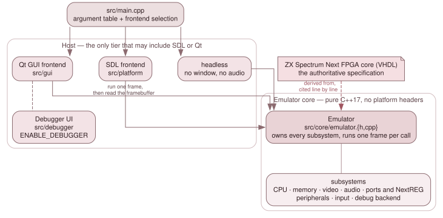

# 2. Architecture

JNEXT is one large object surrounded by three interchangeable shells. The
object is `Emulator`; the shells are the Qt GUI, the SDL-only frontend and the
headless runner. Everything in this chapter is about that arrangement: how a
process starts and picks a shell, what the core owns and how its parts reach
each other, what happens during one frame, how pixels get to the framebuffer,
and how the whole machine is serialised so it can be rewound.

*The frontends, the emulator core and its subsystems. Only the platform, GUI
and debugger layers see SDL or Qt.*

Read [2.3 A frame, end to end](03-a-frame-end-to-end.md) first if you only
read one page. It is the spine that the rest of the codebase hangs off, and
almost every surprising thing in the video and debug code follows from the
order of operations there.

## What is in this chapter

- [2.1 Startup and the frontends](01-startup-and-the-frontends.md) — argument
  parsing, SD-card resolution, and which of the three shells runs.
- [2.2 The emulator core](02-the-emulator-core.md) — what `Emulator` owns, and
  how subsystems are wired to each other.
- [2.3 A frame, end to end](03-a-frame-end-to-end.md) — one frame followed from
  the frontend's tick to the framebuffer it gets back.
- [2.4 The video pipeline](04-the-video-pipeline.md) — the layers, the
  compositor, and the per-scanline change-log replay.
- [2.5 Save state, rewind and determinism](05-save-state-and-rewind.md) — state
  serialisation, the rewind ring, and what makes an automated run reproducible.
