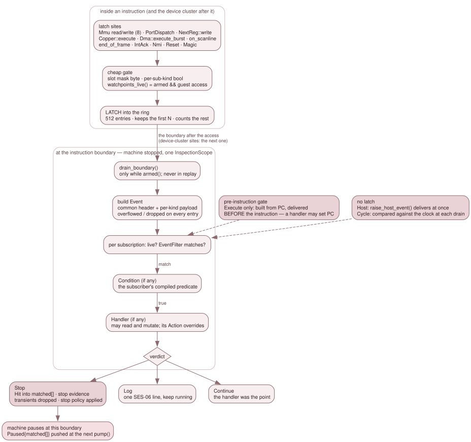

# 3.9.2 Event delivery and mutation

Breakpoints, watchpoints, script rules, DeZog's temporary breakpoints and the
recorder's frame hook are all one thing in the backend: a **subscription** to
an **event**. This page describes how an event gets from the place it happens
to the subscriber, and what a subscriber, or any other frontend, may write.

The whole pipeline fits in one sentence:

> A site inside an instruction **latches**; a boundary with the machine stopped
> **delivers**.

No subscriber code runs inside `Mmu::write`, the CPU or a device tick. That is
what makes "an inspection read has no side effects" a property of the code
rather than of the caller's discipline.



*Above the boundary a site only latches. Below it, with the machine stopped,
each latched entry becomes an `Event` and runs through every live
subscription's filter, condition and handler.*

## Subscriptions

A `Subscription` (`events.h`) is:

| Field | Meaning |
|---|---|
| `kind` | one of the fourteen `EventKind`s (below) |
| `filter` | an `EventFilter`: the cheap, hot-path-testable half — an address or Copper-PC range, an optional page qualifier, a page set, a port mask and value, a NextREG set, a source, a frame, a scanline, a cycle, a reset kind, a sub-kind, a host-event name |
| `access` | for `Mem` and `Port`, which directions to watch |
| `condition` | optional `Condition`, `bool(const Event&, const Debugger&)`: a predicate the subscriber compiled. It may read the whole inspection surface and nothing else |
| `handler` | optional `Handler`, `Action(const Event&, Debugger&)`: the subscriber's body. It may read and mutate, and its return value overrides `action` |
| `once` | disable after the first accepted firing (filter matched and condition passed) |
| `transient` | exempt from the master switch, removed at the next stop, hidden from user lists, unlimited in number |
| `action` | the static verdict: `Stop`, `Log` or `Continue` |
| `enabled` | the subscription's own flag |

The owner is the `ClientId` that called `subscribe()`. `subscriptions()`
reports a `SubscriptionInfo` per entry, which says *whether* a condition and a
handler are present but never hands the closures out: they capture the
subscriber's interpreter state.

A subscription is **live** when `enabled && (transient || master) &&
client_enabled(owner)`. `EventTable` (`src/debug/event_table.*`) caches that
as one bool per entry and recomputes it whenever anything changes, never per
instruction. `transient` is exempt from the master switch so that Step Over and
Run to Here keep working on a machine whose breakpoints the user has all
suspended.

A live subscription is **delivered only while the machine is armed**
([3.9.4](09-4-execution-control-and-rewind.md)). An unarmed machine skips the
boundary drain altogether. That is why a GUI breakpoint, owned by a non-arming
observer client, fires only while something else arms the machine.

## The fourteen kinds, and when each is delivered

`Execute` is the only kind delivered **before** its instruction runs. The
pre-instruction gate in `run_frame()` builds the event from PC and delivers it
at once, which is what lets a handler write PC and redirect execution. Every
other kind is delivered at an instruction boundary:

| Kind | Latched at | Delivered | Late by |
|---|---|---|---|
| `Execute` | — (the pre-instruction gate) | before the instruction | — |
| `Mem` | one of the eight `Mmu` read/write sites | the raising instruction's own boundary | nothing |
| `Port` | `PortDispatch`, after the dispatch, so a read carries the value the guest got | same | nothing |
| `Dma` (`Start`, `Byte`, `End`) | `Dma::execute_burst()` | the boundary of the slot the burst ran in | nothing |
| `NextRegWrite`, CPU writer | `NextReg::write` | the next boundary | ≤1 instruction |
| `NextRegWrite`, Copper writer, and `Copper` (`Move`, `Wait`, `Halt`) | `Copper::execute()` | the next boundary | ≤1 instruction |
| `Scanline` | `on_scanline`, with the line's own boundary cycle | the next boundary | ≤1 instruction |
| `Frame` | `end_of_frame()` | at that frame edge, before its `tick_auto_type()` | nothing |
| `IntAck`, `Nmi` | the CPU's accept seams | the boundary | nothing |
| `Reset` | `soft_reset()`, or the backend after a hard reconstruct | the next drain | — |
| `Magic` | the magic-opcode hook | the boundary | nothing |
| `Cycle` | — (compared with the master clock at each drain while one is armed) | the first boundary with `master_cycle >= cycle` | — |
| `Host` | — (`raise_host_event()` delivers it synchronously) | at the call | — |

The "≤1 instruction" entries are all one fact. The boundary drain runs
**before** `tick_devices_after_instruction()`, and that is where the Copper and
the deferred CPU NextREG queue run. Moving the drain behind the device cluster
would change the GH #265 early-return contract for every data breakpoint, so
the delay is accepted and stated instead. A CPU `NextRegWrite`'s payload still
names the writer's PC.

DMA is *not* late. A burst runs from `dma_.execute_burst()` inside
`step_one_instruction()`, before that slot's drain, so a `Dma` event, and the
`Mem` and `Port` events of its own bytes, arrive at that slot's boundary like
the CPU's own accesses. A slot is DMA or CPU, never both. A DMA NextREG write is
late, because it goes through the same deferred queue as a CPU one.

A Copper MOVE is **one** latch entry. The drain fans it out to both
`Copper{Move}` and `NextRegWrite{source=Copper}` subscriptions, and the
`NextReg::write` hook skips a Copper write so the ring never holds two.

**`cycle` is slot-granular for a latched kind.** The master clock ticks once per
instruction slot, so every event one instruction raises carries that slot's
start cycle. Two `Mem{Write}`s from one `LD (nn),HL` are indistinguishable by
`cycle`. `Scanline` is exact, because the site hands the latch the line's own
boundary cycle. Its `cvc` comes from the line number rather than from a cycle,
because `cvc` steps at raw `hc == hc_ula_zero_raw_hc()` and not at raw `hc` 0
(GH #257).

## The delivery

`Debugger::Impl::drain_boundary()` (`debugger_events.cpp`) walks the ring in
order. For each entry it builds an `Event` (`build_event()`), then for each
subscription:

1. skips it unless it is live and its `EventFilter` matches;
2. stamps the event with the subscription's id, owner and the next delivery
   sequence number (the cursor `events_fired_since()` takes);
3. runs the `Condition`, if any, and skips the subscription if it is false;
4. runs the `Handler`, if any, whose `Action` replaces the static one;
5. records the delivery, and spends a `once` subscription through
   `set_enabled()` so the masks follow;
6. acts on the verdict: `Stop` records a `Hit` and the stop evidence, `Log` emits
   one SES-06 line, `Continue` does nothing more.

Then it clears the ring. If any verdict was `Stop`, it drops the transient
subscriptions, applies the stop policy, and the hot loop pauses at this
boundary. The `Paused` push reaches listeners at the next `pump()`, carrying
`PausedInfo::matched`: every subscription that matched, transient ones
included. Choosing between them (DZRP reports "temporary breakpoint" before
"breakpoint") is the frontend's policy over that list.

**The whole delivery runs under one `DebugState::InspectionScope`.** A
delivery happens inside `run_frame()`'s `GuestExecutionScope`, where watchpoints
are live, so a handler that read or poked a watched address would latch a watch
on itself. `poke(MemSpace::cpu())` takes a scope of its own as well, so the
property holds for any caller on any path.

**Nothing is delivered during a rewind's replay.** `rewind_to_cycle()` replays
forward with the gate live, and an `Execute` subscription inside the replayed
span would stop it short. So the gate and the drain both return at once while
`Emulator::replay_mode()` is true, and the drain still empties the ring.

**A handler may subscribe and unsubscribe.** The delivery walks the table by
index, so a subscription added during a delivery is not visited for that event,
and an unsubscribe only marks the row; the table is compacted once the
outermost delivery ends. `raise_host_event()` may be called from a handler and
nests.

## The ring is bounded, and says so

The ring holds 512 entries. The bound comes from the Copper, which executes once
per master cycle, so one long contended instruction can carry hundreds of Copper
latches. On overflow the ring keeps the first entries in order, counts the rest,
and marks every delivery of that boundary `overflowed` with the `dropped` count:
a subscriber whose own event survived still has to know the boundary was lossy.
This is tested, not assumed: `EventTable::shrink_ring_for_test()` shrinks the
ring and the `EVT-OVF-*` rows drive a Copper MOVE burst over it.

## What the hot path pays

**The memory sites test one byte.** Each of the eight `Mmu` sites opens with
`debug_state_ && watchpoints_live() && rd_watch_armed(addr)` (or
`wr_watch_armed`). The third term is a per-8-KB-slot mask byte: one load, a
shift and a test. Everything behind it — the legacy watchpoint scan, the
precise range match and the ring append — is out of line in `Mmu::watch_read_`
and `Mmu::watch_write_`. A port watch contributes to a separate
`port_watch_armed()` flag and to no memory slot.

The mask bytes live on `BreakpointSet`, because they have two contributors: that
class's own legacy watchpoints and the event table's `Mem` subscriptions.
`BreakpointSet::rebuild_live_()`, which every mutator already calls, recomputes
the legacy half, so there is no notification to forget.
`Debugger::Impl::gates_changed()` publishes the event-table half.

**The Copper and the DMA carry plain bools.** `Copper::execute` runs once per
master cycle and is 8-12 % of the `copper-demo` and `beast` profiles, and
`Dma::execute_burst` runs once per byte, so neither reads the table at its site.
`gates_changed()` sets one bool **per sub-kind** through
`Copper::set_events_armed()` and `Dma::set_events_armed()`. A
`Copper{Halt}`-only subscriber does not latch a `Move` per master cycle, which
matters because ring space is observable. The rarer kinds (`Frame`,
`IntAck`, `Nmi`, `Reset`, `Magic`) test the table's kind bit at their site.

**Every user pays one store.** Each instruction stores its pre-execution PC
(`debug_slot_pc_ = pc_pre_exec`), which a latch cannot recover once
`cpu_.execute()` has moved on. `make bench-hotlatch` (`test/bench/ab-hotlatch.sh`)
runs an interleaved A/B over the `JNEXT_BENCH_WATCH` fixture in
`headless_app.cpp`, prints each variant's own hit count so a run shows whether
the watch fired, and bounds that cost below the run-to-run spread.

## Why the machine stopped

`state().pause_reason` (`PauseReason`) needs evidence that survives the stop.
`DebugState::pause()` clears the step mode, and the hot loop consumes the
data-breakpoint latch as it pauses. So there are three records: the backend's
armed-verb reason, `DebugState::note_watch_stop()` and `note_magic_stop()` for
the two stops the machine causes, and the drain's own latch for a subscription
stop. `Debugger::state()` reads them in this order:

1. `Corrupt`: an unacknowledged failed restore, which refuses every resume;
2. the armed verb: `User`, `Step`, or `RunTo` at its target;
3. the subscription stop;
4. `Magic`;
5. a legacy watchpoint (`Watch`);
6. a legacy PC breakpoint at PC (`Breakpoint`);
7. `User` with no owner: paused, and nothing explains it.

A subscription stop maps to `Breakpoint` for `Execute`, to `Watch` for `Mem` and
`Port`, to `Magic` for `Magic`, and to `Script` for every other kind. `Script`
therefore means "a subscription of another kind stopped the machine", whoever
owns it. A script's `stop` in an `execute` rule reports `Breakpoint`.
`PauseReason::text` is never filled: a `Handler` returns an `Action` and has no
channel for a message.

`Magic` and `Corrupt` carry no owner (`by == CLIENT_NONE`): neither is any
client's verb, so no client's detach may release them
([3.9.3](09-3-sessions-the-pump-and-reconstruct.md)).

**That evidence must not outlive the machine it describes.** A restore or a
reset replaces the machine, so a reason left from before it names an
instruction that, on the machine now in memory, never ran.
`Emulator::debug_after_machine_transition_()` is the one place that reconciles
it. `load_state()` calls it (every restore routes through `load_state()`:
`load_state_bytes`, `step_back`, `rewind_to_frame`, `run_back_to_cycle`, a
`.jns` load's round trip), and so does the end of `init()`, which is
`soft_reset()`. It clears `DebugState`'s stop records, the pending stop, the
latch ring, and — through `DebugState::set_machine_replaced_hook()` — the
backend's armed verb and delivery state. It then re-derives the eight slot pages
the masks are computed from.

The ring is kept for a soft reset and discarded for a restore: `soft_reset()`
latches its own `Reset` event before calling `init()`, so the event carries the
pre-reset cycle. And the reconciliation runs from a scope guard at the top of
`load_state()`, not as its last statement: `load_state()` has many early returns
and loads the clock first, so a torn restore is a machine transition too.

## Mutation

Reads have no side effects. Writes are a separate capability, open to every
frontend and to script handlers, under one contract.

| Verb | Lands |
|---|---|
| `set_register` | one register; `PC` also clears `halted` |
| `poke(MemSpace::cpu(), …)` | through `Mmu::write` on the live map: overlays honoured (DivMMC, Multiface, Layer 2 write-over, alternate-ROM write-over, config-mode SRAM), ROM ignored, per-scanline change logs and the attribute mux updated |
| `poke(MemSpace::page(p), …)` | the physical page, whatever is mapped over it |
| `poke(MemSpace::rom(i), …)` | refused: `RefusedReadOnly` |
| `set_mmu_slot` | through the NR 0x50+slot handler, so page 0xFF on slot 0 or 1 re-engages legacy ROM paging as the guest's `NEXTREG` does |
| `nextreg_write` | the register's own write handler, synchronously, side effects included |
| `port_out` | dispatched like the guest's `OUT` |
| `set_sprite_attr_raw`, `write_pattern_ram`, `set_palette`, `set_border`, `set_audio_mute_mask` | through the engine's own setters, not as port traffic |

**When a write lands.** Always at a delivery point, never inside a hot-path
hook. From a frontend command the machine is paused at an instruction boundary.
From an `Execute` handler the instruction at PC sees the write: setting PC
redirects before anything runs (and skips a breakpoint at the new PC for that
one instruction, because the gate already ran). From any other kind the raising
instruction has completed and the write lands before the next one. A later
handler of the same delivery sees the write.

**`poke(Cpu)` reports what landed.** Every byte goes through
`Mmu::write_landed()`, which is `Mmu::write` returning its routing decision. A
byte an overlay takes counts; a byte dropped on ROM does not. The result is `Ok`
only when every byte landed, and `RefusedReadOnly` with the landed count
otherwise. Nothing is refused up front: a range across ROM and RAM still lands
its RAM bytes, as the CPU's own write would.

**The backend logs every write.** Each successful mutation, from any client,
emits one line on the `debugger` channel and to every listener:

```
MUTATE <what> <old> -> <new> by <client>
```

A block write cannot express one old and new value, so it uses a range form,
for example `MUTATE mem cpu:0x8100 4 bytes by 3`. A partly read-only `poke`
says how many bytes landed. A CI transcript therefore shows what a script
changed, and a script's log shows what a GUI or a remote client changed.

**A debugger write is not an event.** It fires no watch, no `NextRegWrite` and
no `Port` event. That rests on `guest_access()` being false while the write
runs. A command from `pump()` runs outside `run_frame()`. A handler runs inside
it, but under the delivery's `InspectionScope`. `NextReg::write` is the one hook
for every NextREG writer, and it is gated on `guest_access()` as well, so a
panel's or a script's `nextreg_write` fires nothing on itself.

**`Mmu::write` latches before the overlay arbitration.** The watch test is at
the top of the function, before the Multiface, DivMMC, Layer 2, alternate-ROM
and config-mode cascade and before the read-only drop. A guest write into ROM
that lands nowhere still raises `Mem{Write}`, with `prev == value`. That is what
a user watching "who writes here" wants.

**Under RZX, writes are refused.** A recording cannot carry a write, and a
playback would diverge from it, so a mutation answers `RefusedRzx` while an RZX
is recording or playing. The Qt Memory and NextREG panels show the refusal by
leaving the value as it was.

**Rewind.** A write is machine state, so the next frame-boundary snapshot
carries it. Interpreter state — script variables, `once` flags — is not in a
snapshot, and nothing is delivered during a replay. A rewind to a point inside
the frame a write happened in therefore replays that frame without the write,
and nothing refuses such a rewind: `step_back` and `rewind_to_frame` check only
the RZX state and the ring. The script engine logs a warning the first time a
script mutates a machine with the rewind buffer on.

## Tests

`debugger_backend_test`'s `EVT-*` rows pin the event table: one family per
kind, the filters, delivery timing, `once` and transients, the master and
per-client switches, overflow (`EVT-OVF-*`), and re-entrancy. The `INS-*` write
rows pin the mutation contract, including the `MUTATE` lines and the RZX
refusals. `script_events_test`'s `SCRIPT-EV-*` rows drive the same machinery from
the DSL on real 48K and Next machines.
