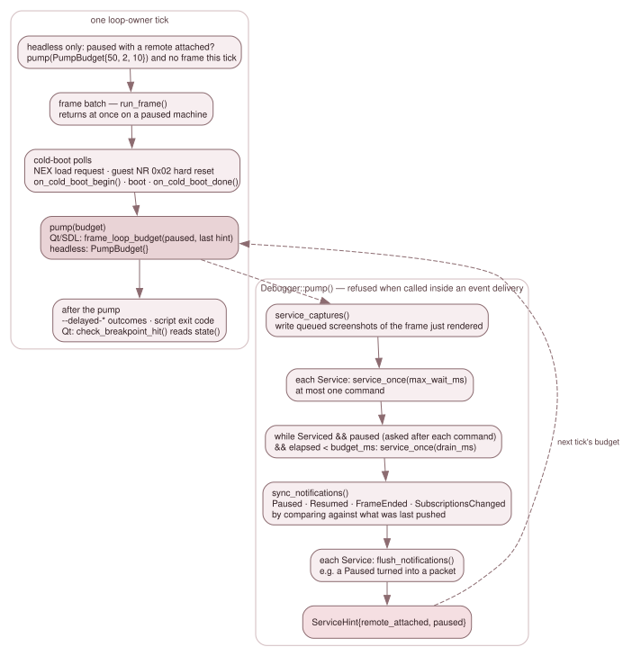
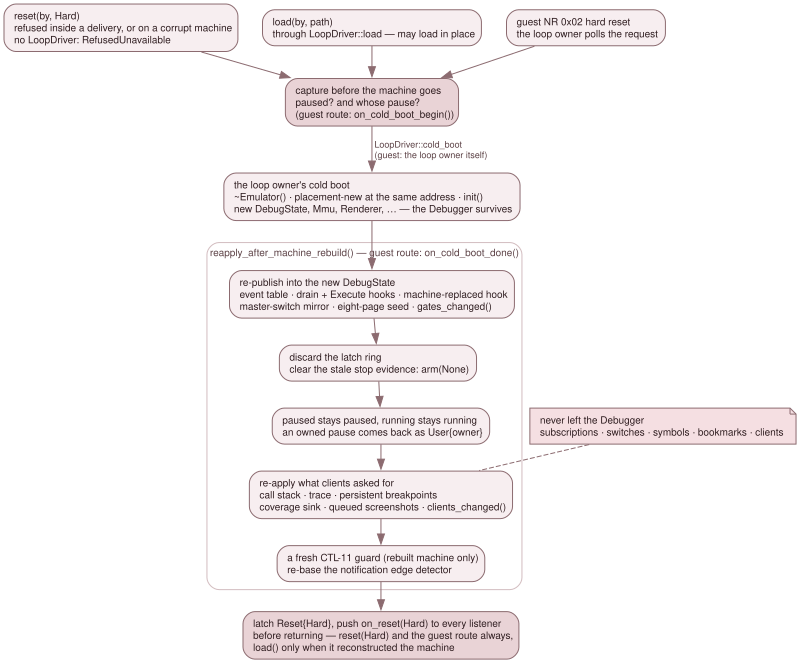

# 3.9.3 Sessions, the pump and the reconstruct contract

The backend does not own a thread and does not own the frame loop. A **loop
owner** — `QtApp`'s timer tick, the SDL loop, `HeadlessApp::run()` — owns both.
This page is the seam between them: how a frontend becomes a client, how the
backend talks back to it, when its commands run, and how everything a client set
survives a hard reset that rebuilds the machine under it.

## Clients

`attach(ClientInfo)` returns a `ClientId`. A `ClientInfo` carries a display
`name`, a `ClientKind` and the `observer` flag:

| `ClientKind` | Who attaches it |
|---|---|
| `Gui` | the Qt debugger: one observer client for the life of the GUI, one arming client while the debugger window is open |
| `Dzrp`, `Zrcp`, `GdbRsp` | each protocol server, one client per connected peer session |
| `Script` | the script engine, the recorder, and `ScriptHost`'s observer listener |
| `Test` | the test harnesses |

Every verb that mutates or transitions takes the client's id, and every
transition is broadcast with it. The client table holds each client's listener,
its `live_raster` request, its per-client event switch and its bookmarks. It
lives on `Debugger::Impl`, outside the `Emulator`, which is what lets all of it
survive a machine rebuild. Ids are handed out in attach order and never reused.

**Attaching arms the machine; an observer does not.** `attached()` is "at least
one *arming* client is attached". An observer (`ClientInfo::observer`) is a
client in every other respect — it owns subscriptions, has a listener, issues
verbs, keeps bookmarks — but counts toward no arm bit. Its subscriptions
therefore fire only while something else arms the machine. The Qt GUI's
breakpoints belong to an observer: they outlive the debugger window, fire with
the window shut when `--persistent-breakpoints` or a remote client arms the
machine, and cost a closed window nothing.

`DebugState` keeps one bit per arming contributor and ORs them in
`refresh_gates_()`:

- `clients_attached_`: published by `clients_changed()` from the client table;
- `persistent_`: `--persistent-breakpoints`;
- `replay_armed_`: set by `DebugState::ReplayArmScope` for the length of a
  rewind's replay loop;
- `magic_hold_`: set when a magic breakpoint fires, released by the resume that
  ends its stop.

Each contributor has its own bit because a shared one would let one owner's
release clear another's arm. `SuspendScope` clears all of them. Outside the two
holds, `armed() == attached() || persistent_breakpoints()`.

`attached` and `live_raster` are two different gates. `attached` gates the
step machinery: Step Out's per-instruction test and the `STEP_BACK` /
`RUN_BACK_TO_CYCLE` step modes. `live_raster` — per client, ORed — gates only
the render-every-frame hint and the per-instruction `VideoTiming::advance()`
walk. `refresh_gates_()` precomputes both into `DebugState` bits, so each
hot-path reader pays one bool load, and `Debugger::attached()` and
`live_raster()` read the same bits back.

## Detaching, and who owns a pause

`detach(cid)` removes the client's subscriptions, its bookmarks and every other
record keyed by its id (its event switch, its unflushed capture failures).
What happens to a pause depends on whose it is.

- **The pause is this client's** — its `pause()`, its step, or a `Stop` on one
  of its subscriptions. While another *arming* client remains, the pause passes
  to it and the machine stays paused; `pause_reason.by` is rewritten and nothing
  is pushed. The heir is the client the machine was paused by before the leaver
  single-stepped it, if that client is still attached (`step_into()` on a paused
  machine keeps it in `Impl::pause_origin`), otherwise the earliest-attached
  remaining arming client. Only the last arming client out releases the pause,
  which is what stops a crashed DeZog from leaving the machine hung.
- **The pause is another client's.** It survives.
- **The pause is unowned.** `PauseReason::Magic` and `PauseReason::Corrupt`
  carry `by == CLIENT_NONE`, and no detach ever releases them.

An observer neither inherits a pause nor holds one back from release. The same
rule applies to a pause captured for a guest cold boot that has not completed
yet. The detach is logged on the `debugger` channel, for example
`DETACH client 1 (released its pause)`.

## Listeners

`set_listener(cid, Listener*)` installs a client's push interface. `Listener`
has seven pure virtual methods; a notification silently ignored by a default
empty override is the failure the design rules out.

| Push | When |
|---|---|
| `on_paused(PausedInfo)` | the machine stopped: `by`, `reason`, `cycle`, `pc`, `matched[]` |
| `on_resumed(by)` | it started again |
| `on_reset(kind)` | a reset; a hard one before the verb that caused it returns |
| `on_frame_ended(frame)` | frames ended since the last pump |
| `on_subscriptions_changed(kinds)` | the subscription model changed; carries the live kinds |
| `on_exit_requested(code)` | a `Stop` under `StopPolicy::ExitNonZero` |
| `on_log(level, text)` | every SES-06 line, the `MUTATE` lines included |

Pushes are synchronous, on the emulation thread, and must do no UI work. The
Qt listener records and acts on its own tick.

`Paused`, `Resumed`, `FrameEnded` and `SubscriptionsChanged` are **not pushed at
each transition site**. There are many ways into and out of a pause, and a push
at each is the two-lists failure. Instead `sync_notifications()` compares:

- `paused()`;
- `DebugState::resume_generation()`, so a stop-resume-stop between two pumps
  is two pushes rather than none;
- the frame's start cycle (`Emulator::current_frame_cycle()`), because the first
  frame run again after a rewind ends without the frame counter moving;
- `EventTable::revision()`

against what it last pushed, and `pump()` calls it. So a stop in this tick's
frames is notified in this tick's pump. `Reset` is the exception and is pushed
synchronously by the verb, so that an adapter whose client is blocked in a `run`
can complete the reply.

## The pump

*One loop-owner tick, and what `pump()` does inside it.*

`pump(PumpBudget)` is the loop owner's once-per-tick service call, made after
the tick's frames and after the cold-boot polls. In order, it:

1. writes the screenshots queued for the frame just rendered, before any
   command of this pump can change the machine;
2. drains the registered `Service`s;
3. syncs the notifications;
4. calls each service's `flush_notifications()`;
5. returns a `ServiceHint{remote_attached, paused}`, which the loop owner uses
   to pick the next tick's budget.

The drain has two arms. While the machine **runs**, each service is asked for at
most one command whatever the budget says, because the loop owner needs its
thread back for the next frame. While it is **paused**, the service keeps
answering while the peer keeps talking, bounded by `budget_ms`. A DeZog ZRCP
step is about fifteen sequential round trips, which at one per tick would take
300 ms. "Paused" is asked after each command, not at entry: a `run` in the chain
hands the loop owner its frames back at once, and a `pause` arriving while
running lets the reads behind it be answered in the same pump. `budget_ms == 0`
therefore means *one* command, not "unbounded".

`DebugServers` (`src/platform/debug_servers.*`) holds the budgets, so all three
loop owners share one statement of them:

| Loop owner | Running | Paused, with a remote attached last tick |
|---|---|---|
| Qt, SDL | `PumpBudget{}`: one command | `PumpBudget{0, 2, 10}`: drain a queued chain, never block the tick |
| headless | `PumpBudget{}` | `PumpBudget{50, 2, 10}`, and no frame that tick |

The headless branch turns what would be a busy spin on a paused machine into a
wait. Its one countdown that keeps running is `--delayed-automatic-exit`,
charged in wall time at 20 ms a frame, because it is a hard bound and a client
holding the machine must not hold the process. The budgets are the one place in
the backend that reads a wall clock, and legitimately: they are host service
parameters, and nothing in the emulated timeline depends on them.

`pump()` refuses to run from inside an event delivery, and refuses rather than
asserting: an `assert` compiles away in the build where a frontend bug would
ship, and re-entering the drain would deliver a boundary's events twice.

## The stop policy

`StopPolicy` decides what a `Stop` verdict does in this frontend, and the loop
owner sets it, never an adapter:

| Loop owner | Policy |
|---|---|
| `QtApp` | `Pause`: pause and notify |
| `SdlApp`, `HeadlessApp` | `ExitNonZero`: pause, log, push `on_exit_requested(3)` |

The SDL frontend has no pause path, and a headless run is a CI verdict.
`ExitNonZero` becomes `Pause` while any service has a peer connected, so a
client blocked on `run` gets its stop reply rather than the process exiting
under it. `stop_policy()` returns what was set; the override lives at the one
place the policy is consumed. The exit code is 3: never 2, which both test
harnesses use for a harness fault, and never 1, which means "JNEXT could not
run". The backend logs the request at info level. Only the listener that decides
knows which code is taken, so `ScriptHost` logs the `requesting exit 3` warning
when the stop is a script's.

An explicit `pause()` is a stop that drops the transient subscriptions, but it
is not an `Action::Stop`, so it never requests an exit.

## No verb that drives the machine runs inside a delivery

A handler runs with `run_frame()` still on the stack and the drain walking the
latch ring. So every verb that would do any of the following refuses there with
`Unsupported`, through one helper (`Impl::refuse_inside_delivery()`):

- **execute** the machine: the step verbs, and a save that has to advance to a
  frame boundary;
- **change its run state**: `pause`, `run`, `step_out`, the `run_to` family —
  each re-arms the stop evidence, which would rewrite the very stop the handler
  is part of;
- **rewind or restore** it: `step_back`, `rewind_to_frame`, `load_state_bytes`,
  `bookmark_restore`;
- **reset or replace** it: `reset` of either kind, `load`,
  `on_cold_boot_done`, and the one NextREG write that resets (NR 0x02 with the
  soft-reset bit, through `nextreg_write` or `port_out`).

A handler stops the machine by returning `Action::Stop`. Mutations are allowed
(see [3.9.2](09-2-event-delivery-and-mutation.md)), `raise_host_event` nests,
and `detach` is a session verb: its release of the departing client's pause goes
through `run()`'s body rather than the refused public verb.

## How the loop owners host the backend

`HeadlessApp`, `SdlApp` and `QtApp` each, in `init()`:

1. build one `Debugger` and set the stop policy;
2. register a `LoopDriver` with `set_loop_driver()`: `cold_boot` runs the loop
   owner's own boot sequence, and `load` its load dispatch. Both live in
   `src/platform/`, above the backend, so a closure is the only way the backend
   can reach them;
3. open the protocol servers the command line asked for (`DebugServers::start()`);
4. start the `ScriptHost` for `--script`, `--script-key`, `--map` and
   `--record-script`.

Every cold boot the loop owner decides on — a guest NR 0x02 hard reset, a NEX
load request, F1, a menu load — is bracketed with `on_cold_boot_begin()` and
`on_cold_boot_done()`. The loop owner polls for those requests **before** it
pumps, so a guest reset and a client's `reset(Hard)` in the same tick run in
that order. `QtApp` pumps in `post_frames()`.

With no client attached none of this arms anything, so a run with the backend
is bit-identical to a run without it (`debugger_backend_test` rows HOST-01..05,
the last three through the real `HeadlessApp`). Because nothing a normal run
does can show a missing call, the `JNEXT_HOST_PROBE` fixture
(`src/platform/host_probe.h`, env-gated, zero cost unset) makes them
observable. It runs a client inside `pump()` as a `Service`, exercises the
guest and the client cold-boot paths, and prints one `HOSTPROBE` line per check.
The regression rows `sdl-host-probe-func`, `qt-host-probe-func` and
`qt-host-order-func`, and backend rows HOST-07 and HOST-08, read those lines.
`JNEXT_HOST_PROBE=sdcard:<image>` checks the SD-card change poll the same way
(`sdcard-swap-func`).

**The CLI `--delayed-*` flags keep their own countdowns.** Each loop owner
counts loop ticks for them, because a tick count survives a cold boot and keeps
counting while the machine is paused, which keeps `--delayed-automatic-exit` a
hard bound; a frame tag does neither. Only the actions go through the backend:
`press_key`, `press_nmi` (which calls the F9/F10 hotkey functions, gates
included), `save_snapshot`, and `screenshot()` through
`src/platform/cli_capture.h`, whose outcome the loop owner reads back with
`flush_captures(CLIENT_NONE)`. The seconds-form countdowns are `cli::Delay`
(`src/platform/cli_delay.h`): each tick is charged at the refresh of the frame
just run (`video_timing().refresh_60hz()`).

## The reconstruct contract

A hard reset is a power-on cold boot the frontend performs.
`emulator_frontend_cold_boot()` destroys the `Emulator`, placement-news a new
one at the same address and re-runs `init()`. `&emu` stays valid, which is what
lets a `Debugger` live across it, but every sub-object is new — the
`DebugState` included. Left alone, a surviving `Debugger` would be silently
disconnected: every subscription still exists and lists as live, and not one
can ever fire.

*The three routes take one capture before the machine goes and run one
re-application after it comes back.*

Three routes land a new machine, and all three go through
`Debugger::Impl::reapply_after_machine_rebuild()` (`debugger_reconstruct.cpp`):

- `reset(by, Hard)` runs `LoopDriver::cold_boot` **synchronously**, inside
  `pump()`, so later commands in the same drain see the new machine (a ZRCP
  `hard-reset-cpu` → `enter-cpu-step` → `smartload` chain works). With no
  driver it refuses with `RefusedUnavailable`. It is subject to the corruption
  gate like any verb that leaves the machine running;
- `load(by, path)` runs `LoopDriver::load`, which may load in place
  (`emulator_apply_load()`), cold-boot first, or re-`init()` in place. It
  re-applies unconditionally — the re-application is idempotent on a load that
  replaced nothing — and tells a rebuild from an in-place load by its own
  publication: only a brand-new `DebugState` can point anywhere but
  `Impl::events`;
- a guest NR 0x02 hard reset is performed by the loop owner, which calls
  `on_cold_boot_begin()` just before it destroys the machine and
  `on_cold_boot_done()` after.

The capture taken before the machine goes is two facts: was it paused, and whose
pause was it. The re-application then:

1. re-publishes into the new `DebugState` what the constructor published: the
   event table, the drain and `Execute` hooks, the machine-replaced hook. The
   fourth hook, the latch stamper, is the `Emulator`'s, and `init()` installs it.
   It also mirrors the master switch into the new `BreakpointSet`, seeds the
   eight live slot pages (they were discarded during `init()`, while the table
   pointer was null) and calls `gates_changed()`, the only writer of the
   event-mask half of the hot-path gate across a boot;
2. clears the latch ring — it lives on `Impl`, so it survives, while everything
   in it describes a machine that is gone — and arms `PauseReason::Kind::None`,
   because `init()` reconciled the stop evidence while the hook was still null;
3. re-applies the pause: paused stays paused, running stays running. There is no
   `Reset` pause reason, so a client's hard reset never pauses a running
   machine. A pause a client owned comes back as `User{that client}`, so its
   detach can still release it; an unowned pause stays unowned;
4. re-applies what clients asked for: call-stack tracking, the trace and
   `persistent_breakpoints` from the backend's own record of each request
   (`Impl::want_*`, empty until a client sets it, so a machine nobody configured
   keeps its defaults), the coverage sink, the queued screenshots' hold on the
   new renderer (each capture's wait re-based on the new machine's frame
   counter), and each client's arm bit and `live_raster` through
   `clients_changed()`;
5. starts a fresh CTL-11 corruption guard on a rebuilt machine, whose error
   generation restarts at 0, so an old acknowledgement cannot pre-acknowledge its
   first corruption;
6. re-bases the notification edge detector on the new machine, whose resume
   generation and frame counter restarted. Every route first flushes the old
   machine's pending pushes, so re-basing loses nothing; the exception is a
   `done` with no `begin`, whose machine is gone before the backend hears of it.

Subscriptions, switches, the symbol table and bookmarks need nothing: they never
left the `Debugger`. Then the `Reset{Hard}` event is latched — after the ring
discard, or it would go with the stale entries — and `on_reset(Hard)` is pushed
to every listener before the verb returns: always for `reset(Hard)` and the
guest route, and for `load()` only when it rebuilt the machine.

The guest-route pair is pinned state by state: `begin` then `done` keeps the
pause and its owner; `done` without a `begin` re-applies the rebuilt machine's
own state, unowned; a second `begin` replaces the first; a `reset(Hard)` or
`load()` in between discards a pending capture; a detach of the capture's owner
passes the captured pause on, or releases it; and neither call needs a driver or
refuses on a corrupt machine.

`emulator_cold_boot()` carries nothing of the debugger's across a boot: the
backend is the single owner of everything it re-applies.

## Tests

`debugger_backend_test` pins the session (`SES-01-*` attach and detach,
`SES-02-*` the pushes and the edge detector, `SES-03-*` the drain arms), the
reconstruct contract (`CTL-12-*`, `CTL-15-*`), the destructor's retirement of
what the constructor published (`LIFE-*`), and the hosting (`HOST-*`).
`remote_transport_test`'s `XPT-PUMP` rows drive the real transport through
`pump()`.
