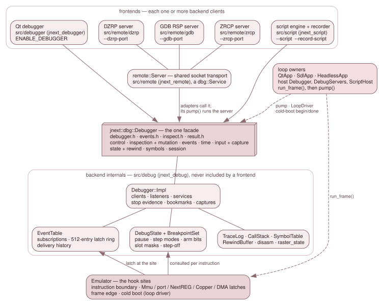

# 3.9 The debug subsystem

The debug subsystem is the developer-facing half of JNEXT. It stops the machine,
shows everything inside it, changes some of it, starts it again and, with
rewind on, runs it backwards. Six programs drive it:

- the Qt debugger window;
- three protocol servers, so DeZog, `z88dk-gdb` and ZEsarUX clients can attach
  over a socket;
- the debugger scripting language (`.jds`);
- the record/replay recorder, which writes `.jds` scripts.

All six are **frontends** of one backend. None of them holds an `Emulator`.
Each holds a `jnext::dbg::Debugger`, the one facade declared in four published
headers. The backend lives in the same process and on the same thread as the
emulation, so reading machine state is a direct call rather than a message, and
the run loop consults the backend once per instruction, before the fetch.

This section describes the backend and the contracts every frontend relies on.
[3.10](10-0-the-debugger-frontends.md) describes the frontends.

*The frontends hold only the facade. The backend's internals are reached from
the `Emulator`'s hook sites. The loop owners host the facade and are the only
callers of `run_frame()` and `pump()`.*

## The layers

**Frontends.** A frontend is one or more backend *clients*. It attaches, gets a
`ClientId`, issues verbs with that id, and installs a `Listener` for the
backend's pushes. The three socket servers also register a `Service`, which the
loop owner's `pump()` drives. Protocol models stay in the frontend: DZRP's bank
bytes, ZRCP's 100 breakpoint slots and cpu-step mode, RSP's register packing and
the DSL's grammar are not in `src/debug/`.

**The facade.** `jnext::dbg::Debugger` (`src/debug/debugger.h`) and its value
types (`events.h`, `inspect.h`, `result.h`) are the published API. They cover
control, inspection and mutation, events and conditions, deterministic time,
input injection and capture, state and rewind, symbols, and the session.
[3.9.1](09-1-the-backend-api.md) describes them.

**The backend internals.** All of the facade's state lives in
`Debugger::Impl` (`src/debug/debugger_impl.h`), behind one `unique_ptr`. That
covers the client table, the services, the stop evidence, the bookmarks and the
queued captures. Next to it are the event table, `DebugState`, the legacy
breakpoint store, and the older primitives the facade is built on: the trace
log, the call-stack tracker, the symbol table, the rewind ring, the
disassembler and the raster derivation. No frontend includes any of these
headers.

**The hook sites.** The `Emulator` keeps the places where the backend is
consulted, and nothing else:

- the pre-instruction gate in `run_frame()`;
- the latch sites in `Mmu`, `PortDispatch`, `NextReg::write`, the Copper, the
  DMA and the frame and scanline edges;
- the boundary drain after each instruction.

It learns nothing about any frontend. `DebugState` holds a *pointer* to the
event table, which is how the eight `Mmu` sites reach it without seeing a
`Debugger`.

**The loop owners.** `QtApp`, `SdlApp` and `HeadlessApp` each build one
`Debugger` in `init()` and keep it for the life of the process. Each also holds
a `DebugServers` (the protocol servers the command line asked for) and a
`ScriptHost` (scripts and the recorder). The backend owns no thread and no frame
loop. The loop owner runs the frames and then calls `pump()`, once per tick.
[3.9.3](09-3-sessions-the-pump-and-reconstruct.md) describes that seam.

## Where the code lives

| Path | Target | What it holds |
|---|---|---|
| `src/debug/debugger.h`, `events.h`, `inspect.h`, `result.h` | `jnext_debug` | the published facade and its value types |
| `src/debug/debugger*.cpp`, `debugger_impl.h`, `event_table.*`, `inspect.cpp`, `result.cpp` | `jnext_debug` | the facade's implementation |
| `src/debug/debug_state.*`, `breakpoints.*`, `trace.*`, `call_stack.*`, `symbol_table.*`, `rewind_buffer.*`, `disasm*.*`, `raster_state.*`, `resume_guard.h`, `debug_keymap.*` | `jnext_debug` | the primitives under the facade, and the debugger keymap model |
| `src/debugger/` | `jnext_debugger` (Qt) | the Qt debugger window and its panels ([3.10.2](10-2-the-qt-debugger.md)) |
| `src/qt/` | none (header-only) | the Qt conversions of the debugger keymap, the menu-bar Alt-navigation style |
| `src/remote/` | `jnext_remote` | the shared socket transport ([3.10.1](10-1-the-socket-transport.md)) and the three servers in `dzrp/`, `gdb/`, `zrcp/` |
| `src/script/` | `jnext_script` | the scripting language, its host and the recorder ([3.10.6](13-the-debugger-scripting-language.md)) |
| `src/platform/debug_servers.*` | platform | how a loop owner opens the servers and picks each tick's pump budget |
| `src/platform/cli_capture.h`, `host_key_wiring.h`, `host_probe.h`, `recording_info.h` | platform | the CLI screenshot path, the script host keys, the host-probe fixture, the recorder's header facts |

`jnext_debug`, `jnext_remote` and `jnext_script` have no toolkit dependency and
are built in every configuration. `jnext_remote` links `jnext_script`, because
the ZRCP server compiles its breakpoint conditions with the DSL's expression
compiler.

## What the gates enforce

Three rules hold the layering in place, and each is checked, not just written
down.

**No Qt below the Qt frontend.** `debug_qt_free_test` fails every
`make unit-test` if:

- a Qt include directive or a `*_qt.*` file appears under `src/debug/`;
- a file under `src/debugger/` includes a header of the core layers (`core/`,
  `cpu/`, `memory/`, `video/`, `audio/`, `peripheral/`, `port/`);
- a file under `src/debugger/` names `Emulator` in code.

Rows QTF-06..08 and QTF-12/13 test the detectors themselves on planted files.
The Qt code that both Qt libraries share lives in the header-only `src/qt/`.

**No `Emulator` below a frontend.** `Emulator` is only forward-declared in the
four published headers. None of them may reach any of these:

- `core/emulator.h`, `src/platform/`, Qt or SDL;
- `memory/mmu.h`, `video/renderer.h`, `video/palette.h`, `video/timing.h`;
- `debug/debug_state.h` or `debug/breakpoints.h`.

`test/lint-debug-headers.sh` preprocesses a one-line translation unit per
published header and matches that set against the `-M` dependency list, so a
forbidden header pulled in three levels down is caught like a direct include.
The lint is row 5 of the regression preflight (`lint-debug-headers`). In
`make harness-selftest`, HS-57a and HS-57b prove the row is wired and that its
verdict turns the row red. HS-57c proves the verdict does not depend on the temp
or source path.

`debugger_impl.h` *does* include `core/emulator.h`. That is the reason it is
internal, and the lint checks only the four published headers.

**The published types do not drift.** `src/debug/debug_types_check.cpp` is a
translation unit of `static_assert`s, built in all four configurations. It pins:

- the backend-owned mirrors against what they mirror: `StepMode` against
  `::StepMode`, `PaletteId` against `::PaletteId`, the screenshot layer mask
  against `Renderer::LAYER_*`;
- every `Result` enumerator's value, because adapters map a `Result` to a wire
  error by index;
- each of `Listener`'s seven methods separately. `is_abstract` on the class
  would still pass if one method gained a default body;
- `MachineInfo`'s two clock domains against `MachineTiming`, and the relation
  of eight master cycles to one T-state.

`EventKind`, `Layer`, `RegId` and `ClipLayer` each end in a `Count` sentinel,
and every count is derived from it. A count derived from the last real
enumerator is blind to an append: a new kind would ship with no mask bit and no
switch arm. `jnext_debug` and `jnext_script` are also built with
`-Werror=switch`, so a switch without a `default` that misses a new enumerator
fails the build.

One caveat about "no toolkit": `jnext_debug` links SDL3, because
`rewind_buffer.cpp` includes `core/emulator.h`, which reaches `input/keyboard.h`
and from there `SDL.h`. The rule is *no GUI toolkit*, not *no dependencies*.

## What `ENABLE_DEBUGGER=OFF` removes

`ENABLE_DEBUGGER` (default `ON`) gates **only the Qt debugger UI**. With it
off, `jnext_debugger` is neither compiled nor linked, and every use site in
`src/gui/` sits inside an `#ifdef`. The backend, the servers, the scripting
language and `Emulator::debug_state_` are present in every build. That is why
`--magic-breakpoint`, `--trace`, `--dzrp-port`, `--gdb-port`, `--zrcp-port` and
`--script` work in an SDL-only build.

What a run pays for the debugger does not depend on whether it is compiled in.
It depends on whether it is **armed**. Nothing is armed until one of these
happens:

- an arming client attaches (the open debugger window, a remote client, a
  loaded script, the recorder);
- `--persistent-breakpoints` is given;
- a magic breakpoint fires, which holds the machine only for its own stop.

Unarmed, the per-instruction test is a cached bool: one load and a
predictable branch. [3.9.4](09-4-execution-control-and-rewind.md) describes the
bits behind it.

## In this section

- [3.9.1 The backend API](09-1-the-backend-api.md): the four headers, their
  conventions, and every capability family.
- [3.9.2 Event delivery and mutation](09-2-event-delivery-and-mutation.md):
  how an event gets from a hook site to a subscriber, and what a write from a
  frontend may do.
- [3.9.3 Sessions, the pump and the reconstruct contract](09-3-sessions-the-pump-and-reconstruct.md):
  clients, listeners, the loop owners, and how a client survives a hard reset.
- [3.9.4 Execution control and rewind](09-4-execution-control-and-rewind.md):
  `DebugState`, the step modes, the legacy breakpoint store, rewind, and the
  magic breakpoint and port.

The design that produced all of this is `doc/design/DEBUG-SUBSYSTEM-ARCHITECTURE.md`,
with one document per frontend in `doc/design/debug-subsystem/`. The design
documents record why each choice was made. Where they and these pages disagree,
these pages follow the code.
