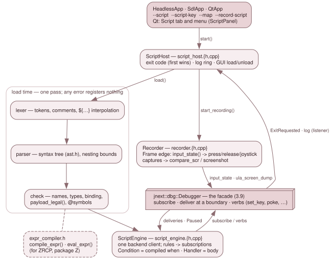

# 3.13 The debugger scripting language

A debugger script (`.jds`, GH #26, carrying #279's use cases) is a list of
rules. Each rule is an event and the actions to run when it happens. The
language lives in **`src/script/`** (CMake target `jnext_script`). It has no
toolkit dependency, so it is built in every configuration, and it reaches the
machine only through the published `jnext::dbg::Debugger` facade of
[3.9](09-debug-and-the-debugger.md) — never through `Emulator`. The record /
replay workflow of GH #20 is built on top of it (the recorder, below).

The design and the reason behind each rule is
`doc/design/debug-subsystem/dsl-frontend.md`. Its "as built" appendices (G to
M) record every choice made where the design was silent, and every place the
code departs from it. This page describes the code.

## The pieces

| File | What it holds |
|---|---|
| `lexer.{h,cpp}` | tokens; comments `;` `//` `#`; integers (decimal, `0x`, `$`, `0b`, 32-bit wrapping); strings with `${expr[:x2\|x4\|d]}` interpolation; the bracketed accessors (`mem[`, `mem16[`, `phys[`, `nextreg[`, `mmu[`, `page[`, `stack[`, `changed(`, `depth(`) as single tokens |
| `parser.{h,cpp}`, `ast.h` | recursive descent over the grammar; the syntax tree (`Script`, `Rule`, `EventSpec`, `Action`, `Expr`) |
| `names.{h,cpp}` | the one table of reserved words, built-in state names (`LIVE`) and payload names (`PAYLOAD`); which names `set` may assign |
| `check.{h,cpp}` | the load-time checks and BINDING: each upper-case name resolved to what it reads in its scope; `payload_legal()` — the per-event payload table |
| `value.h`, `state.{h,cpp}` | the value model; the interpreter state: variables and the snapshot stacks |
| `evaluator.{h,cpp}` | evaluation over a checked tree; `make_condition()` (a rule's `when` as a backend predicate); `machine_code()` |
| `expr_compiler.{h,cpp}` | the public library surface: `compile_expr()`, `eval_expr()` |
| `script_engine.{h,cpp}` | `ScriptEngine`: loaded scripts as backend subscriptions; the actions; stop and exit |
| `script_host.{h,cpp}` | `ScriptHost`: what the three loop owners hold to run `--script`, `--script-key`, `--map` and `--record-script` |
| `recorder.{h,cpp}`, `key_names.{h,cpp}` | the GH #20 recorder, and the key names it writes |
| `src/platform/recording_info.h` | `recording_info_of()`: the recorder's header facts, taken from the booted machine |
| `src/platform/host_key_latch.h`, `host_key_wiring.h` | the script host keys (Alt+1..Alt+8) in the emulator windows |
| `src/debugger/script_panel.*`, `debugger_window.cpp` | the Qt Script tab and Script menu |

## From text to a checked script

`parse_script()` stops at the first syntax error and reports it as
`line:column: message`. It also bounds nesting:

- an expression tree is at most `MAX_EXPR_DEPTH` (200) levels tall;
- `if` is nested at most `MAX_IF_DEPTH` (64) deep.

A chain of operators counts one level per operator, so `a or b or …` stops at
200 terms. Every later pass recurses over these trees and nothing else, so this
one bound is what keeps a pathological script, or a ZRCP expression, from
overflowing the stack.

`check_script()` then reports every load-time error with its position, not just
the first. It binds each name in place (`Expr::builtin`), and the binding
depends on the scope:

- `PC` is the CAUSING instruction's PC in an event rule, and the CPU's PC in a
  filter bound or a `var` initializer;
- `HC_ULA` and `CVC` are the Copper step's position in a `copper` rule, and the
  live raster elsewhere;
- a payload name is admitted only where `payload_legal()` says the backend's
  `Event` carries it. `PREV` needs a write, `CPC` needs a `copper` rule, and
  filter bounds and initializers have no payload at all.

Types are fixed here too. Strings only compare and interpolate; they never go
into arithmetic or a condition. `@symbol`s are resolved against the backend's
one symbol table (CAP-SYM, filled by `--map` or **Map > Load MAP**). That table
keeps only the `; addr` lines of a z88dk map: a `; const` such as a crt section
bound is not a symbol.

## Values, state and the snapshot stacks

Integers are 32-bit signed and wrap. Comparisons, `and`, `or` and `not` yield
1 or 0, and `and`/`or` short-circuit.

Each loaded script has its own variables, labels and snapshot stacks
(`ScriptState`). A snapshot (`snap NAME`) records:

- the registers, with IFF1, IFF2, IM, SP and PC;
- the word at SP;
- the eight MMU slots;
- FRAME and CYCLE.

All of it is read through the side-effect-free inspection surface. Each name is
a stack, so nested entries pair with their own exits. `changed(NAME, regs)`,
`changed(NAME, mmu)`, `changed(NAME, iff1)` and `changed(NAME, stack0)` and
`dump_diff NAME` compare the machine against the TOP entry.

A stack holds at most `MAX_SNAPSHOT_DEPTH` (4096) entries. A full stack on
`snap`, or an empty one on `unsnap` / a field / `changed()`, is a run-time
error, never a silent drop. `depth()` of an empty stack is 0, not an error.

Run-time failures (division by zero, an address out of range, an empty stack)
throw `EvalError` with the failing node's position. The engine catches it,
disables the rule and logs `SCRIPT ERROR file:L:C: … — rule X disabled`.

## The expression compiler as a library

`expr_compiler.h` is the stable surface other frontends call, and it names no
AST type:

- `compile_expr(text, scope)` returns a `dbg::Condition` — the backend's
  CAP-EVT predicate — for events of a `PayloadScope`;
- `eval_expr(text, debugger)` evaluates once, in the no-event scope.

The engine compiles every `when` through the same code, via `make_condition()`
in the evaluator. The ZRCP server ([3.12](12-the-zrcp-server.md)) is the other
caller: `src/remote/zrcp/zrcp_condition.*` translates ZEsarUX's breakpoint
dialect into this grammar — tokenising and grouping as ZEsarUX does, emitting a
fully bracketed expression — and compiles it here, so it owns no evaluator. The
one thing the language cannot read is whether a slot holds ROM, so ZEsarUX's
`SEGn` / `ROM` / `RAM` are evaluated by the adapter.

## The engine: rules as backend subscriptions

`ScriptEngine` is ONE backend client (`ClientKind::Script`), and it is also its
own `Listener`. `load(text, file)` does four things, in this order:

1. parses and checks the text;
2. runs the `var` initializers;
3. evaluates every filter bound (`@code_end - 1` and the like);
4. only then registers each rule (`subscriptions_for()`).

A script with any error registers nothing.

A rule is one subscription, with one exception: `on execute … page P1..P2` is
one subscription per page, because the Execute filter takes a single page
(`MAX_EXECUTE_PAGES` = 16). The engine spends the sibling subscriptions of a
fired `once` rule itself.

The subscription's `Condition` is the compiled `when`, plus two refinements the
backend filter cannot express: a port range, and the destination of a
`dma byte` range. So the backend evaluates the predicate, and a non-matching
hit never enters the interpreter. The `Handler` runs the body at the delivery,
with the machine at an instruction boundary, and returns the verdict.

**A stop-only `execute` rule** — its body exactly `stop ["msg"]` — is
registered as a static `Stop` with no handler. That is the shape every frontend
breakpoint has, so other clients see it:

- `probe_execute(pc)` lists it whenever its `when` holds at `pc` (the backend
  evaluates the condition), which is how a ZRCP `run` stops on it;
- `subscriptions()` reports `action Stop`, no handler.

Its bookkeeping happens in `on_paused()` from `PausedInfo::matched` (see
`account_static_stops()`): the hit, `once`, the `SCRIPT STOP` line, the status
and `REASON`.

**Where actions run**:

| Action | When it takes effect |
|---|---|
| `log`, `dump_*`, `snap`, `assert`, `stop`, `exit`, `enable` / `disable`, `set` / `out` | in the delivery |
| `press` / `release` | through IN-01 / IN-02, which queue for the frame edge themselves |
| `joystick`, `compare_scr` issued outside a `frame` rule | the engine's own every-frame subscription (`ensure_edge()` / `run_edge()`); issued inside a `frame` rule, at once — that rule already runs at the edge |
| `screenshot` | CAP-01 defers it to the next rendered frame |
| `save_snapshot` | `on_frame_ended()`, the first `pump()` at a frame boundary: the backend refuses a save inside a delivery |
| `on stop` rule bodies | `on_paused()` |

Mutations (`set`, `out`) go through the debugger's write paths (`set_register`,
`poke`, `nextreg_write`, `port_out`, `set_audio_mute_mask`). These raise no
events, and the backend logs each as a `MUTATE` line. With a rewind buffer
active, the first mutation logs a warning.

Every engine log line is stamped `[jds F:frame C:cycle]`.

## Stop, exit and the exit code

There are three verdicts:

- **`stop`, and a failed `assert`**, return `Verdict::Stop`. The backend pauses
  at the boundary — the end of the offending instruction for a write — and
  applies the loop owner's stop policy (`StopPolicy`): Qt pauses; headless and
  SDL request exit 3. The engine logs `SCRIPT STOP: <reason> at PC=… FRAME=…
  CYCLE=…`. **The rest of the body still runs**, so a span script's `unsnap`
  keeps its stack balanced.
- **`exit n`** calls `EngineHost::exit(n)` during the delivery, BEFORE the
  backend's stop asks for 3. The loop owner keeps the first code it is given,
  so `exit 7` exits 7. The exception: an `exit` that follows a `stop` or a
  failed `assert` **in the same rule body** is not taken. It is logged
  `SCRIPT EXIT n not taken: the rule stopped first (reason)`, and the stop's 3
  stands (`body_stopped_`, row SCRIPT-EV-ASSERT-EXIT). Without that,
  `assert … exit 0` passed a failed assert. Before handing a code over, `exit`
  calls `flush_captures()`: a screenshot still pending or failed, or a
  `save_snapshot` still queued, turns `exit 0` into 1.
- **A run-time error** disables the rule and asks for exit 1 at the next frame
  edge.

`unreached_verdicts()` counts what a run never got to: rules holding `exit` or
`compare_scr` that never fired, deferred actions still pending, and
`--script-key`s not yet delivered. The headless and SDL loops ask for it at the
`--delayed-automatic-exit*` bound and exit 3 when it is non-zero.

`status()` gives the first exit code, the stop count with the last reason, the
run-time errors and the unreached count. It is the Script tab's verdict line.

## The host: `ScriptHost`

`HeadlessApp`, `SdlApp` and `QtApp` each hold a `ScriptHost` beside their
`DebugServers`. It is declared after `debugger_`, so it is destroyed first.

`start()` loads `--map` into the symbol table, then each `--script` in order,
and schedules `--script-key`. Any failure is logged and fails the start, so the
loop owner exits 1 before the machine runs.

It hears exit codes in two ways: from the engine (`EngineHost::exit`), and from
the backend's `ExitRequested`, through a NON-ARMING listener client
(`ClientInfo::observer`). The first code wins. The Qt GUI starts it with
`exits = false`, so a script there pauses and never exits.

The GUI side of the host:

- `load_file()`, `unload_all()` (which destroys the engine — its client arms
  the machine), `reload()`;
- a 2000-line log ring of the engine's and the recorder's lines (with the
  backend's `[client N]` tag removed), read with `log_since()`.

## Host keys

Script host keys are the backend's `Host` events named `script1` … `script8`.
They are reached in four ways:

- **The emulator windows**, Qt and SDL alike, go through the shared key
  `Router` (`host_key_latch.h`). Alt (left or right) with no Ctrl, Shift or GUI,
  plus a digit 1..8, calls the callback `wire_script_keys()` installs. That
  callback runs `Debugger::raise_host_event("scriptN")`. The digit's press and
  release are both swallowed, script loaded or not. An autorepeat of a held
  chord raises nothing, and `release_all()` / `attach()` forget a held chord.
  See [3.7 Input](07-input.md).
- **The debugger window** has eight `Qt::WindowShortcut` `QAction`s with
  auto-repeat off. They are window-scoped, so a key pressed in the emulator
  window is raised once, by the Router.
- **The keymap** refuses Alt+1..Alt+8 as a debugger binding (`validate_combo()`
  in `debug_keymap.cpp`).
- **Headless**: `--script-key FRAME N` queues the key in the engine
  (`queue_host_key()`). `run_edge()` raises it at the edge of that frame,
  before the deferred actions run.

## The recorder (GH #20) and `compare_scr`

`Recorder` is a second backend client (`ClientKind::Script`, arming). It
OBSERVES and never drives. Its frame-edge handler does the work:

- **Input edges.** At every frame edge E_K it reads INS-16 `input_state()` and
  writes one level edge per change since E_K-1, stamped `on frame K-1`:
  - a matrix bit, by its `key_names.cpp` name, or `row,col` for CAPS SHIFT and
    SYMBOL SHIFT;
  - an extended key, as `ext:<name>`;
  - a joystick connector's whole 12-bit state.

  The `Frame` delivery precedes the edge's injection drain and
  `tick_auto_type()`. So a change applied at E_K-1, by a host key or a script
  alike, is first seen at E_K, and replaying it at E_K-1 shows it to the guest
  from frame K, as the original did.
- **Captures.** A capture (host key `script8`, or `capture()`) is taken at the
  NEXT frame edge, where a replay's `on frame K` rule runs:
  - **`.scr`** when only the ULA is on (NR 0x68 b7, NR 0x15 b0/b7, NR 0x69 b7
    and NR 0x6B b7 all clear). The recorder writes `ula_screen_dump()` itself
    and emits `compare_scr`.
  - **PNG** otherwise: through CAP-01 `screenshot()`, with a `screenshot` line
    naming a `-replay.png`.
- **The script.** `stop()` calls `flush_captures()`, so a PNG still pending is
  dropped together with its line. It then writes the script: a header, `once`
  asserts on `MACHINE` and `nextreg[0x05]`, the warnings (as comments and as
  `log` lines), the edges and captures, and `exit 0` two frames after the last
  recorded one.
- **Cold boot.** A `Reset{Hard}` — a hard reset, or a menu load — restarts the
  recording and re-reads the header's facts through `recording_info_of()`.

`ScriptHost` owns the recorder: `start_recording()`, `capture_screen()`,
`stop_recording()`. `--record-script` starts it before the first frame, in any
frontend. The host's destructor writes the script on the way out (through
`~Recorder`).

`compare_scr` byte-compares `ula_screen_dump()` with a file. A mismatch logs
the first differing offset (or the sizes) and `ASSERT FAILED: msg`, then stops.
A file that cannot be read is a run-time error.

## Adding a built-in name

1. **`ast.h`**: add the `Builtin` enumerator. Payload names go after `P_ADDR`,
   which is how the evaluator tells the two apart.
2. **`names.cpp`**: add the spelling to `LIVE` or `PAYLOAD`. If a script may
   `set` it, add it to `is_assignable()` too.
3. **`check.cpp`**: for a payload name, admit it in `payload_legal()` for
   exactly the events whose `dbg::Event` carries it.
4. **`evaluator.cpp`**: read it in `eval_int()`'s switch. The library is built
   with `-Werror=switch` over the published enums, so a missing arm in a
   switch without a `default` fails the build. For `set`, add the write path
   in `ScriptEngine::exec()`'s `ActionKind::Set` case, through a debugger verb.
5. **Tests**:
   - `script_parse_test` evaluates every name against a real `Debugger` and pins
     the payload table both ways;
   - `script_eval_test` covers the value model;
   - `script_events_test` covers a payload as delivered.

   Pin each count in `test/unit-tests.conf`.
6. **Docs**: §2.3 of the design, and the user guide's language reference.

## Adding an event kind

The backend comes first. The event must exist in `src/debug/events.h`
(`EventKind`, its `EventFilter` fields, its `Event` payload), be latched at its
site and matched by `EventTable` (see 3.9's event pipeline), and have its own
`debugger_backend_test` rows. Then the DSL:

1. **`names.cpp`**: add the keyword to `RESERVED`.
2. **`ast.h`**: add an `EventType` (and a sub-kind enum, like `CopperSub`, if it
   has one).
3. **`parser.cpp`**: in `parse_event()`, parse its filter into `EventSpec`.
4. **`check.cpp`**: `scope_of()` maps it to a `PayloadScope`, and
   `payload_legal()` admits its payload names.
5. **`script_engine.cpp`**:
   - in `subscriptions_for()`, build the `dbg::Subscription` (kind, filter, and
     any engine refinement in the `Condition`);
   - in `describe_event()`, describe it for the Script tab.
6. **`evaluator.cpp`**: read any new payload field from the `dbg::Event`.
7. **Tests**:
   - `script_parse_test`: the grammar, the payload table, what the rule
     registers as;
   - `script_events_test`: a SCRIPT-EV row that drives it on a real machine and
     asserts the payload;
   - if it is user-visible, a `script-*-func` row. The suite's demo is
     `demo/dsl_demo/` — its fixtures live under `test/00regression/nex/` and its
     scripts in `test/scripts/dsl/`.

## Tests

| Suite / rows | What it pins |
|---|---|
| `script_parse_test` | grammar, error positions, precedence, the payload table, every name against a real `Debugger`, every worked script of the design |
| `script_eval_test` | the value model, the snapshot stacks, interpolation |
| `script_events_test` | the engine on real 48K and Next machines, the `ScriptHost` (SCRIPT-HOST-*) and the stop/exit rules |
| `script_record_test` | the recorder, including a record → emit → replay round trip on a fresh machine (REC-RT-*) |
| QSCR-* (`debugger_panels_test`), DKSK-* (`debugger_keymap_test`), H-SCRIPT-* (`host_hotkey_test`), HKL-SK-* (`host_key_latch_test`) | the Qt Script tab and menu, the host keys in both windows |
| `script-*-func` (regression) | the binary end to end |

The `script-*-func` regression rows cover:

- the three frontends' exit codes;
- the dsl_demo suite, each row with a red twin against `dsl_demo_buggy.nex`. The
  three #279 ChaseTheBug cases are `script-guard-func`, `script-mmu-func` and
  `script-isr-func`;
- the two DAPR recordings;
- a headless record → replay round trip;
- a recording from a real SDL window, in `script-replay-edge-func`.
