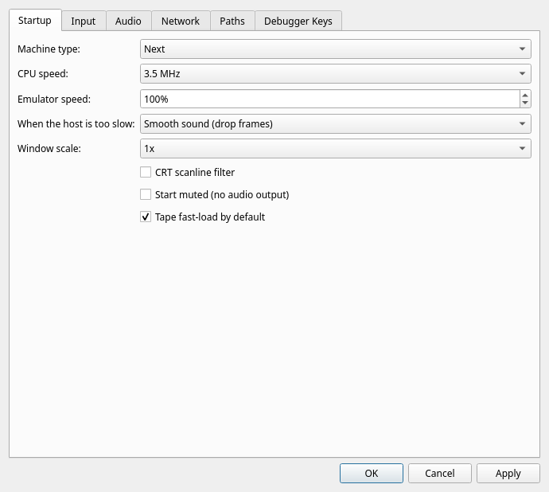

# Preferences

**Settings > Preferences…** opens a dialog with five tabs.

**Startup** holds what the emulator should look like when it launches:

| Setting | Choices | Notes |
|---|---|---|
| Machine type | 48K, 128K, +3, Next | See [5.1](../05-running-programs/01-choosing-a-machine.md) |
| CPU speed | 3.5, 7, 14, 28 MHz | The emulated Next's own clock |
| Emulator speed | 10%–1000% | How fast the emulator runs against real time |
| Window scale | 1x, 2x, 3x | |
| CRT scanline filter | on / off | |
| Start muted | on / off | Takes effect on next launch only |
| Tape fast-load by default | on / off | See [5.5](../05-running-programs/05-recording-and-playback.md) |

**Input** picks what drives each of the Next's two joystick connectors — an
autodetected USB gamepad, or the host cursor keys with Space as fire. Only one
connector can use the cursor keys at a time, and the dialog enforces that for
you. Details in [5.2](../05-running-programs/02-input.md).

**Audio** has -24 dB to +24 dB sliders for the final master output and for the
beeper, each of the three TurboSound AY chips, and the DAC family. Every slider
is centred on the 0 dB default, which leaves that source unchanged. Subsystem
gains are applied before the master. Changes apply immediately to playback and
WAV/video recording; large positive boosts can clip.

**Network** holds the emulated ESP-01 WiFi module: an **Enable** checkbox and
an **Allowed hosts** box, one host name per line — a comma separates entries
too, so a line copied out of the config file works. This is the permanent form of
`--esp` and `--esp-allow`, for when you run NXtel or nextsync often enough to
tire of typing them. An empty host list places no restriction on the name the
program may ask for; listing hosts narrows it, matching exactly and ignoring
case. The list is greyed out while the module is off, since on its own it
restricts nothing. Loopback, link-local and cloud-metadata addresses are
refused whatever you put here, and your own LAN stays reachable.

Turning the ESP on here does not put a running program on the network — see
below — and while it *is* running with the ESP on, the status bar always
carries an ESP cell, so it can never be on invisibly.

**Paths** remembers three directories so the file dialogs open somewhere
useful: the last directory you loaded a program from, a default SD-card image,
and where screenshots go.

## Apply, OK and Cancel

**Apply** pushes the settings to the *running* machine — change the window
scale or a joystick source and it happens immediately, with nothing lost.
**OK** does the same and closes the dialog; **Cancel** discards.

Two settings cannot work that way, and both say so:

- **Machine type** is a power cycle. If you change it, JNEXT asks whether to
  restart now and warns that anything running will be lost. Answer **No** and
  the machine keeps running — your choice is still saved and takes effect the
  next time JNEXT starts. Every *other* setting in the dialog applies either
  way, so declining the restart never throws away the change you actually came
  to make.
- **Start muted** only takes effect at launch, because the audio device is
  opened once when JNEXT starts.
- **The ESP-01 settings** on the Network tab take effect at the next machine
  start. The module is created when a machine boots and is deliberately kept
  across a soft reset — a reset the real hardware never even sees should not
  drop a live connection — so there is nothing to switch on the machine already
  running. A hard reset (**F1**, or **Machine > Reset**) is enough; you do not
  have to quit JNEXT.

> The **Machine > Machine Type** menu behaves differently on purpose: it
> restarts straight away without asking. Picking "48K" from a menu called
> Machine *is* an explicit request to become a 48K; the same field buried on a
> Preferences tab is not.
