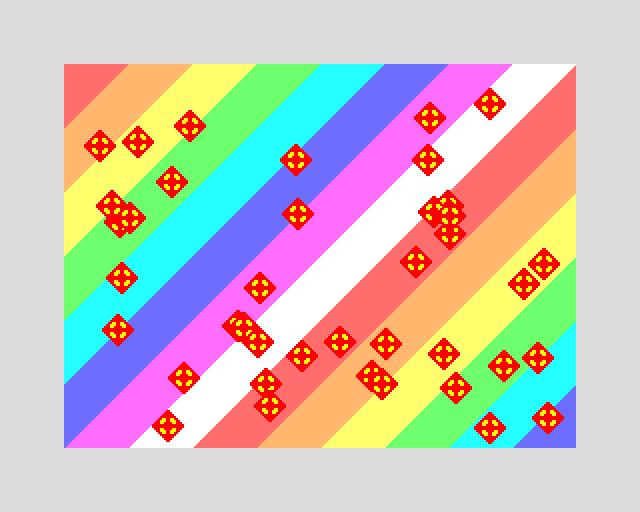
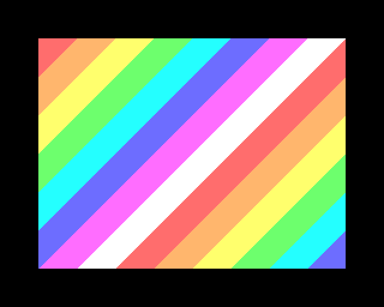
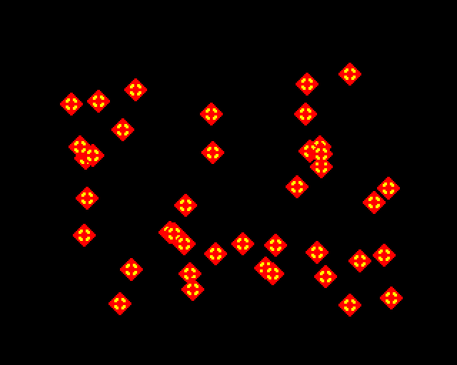

# 5.3 Display

**Scale.** **View > Scale 1x/2x/3x**, or press **F2** to cycle. Scaling is
always a whole number of pixels, so the picture stays sharp.

**Fullscreen.** **F11**, or **View > Fullscreen**. The image is centred with
black bars, keeping the correct shape. F11 again returns. (Esc will not: it is
the Break key.)

**CRT filter.** **View > CRT Filter** overlays soft scanlines, for a more
period-accurate look.

**Layers.** The Next composites several video layers — the classic ULA screen,
Layer 2, the tilemap and up to 128 sprites — and the running program decides
their stacking order and transparency. There is nothing to configure; it is
simply what you see.



You can, however, pull them apart, which is useful when something looks wrong
and you want to know which layer is responsible:

```
jnext --headless demo.nex --delayed-screenshot l2.png \
    --delayed-screenshot-layers layer2
```

 

*The same frame with only Layer 2, and with only the sprites.* Excluded layers
are treated as switched off, so what remains still composites normally.
Leaving out `ula` also removes the border, since that is the ULA's job.

**Screenshots.** **File > Save Screenshot…** (Alt+S) or the toolbar camera
button writes a PNG. JNEXT remembers the directory. For scripted, repeatable
captures, see [chapter 7](../07-automation-and-ci/index.md).

---
