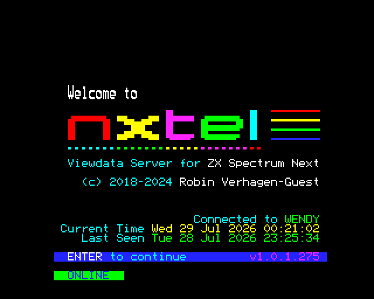

# 5.6 Networking

A real ZX Spectrum Next has a header for an **ESP-01 WiFi module**, and the
software written for it — NXtel, nextsync, the NextZXOS `.HTTP` and `.zxdb-dl`
dot commands — talks to that module over a serial link. JNEXT emulates one, so
those programs can reach the network through your host machine.

There is no WiFi to configure. The emulated module reports itself as already
associated with an access point, because to the guest program that is what a
working ESP-01 looks like; the actual connections are made by your host.

## It is off by default, and it stays off until you say otherwise

Turning this on gives the running program **an outbound TCP pipe out of the
emulator**. That program can already read and write the SD-card image. A
program you did not write is a program you are trusting.

So JNEXT never enables it for you, and **no loaded program can enable it for
itself**. You turn it on in one of two places:

- for one run, `--esp` on the command line;
- permanently, **Settings > Preferences > Network**.

`--no-esp` forces it off for a single run, whatever the saved setting says.
That is the escape hatch that makes the permanent setting safe to have: if you
have the ESP on by default and want to run something you do not trust, start it
with `--no-esp`.

The setting is stored in `~/.jnext/jnext.conf` under `[esp]`, and it is the one
Preferences setting that cannot be applied to a machine that is already
running — the module is built when a machine starts. Change it and it takes
effect on the next **Machine > Power Reset** (or F1), or the next launch. You
do not have to quit JNEXT.

## You can always see whether it is on

Whenever the module is enabled, the status bar grows an **ESP cell**. There is
no way to have the ESP on without that cell being there — not by command line,
not by config file, not by Preferences.

Idle, it names the restriction in force, so you can tell at a glance whether
your allowlist actually loaded:

```
ESP: on (any host)        no restriction on the host name
ESP: on (2 allowed)       two named hosts, listed in the tooltip
```

Once the program starts connecting, the cell follows it — `ESP: nx.nxtel.org:23280`
while connected, `ESP: closed …` after. Two states are shown **in red** and
stay red so you cannot miss them by looking away:

| Cell | Means |
|---|---|
| `ESP: REFUSED host:port` | your allowlist, or the always-refused list below, blocked it |
| `ESP: FAULT` | the host side of the connection broke; the ESP has stopped making progress |

Hover the cell for the full history of the session — the cell can only show the
most recent event, and "it flashed something red a minute ago" needs to stay
answerable.

## A worked example: NXtel

NXtel is a Viewdata/teletext client for the Next, and it is the program this has
been verified against end to end, over the live internet.

It ships on the NextZXOS SD-card image, and it has to be **launched from
NextZXOS** — loading `NXtel.nex` directly with `--load` gives you a black
screen, and that is not an ESP problem (it does the same with the ESP off).

Start JNEXT with the ESP on, restricted to the BBS:

```
jnext --esp --esp-allow nx.nxtel.org
```

Then, in the emulated machine: **Browser** from the NextZXOS menu, into
`APPS`, then `WIFI`, then `NXtel`, and run `NXtel.nex`. Choose **Connect**, and
pick the NXtel (Wendy) entry.



`Connected to WENDY` and a green `ONLINE` mean the whole chain worked: the
program, the emulated module, your host's network, and the real server.

Two things surprise people the first time:

- NXtel writes a `NXtel.cfg` file next to itself on first run and opens it in
  an editor. That looks like a failure and is not — it is the config being
  created. Carry on.
- The SD-card image is written to. If you need the run to be reproducible, give
  it a copy of the image rather than your master.

## Restricting which hosts a program may reach

`--esp-allow HOST` narrows the program to hosts you name. Give the option **once
per host** — it is not a list:

```
jnext --esp --esp-allow nx.nxtel.org --esp-allow 192.168.1.10
```

A comma is rejected rather than accepted, because `--esp-allow a.com,b.com`
would otherwise become a single host name that nothing ever matches: every
connection refused, while the allowlist *looks* like it names two hosts.

In **Preferences > Network** the same list is one host per line (a comma
separates there too, since that is how the config file writes it). Blank lines
and repeats are dropped. The box is greyed out while the module is off, because
on its own it restricts nothing.

Matching is exact and case-insensitive. There are no wildcards, and an IP
address must be listed as itself — a deliberately small rule for a security
control, and enough for the programs that exist: they connect to a handful of
literal names from their own config.

**With no `--esp-allow` at all, the program may name any host.** An empty list
means "no restriction", not "deny everything" — otherwise `--esp` on its own
would do nothing and the module would just look broken. The startup log and the
status cell both say which of the two you are in.

## What is refused no matter what you allow

These are judged by the address a name actually resolves to, before any
connection is attempted, and **`--esp-allow` cannot re-enable them**:

- **loopback** — `127.0.0.0/8` and `::1`: daemons on your own machine;
- **link-local** — `169.254.0.0/16` and `fe80::/10`;
- **cloud metadata endpoints** — `169.254.169.254`, `100.100.100.200` and
  `fd00:ec2::254`;
- the unspecified addresses `0.0.0.0/8` and `::`;
- **multicast and reserved space** — `224.0.0.0/4`, `240.0.0.0/4`,
  `255.255.255.255`, `ff00::/8`.

IPv6 spellings of an IPv4 address (`::ffff:127.0.0.1`, NAT64, 6to4) are resolved
to what they really reach and judged on that, so they cannot be used to slip
past the list.

**Your own LAN is reachable on purpose.** Private addresses (`192.168.x.x`,
`10.x.x.x`, `172.16-31.x.x`) are *not* refused — reaching another machine on
your own network is the main thing people use this for, and nextsync in
particular connects to a PC on the LAN.

## Nothing about your host leaks into the program

The module reports a fixed, invented identity: SSID `JNextWifiHost`, a
`02:00:00:…` MAC and BSSID, and a `192.168.1.50` station address. None of it is
read from your machine, so a program cannot learn your real SSID, MAC or local
addresses by asking. The emulated module is not a radio and never scans.

## When something does not work

Turn up the module's own log and watch what the program is actually saying:

```
jnext --esp --log-level esp01=debug
```

| Level | What you get |
|---|---|
| `info` (default) | the module coming up, and every connection opened, refused, failed or closed |
| `debug` | every AT command the program sends and every reply |
| `trace` | the raw bytes in both directions |

`--log-level esp01=off` silences the connection reports as well. That is your
call to make and JNEXT will not override it — but the status-bar cell stays,
so the run is still not silent.

Common cases:

- **The program reports a connection error and the cell shows `REFUSED`.** The
  host was blocked. Check your `--esp-allow` spelling against the name the log
  shows the program asking for, or drop the restriction to confirm that is what
  it is.
- **The program behaves as if nothing is there.** Check the cell exists at all.
  No cell means the ESP is off — a `--no-esp` on the command line beats a saved
  preference, and an unchanged `[esp]` setting only takes effect after a Power
  Reset.
- **Nothing at all happens and the program hangs.** Run it once with `--no-esp`.
  If it behaves the same way, the problem is not the networking.

## What is not emulated yet

The command set is the one **evidenced** in software that actually runs on a
Next, so a few things a physical ESP-01 can do are not built:

- **server / listen mode** (`AT+CIPSERVER`) — so nothing can connect *in*;
- **UDP**, **multiplexed connections** and **transparent mode**.

None of them has a consumer in current Next software. Widening the emulation to
the full ESP-01 firmware specification is tracked as
[issue #154](https://github.com/jorgegv/jnext/issues/154).

---
