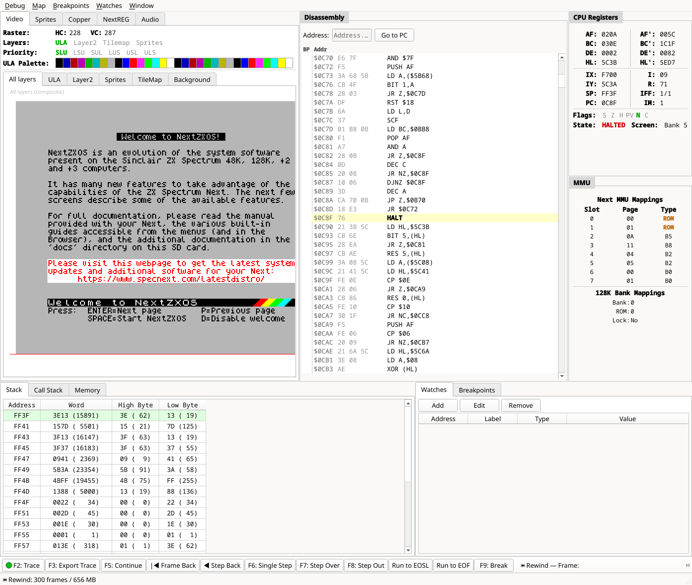

# 6. The debugger

JNEXT ships with a full source-less debugger for ZX Spectrum Next software: it
halts the machine at an instruction boundary and shows you the CPU, the memory
map, every video layer, the Copper program, the NextREG file and the AY
registers, all as the hardware sees them at that instant.

This chapter is a reference. Each panel and each function has its own section,
so you can look one up while you are debugging.

Open the debugger with **Ctrl+D**, with **View ▸ Debugger**, or with the bug
button on the emulator toolbar. The same actions close it. While it is closed
the debugger costs nothing — no breakpoint checking, no call-stack tracking, no
panel refreshes. Closing it also resumes the machine if it was paused.

The debugger opens in its own window, positioned to the right of the emulator
window. It has its own menu bar — **Debug**, **Map**, **Breakpoints**,
**Watches** and **Window** — and a control toolbar along the bottom.

**Window ▸ Attach to emulator window** keeps it pinned to the emulator's
right-hand edge as you drag or resize that window; the setting is remembered
between sessions. This needs a window system that lets an application position
its own windows, so it works on **X11** and is unavailable on **Wayland**,
where the menu item is greyed out — see
[8.2](../08-known-issues/02-the-debugger-window-does-not-follow-the-emulator-window.md)
for why, and how to run under X11 if you want it.

The layout is fixed: video-related tabs on the top left, disassembly in the
centre, CPU registers and MMU down the right, and memory/stack tabs and
watch/breakpoint tabs along the bottom. The splitters between the areas can be
dragged.

The window itself can be made smaller than the panels need. When it is, the
panel area gains scrollbars and pans instead of cutting anything off, and the
control toolbar along the bottom stays put — buttons that no longer fit move
into a **»** overflow menu at its right-hand end. The size is remembered
between sessions, and is clamped to the screen it reopens on, so a window saved
on a large monitor never comes back unreachable on a small one.

Four panels — CPU Registers, Disassembly, Stack and Call Stack — only show data
while the machine is **paused**, and are greyed out while it runs. That is
deliberate: reading them every frame would slow the emulation down for no
benefit, since the values would be a blur. The rest refresh about four times a
second while the machine is running.

---
