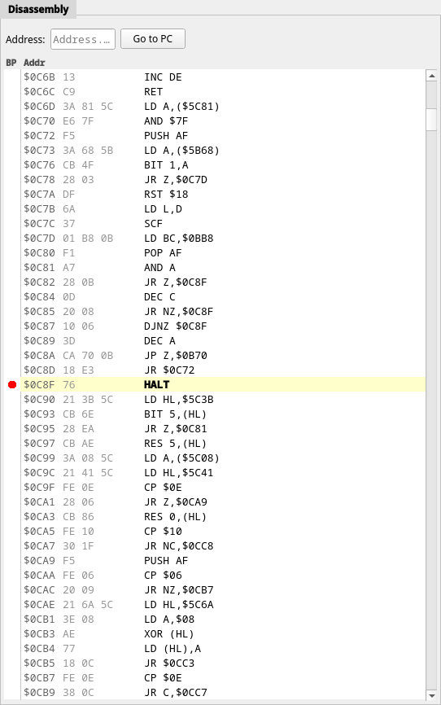

# Disassembly



Z80 plus all 26 Z80N instructions, disassembled live from memory as the CPU
sees it. Columns are the breakpoint gutter, the address, the raw opcode bytes
and the mnemonic. The line at `PC` is highlighted in yellow and set in bold;
the lines you select are highlighted in blue — over the top of the yellow, so
the `PC` line stays recognisable inside a selection, and clear of the gutter,
so breakpoint dots stay visible.

- **Click the gutter** on any line to set or clear an execute breakpoint (shown
  as a red dot). A breakpoint that has been
  [suspended](08-breakpoints.md) — unticked in the Breakpoints panel, or
  covered by its master switch — is drawn as a hollow red ring instead;
  clicking its gutter still removes it.
- **Click and drag** over the listing to select a range of lines, or click one
  line to select just that one. **Shift+click** extends the selection from
  where it started, and **Shift + ↑ ↓ Page Up/Down Home End** do the same from
  the keyboard. **Ctrl+A** selects everything in the view.
- **Address** box — type a hex address and press Enter to centre the view there.
- **Go to PC** re-centres on the current instruction.
- The scrollbar spans the whole `$0000`–`$FFFF` address space. **↑ ↓**,
  **Page Up/Down**, **Home** and **End** navigate; **Enter** runs to the
  selected line.

## Copying the listing

**Ctrl+C**, or **Copy** in the right-click menu, puts the selected lines on the
clipboard as **assembly only** — mnemonics and operands, one instruction per
line, indented four spaces. The address column, the opcode bytes and the
breakpoint gutter are all stripped, and symbols from a loaded
[MAP file](../functions/05-symbols-from-z88dk-map-files.md) are kept, so what
you paste is what you would have written by hand:

```
    LD HL,screen_buf
    NOP
    CALL entry
```

**Copy with Addresses** is the same selection with the address and opcode
columns kept, for a bug report or an annotated trace:

```
$8000  21 34 12     LD HL,screen_buf
$8003  00           NOP
$8004  CD 00 80     CALL entry
```

Right-clicking inside the selection keeps it; right-clicking outside collapses
it onto the line you clicked, so **Copy** on a line you have not selected
copies that one line. Both chords only apply while the disassembly panel has
focus — click in it first if you have been typing somewhere else.

A few things worth knowing:

- The selection is a range of **addresses**, not of screen rows. Scrolling the
  view, stepping the CPU and **Go to PC** all leave it alone, and a copy still
  produces the whole range even when none of it is on screen any more.
- The text is disassembled from memory **at the moment you copy**, not from
  what is painted. That is what makes the point above work, and it also means
  copying while the machine runs freely — when the panel has deliberately
  stopped redrawing — gives you the code that is in memory now.
- Copying with nothing selected does nothing; it never clears the clipboard.

## The right-click menu

The right-click menu is where most of the day-to-day work happens:

| Entry | Effect |
|---|---|
| Copy | The selected lines as assembly only |
| Copy with Addresses | The selected lines with the address and opcode columns |
| Select All | Select every line in the view |
| Toggle Breakpoint | Execute breakpoint on this line |
| Run to Here | Resume until this address is reached |
| Go to Address… | Jump to the address box |
| Watch *symbol* / Watch `$nnnn` | Watch this line's symbol, or a 16-bit immediate in the instruction |
| Watch `(HL)` `(DE)` `(BC)` `(IX` `(IY` `(SP)` | Watch the address the register currently holds |
| Break on Read / Break on Write | Data breakpoint on that immediate, or on the register's current value |

The register entries only appear when the instruction actually references that
register indirectly, and they capture the register's value *at the moment you
open the menu* — they are a shortcut for "watch what HL is pointing at right
now", not a moving target.

The panel does not follow `PC` while the machine runs freely, or during a
"Run to Here" — it is only redrawn when execution stops.
