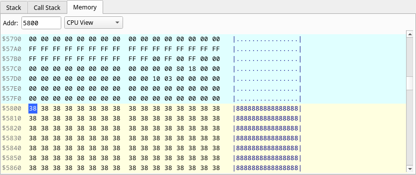

# Memory

A hex editor over the address space: address, sixteen bytes in two groups of
eight, and the ASCII rendering.

- The **Addr** box takes a hex address (`5800`, `$5800` or `0x5800`) and centres
  the view on it.
- The **page selector** chooses the window. `CPU View` shows the whole 64K as
  the CPU sees it — paged-in DivMMC, Multiface or Layer 2 memory included.
  `Slot 0`–`Slot 7` show the 8K **page** mapped in that slot (its label names
  it, and follows the program's paging) — the page itself, so a DivMMC,
  Multiface or Layer 2 overlay switched on over the slot does not show there;
  a ROM slot shows the ROM. `Page...` asks for a page number (hex, `00`–`DF`,
  the numbering of `NEXTREG $50`–`$57`) and shows that page whether any slot
  maps it or not.
- In `CPU View`, rows are colour-coded: the row containing `SP` in orange,
  pixel VRAM `$4000`–`$57FF` in cyan, and attributes `$5800`–`$5AFF` in yellow.

To edit, click a byte and type two hex digits — the write happens on the second
digit and the selection advances to the next byte. Arrow keys move the
selection, **Page Up/Down**, **Home** and **End** scroll, and **Esc** clears
the selection. In `CPU View` writes go through the MMU exactly as a `LD (nn),A`
would, so ROM stays read-only; in a slot or `Page...` view they write the page
itself, where an overlay does not see them, and a ROM slot stays read-only. While an RZX recording or playback is running an edit is
refused — a write the recording does not contain would make its replay go
wrong — and the byte keeps its value.
