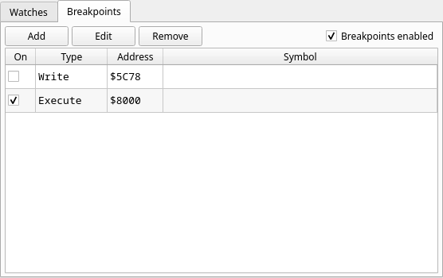

# Breakpoints

Every breakpoint in one list, sorted by address: an **On** checkbox, the type,
the address and — with a MAP file loaded — the symbol at that address.
**Add**, **Edit** and **Remove** manage them; double-clicking a row edits it.
The list and the disassembly gutter stay in sync in both directions.

## Turning breakpoints off without losing them

Deleting a breakpoint to get past it, and typing the address back in
afterwards, is the thing this panel exists to stop.

- **The On checkbox** on a row disables just that breakpoint. It stays in the
  list with its address and type; it simply does not fire. Tick it again and it
  is back exactly as it was. Every breakpoint is created **enabled**, from
  every route — the Add dialog, the Breakpoints menu, a gutter click or the
  disassembly's right-click menu.
- **Breakpoints enabled**, next to the buttons, is the **master switch**. Unticking
  it suspends *every* breakpoint and watchpoint at once, and ticking it back
  restores each one to its own On state — the individual checkboxes are left
  alone while it is off, which is what makes the round trip exact. Use it to
  let a program run through a session's worth of breakpoints and then pick up
  where you left off.

Step Into, Step Over, Step Out and **Run to Here** keep working while the
master switch is off, so a suspended machine is still one you can walk through.

In the disassembly gutter, a suspended breakpoint — individually disabled, or
any breakpoint while the master switch is off — is drawn as a **hollow red
ring** instead of a filled red dot. It stays visible, in the same place, so you
can still see where your breakpoints are; it just does not look armed.
