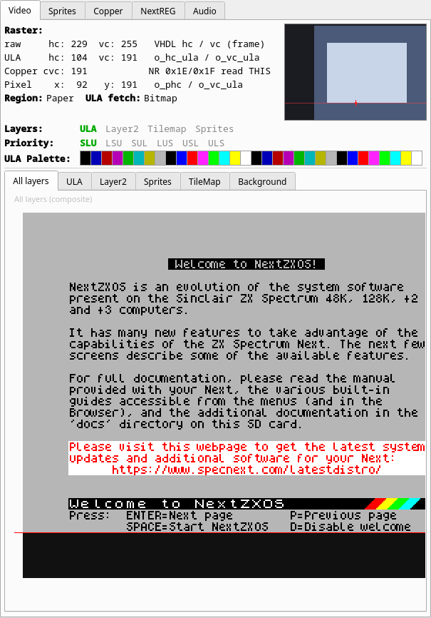

# Video

The state of the whole display pipeline, and a picture of each layer on its own.

## Where the beam is, and what the ULA is doing

The header shows the raster position while paused, and it shows it in every
coordinate system that matters, because the hardware has four of them and they
do not agree:

| Line | Counter | Origin |
|---|---|---|
| `raw` | The frame counters `hc` / `vc` | Top-left of the whole frame, blanking included |
| `ULA` | `hc_ula` / `vc_ula` | The ULA's own counters: both read 0 at the start of the display area |
| `Copper` | `cvc` | `vc_ula` plus the NR `0x64` copper offset — **this is the counter NR `0x1E`/`0x1F` report** |
| `Pixel` | `phc` / `vc_ula` | The pixel being generated: `0,0` is the top-left paper pixel |

Read the labels. `vc` 100 and `cvc` 36 can be the same instant on a 128K
machine; a program that polls NR `0x1F` sees the second number, and comparing
it against the first is a classic way to lose an afternoon. Pixel `x` goes
negative in the left border, which is deliberate: `-12` means twelve pixel
clocks before the first paper pixel of the line.

**Region** says whether the beam is in `Paper`, `Border` or `Blanking`, and the
diagram beside the numbers shows the same thing spatially — the frame with its
blanking (dark), border (mid) and 256×192 paper (light) areas, and a marker on
the current scanline at the current column.

**ULA fetch** says whether the ULA is reading display memory right now, and
what: a `Bitmap` byte, an `Attribute` byte, or `Idle`. This is the piece you
cannot get from NR `0x1E`/`0x1F`, and it is usually the answer you want: if you
have just broken on a write to an attribute byte, it tells you whether the ULA
had already read that byte for this line.

The two are independent, and that is not a bug in the display. The ULA runs
twelve pixel clocks ahead of the beam, so at the start of every display line it
is already fetching while the beam is still painting the left border, and at
the end of the line it has stopped fetching while the last twelve pixels are
still being shifted out. In Timex hi-colour and hi-res modes the attribute
slots fetch a second bitmap plane instead, and the panel says `Bitmap` for
them.

All of this is derived from the emulator's own timing model, so the numbers,
the regions and the fetch schedule follow the selected machine — 48K, 128K, +3
and Pentagon have different line lengths, display origins and blanking windows.
Switch to Pentagon and the diagram changes shape: its horizontal blanking is
narrower than the other machines' and its vertical blanking is taller.

## Layers and palette

At all times the header also shows which layers are enabled (green) or disabled
(grey), which of the six priority orders `SLU LSU SUL LUS USL ULS` is selected,
and the 32 reachable entries of the active ULA palette as swatches.

Below that, one tab per view:

| Tab | Shows |
|---|---|
| All layers | The full composite — the same picture as the emulator window |
| ULA | The ULA screen, with **Primary (bank 5)** / **Shadow (bank 7)** selectable |
| Layer2 | Layer 2, with **Active bank** / **Shadow bank** selectable |
| Sprites | The sprite layer alone |
| TileMap | The tilemap layer alone |
| Background | The NR `0x4A` fallback colour — the one thing on screen that belongs to no layer |

Two conventions to know. Rows the raster has **not yet reached** in the current
frame are drawn dark, so you can see exactly how much of the frame is done at
the point you stopped — pause mid-frame and the bottom of the picture is dark.
**Transparent** pixels are drawn as a light checkerboard, the way an image
editor shows them, which makes it obvious whether a layer is empty or merely
transparent.

The views replay the frame's per-scanline register changes rather than drawing
everything with the register values that happen to be live at the pause. That
is what makes raster effects — Layer 2 parallax splits, per-line palette
gradients, tilemap scroll splits — appear here as they do on screen. Only the
visible tab is rendered.
