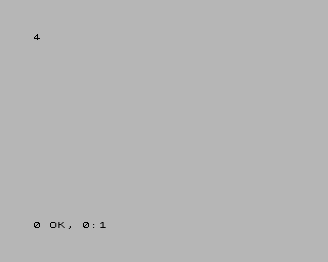

# Keys, joysticks and host keys

A script can type into the guest and move its joysticks, and you can drive a
script from the keyboard with the host keys.

## Pressing keys

| Action | Does |
|---|---|
| `press "KEY"` | KEY goes down, and stays down until `release` |
| `release "KEY"` | KEY goes up (releasing a key that is up does nothing) |
| `press "KEY" for n` | a **pulse**: KEY down for `n` frames, then up |

All three land at the **next frame edge**: a key pressed during frame *N* is
seen by the guest from frame *N*+1, and by nothing in frame *N*. The guest
never sees the keyboard change in the middle of a frame, which is what keeps a
scripted run repeatable. It also means a `press` from an `on write` rule lands
at the same instant as one from an `on frame` rule.

A pulse is the same press `--delayed-keypress-frames` makes: `press "KEY" for
5` in an `on frame N` rule is exactly `--delayed-keypress-frames N KEY`. The
guest sees it for `n`−1 frames, and a 4-frame gap with everything released
follows it, so pulses issued together queue up and type in order:

```
# type.jds — type PRINT 2+2 into 48K BASIC and keep the screen
on frame 150 do
    press "p" for 5          ; P in K mode is the PRINT keyword
    press "2" for 5
    press "sym+k" for 5      ; SYMBOL SHIFT + K is +
    press "2" for 5
    press "enter" for 5
end
on frame 250 do
    screenshot "print.png"
    screenshot "print.scr"
end
on frame 252 do exit 0 end
```

```console
$ jnext --headless --machine 48k --script type.jds
```

```
[debugger] [info] SCRIPT loaded type.jds: 3 rules
[debugger] [info] MUTATE key pulse [5,0] for 5 frames, queued by 2
[debugger] [info] MUTATE key pulse [3,1] for 5 frames, queued by 2
[debugger] [info] MUTATE key pulse [6,2]+[7,1] for 5 frames, queued by 2
[debugger] [info] MUTATE key pulse [3,1] for 5 frames, queued by 2
[debugger] [info] MUTATE key pulse [6,0] for 5 frames, queued by 2
[debugger] [info] SCREENSHOT "print.png" (layers: all) written
[debugger] [info] SCREENSHOT "print.scr" (.SCR) written
[debugger] [info] [jds F:252 C:141453368] SCRIPT EXIT 0
[platform] [info] script requested exit 0
```



Input from a script is a change to the machine, so each one is logged as a
`MUTATE` line, with the keyboard matrix positions (`[row,column]`) it pressed.

### Key names

| Name | Key |
|---|---|
| `a` … `z`, `0` … `9` | that key |
| `enter` (or `return`), `space` | ENTER, SPACE |
| `.` `,` `;` `:` | SYMBOL SHIFT + M, N, O, Z |
| `sym+X` (or `ss+X`) | SYMBOL SHIFT + key X |
| `caps+X` (or `cs+X`) | CAPS SHIFT + key X |
| `left` `down` `up` `right` | the cursor keys: CAPS SHIFT + 5, 6, 7, 8 |
| `"row,col"` | one bit of the keyboard matrix — `"0,0"` is CAPS SHIFT, `"7,1"` SYMBOL SHIFT |
| `ext:NAME` | one of the Next's extended keys (below) |

Names are case-insensitive; an unknown one is a run-time error.

The **Next's extended keys** are the 16 a Next keyboard has beyond the 40-key
matrix — the ones NextREGs 0xB0 and 0xB1 read, and the ones the PC's arrow
keys, Backspace and Esc drive: `ext:right`, `ext:left`, `ext:down`, `ext:up`,
`ext:dot`, `ext:comma`, `ext:quote`, `ext:semicolon`, `ext:extend`,
`ext:capslock`, `ext:graph`, `ext:truevideo`, `ext:invvideo`, `ext:break`,
`ext:edit`, `ext:delete`. They take `press` and `release` only: `press
"ext:up" for 2` is a run-time error. Note that `up` and `ext:up` are different
keys: `up` presses CAPS SHIFT + 7 on the matrix, as a 48K program reads it.

## Joysticks

```
joystick 1 0x10     ; port 1: fire
joystick 1 0        ; nothing pressed
```

`joystick n bits` sets connector `n` (1 or 2) to a 12-bit button state, at the
next frame edge. The bits are:

| Bit | 11 | 10 | 9 | 8 | 7 | 6 | 5 | 4 | 3 | 2 | 1 | 0 |
|---|---|---|---|---|---|---|---|---|---|---|---|---|
| Button | MODE | X | Z | Y | START | A | C (fire 2) | B (fire 1) | up | down | left | right |

The whole state is set at once: `joystick 1 0x09` holds up and right together.
How the guest reads it depends on the joystick mode (NextREG 0x05): Kempston
sees bits 0 to 5, the 3-button Mega Drive modes bits 0 to 7, and bits 8 to 11
only through the MD 6-button latch (NextREG 0xB2).

```
on frame 50 do
    press "ext:up"
    joystick 1 0x10
end
on frame 51 do
    log "NR 0xB0 (extended keys) reads ${nextreg[0xB0]:x2}"
    release "ext:up"
    joystick 1 0
end
on frame 52 do exit 0 end
```

```
[debugger] [info] MUTATE extended key 3 pressed at the next frame edge by 2
[debugger] [info] MUTATE joystick left = 0x010 by 2
[debugger] [info] [jds F:51 C:29497729] NR 0xB0 (extended keys) reads 08
[debugger] [info] MUTATE extended key 3 released at the next frame edge by 2
[debugger] [info] MUTATE joystick left = 0x000 by 2
```

(`jnext --headless --machine next`. Joystick port 1 is the "left" connector.)

## Host keys: Alt+1 to Alt+8

The host keys let you drive a script while you use the program: arm a guard
once the program has loaded, disarm it, take a capture.

- **In the emulator window and the debugger window** (Qt or SDL), **Alt+1** to
  **Alt+8** raise host keys 1 to 8, and a script's `on hostkey N` rules run.
  They work with the debugger window open or closed. Holding a key down counts
  as one press.
- **Headless**, `--script-key FRAME N` raises key *N* at the edge of frame
  *FRAME*, where `on frame FRAME` runs. Repeat the option for more keys.

Alt+1 to Alt+8 belong to the scripts: they never type their digit into the
program, even with no script loaded, so what they do never depends on what is
loaded. **Alt+9** and **Alt+0** still type 9 and 0, and Ctrl+Alt+*N* and
Shift+Alt+*N* are not host keys. A [debugger key
binding](../functions/09-changing-the-keys.md) cannot use Alt+1 to Alt+8.

While a session is being [recorded](10-recording-and-replaying.md), Alt+8 is
also the recorder's **capture** key.

```
var presses = 0

disabled watch_frames: on write 0x5C78 do
    log indent 4 "FRAMES written: ${VALUE}"
end

on hostkey 1 do
    set presses = presses + 1
    if presses == 1 then
        enable watch_frames
        log "key ${KEY}: watching FRAMES"
    else
        disable watch_frames
        log "key ${KEY}: not watching any more"
    end
end

on hostkey 2 do
    stop "stopped from host key ${KEY}"
end

on stop do
    log "the machine stopped: ${REASON} (PC ${PC:x4})"
end
```

```console
$ jnext --headless --machine 48k --script keys.jds \
      --script-key 100 1 --script-key 101 1 --script-key 102 2 \
      --delayed-automatic-exit-frames 200
```

```
[debugger] [info] SCRIPT loaded keys.jds: 4 rules
[debugger] [info] [jds F:100 C:56469512] key 1: watching FRAMES
[debugger] [info] [jds F:101 C:56470520]     FRAMES written: 19
[debugger] [info] [jds F:101 C:57028688] key 1: not watching any more
[debugger] [warning] SCRIPT STOP: stopped from host key 2 at PC=10AC FRAME=102 CYCLE=57587776
[debugger] [info] [jds F:102 C:57587776] the machine stopped: stopped from host key 2 (PC 10AC)
[platform] [info] script requested exit 3
```

In the GUI, the same script is Alt+1 to start watching, Alt+1 again to stop,
Alt+2 to pause the machine.
