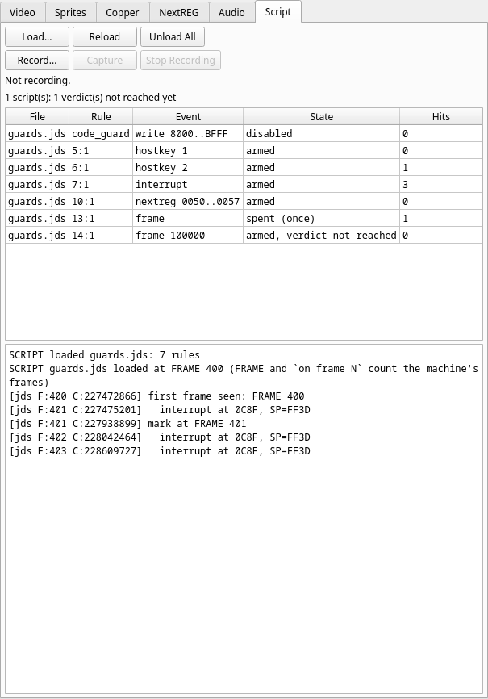

# Running scripts

## From the command line

| Option | Does |
|---|---|
| `--script FILE` | load a script. Repeat it for more: they load, and their rules run, in the order given |
| `--map FILE` | load a z88dk `.map` symbol table first, so scripts can say `@name` (the same table **Map ▸ Load MAP File** fills) |
| `--script-key FRAME N` | raise host key *N* (1 to 8) at the edge of frame *FRAME* — headless only, repeatable |
| `--record-script FILE` | [record the session](10-recording-and-replaying.md) as a replay script |

Scripts load **before the machine runs**, in every frontend: `--headless`, the
SDL build and the Qt GUI. A script that cannot be read, or that has any error,
is reported as *file*:*line*:*column*: *message* and JNEXT exits 1 without
running anything — nothing of any script runs partially, the good ones loaded
before it included. A `--map` that cannot be loaded or holds no symbols is the
same kind of error.

`--script-key` needs `--headless`, and a `--script` (or a `--record-script`)
for the key to go to:

```
--script-key requires --headless (it is a headless automation option).
[debugger] [error] --script-key needs a --script (or --record-script) to deliver the key to
```

### What a headless run prints

The script's lines go to the log, which is standard error (or the file
`--log-file` names), among JNEXT's own. A complete passing run of
[`third100.jds`](01-your-first-script.md#3-make-a-check-that-can-fail), time
stamps aside:

```
[emulator] [info] jnext 1.0.64
[emulator] [info] sdcard: using default image /home/jorgegv/.jnext/sdcard/cspect-next-1gb-fixed.img
[emulator] [info] Initializing emulator: machine_type=1[48K] cpu_speed=0[3.5 MHz] lines=312 tstates/line=224
[emulator] [info] Machine ROM loaded from SD '/MACHINES/NEXT/48.rom' (16384 bytes -> 1 banks): 48K BASIC
[emulator] [info] Machine type: 48K (ROMs from SD '/home/jorgegv/.jnext/sdcard/cspect-next-1gb-fixed.img')
[emulator] [info] DivMMC enabled, ROM loaded from SD '/MACHINES/NEXT/enNxtmmc.rom' (8192 bytes)
[emulator] [info] Multiface ROM loaded from SD '/MACHINES/NEXT/enNextMf.rom' (8192 bytes)
[emulator] [info] SD card image mounted: '/home/jorgegv/.jnext/sdcard/cspect-next-1gb-fixed.img'
[debugger] [info] ATTACH client 1 "script host" kind=4 observer
[debugger] [info] ATTACH client 2 "script engine" kind=4
[debugger] [info] SCRIPT loaded third100.jds: 2 rules [client 2]
[platform] [info] Headless mode initialized
[debugger] [info] [jds F:300 C:168290432] nothing touched the top pixel row [client 2]
[debugger] [info] [jds F:300 C:168290432] SCRIPT EXIT 0 [client 2]
[debugger] [warning] STOP under StopPolicy::ExitNonZero — requesting exit 3
[platform] [info] script requested exit 0
[platform] [info] Headless mode shutdown
[debugger] [info] DETACH client 2 (released its pause)
[debugger] [info] DETACH client 1
```

- `ATTACH client 1 "script host"` and `client 2 "script engine"`: the scripts
  run as a debugger client, like DeZog or the GUI; the `[client 2]` on each of
  their lines says which.
- `STOP under StopPolicy::ExitNonZero — requesting exit 3` is the debugger's
  line for **every** stop of a headless run, an `exit`'s included (an `exit`
  stops the machine too). It is not the verdict.
- **`script requested exit N` is the verdict**: the status the run ends with.

## In the GUI

Scripts given with `--script` are loaded into the GUI the same way. In the
debugger window (**Alt+D**):

- **Script ▸ Load Script...** loads one more script, while the machine runs or
  is paused. A script with an error is not loaded, and a message box names the
  line and the column; the scripts already loaded are untouched.
- **Script ▸ Reload Scripts** loads the same files again, in the same order: hit
  counts start over and `once` rules are armed again.
- **Script ▸ Unload Scripts** removes them all.
- **Record Script...**, **Capture Screen**, **Stop Recording**: the
  [recorder](10-recording-and-replaying.md).

A script loaded from the menu starts at once, and `FRAME` — and `on frame N` —
count the **machine's** frames, not frames since you loaded it. The log says
so: ``SCRIPT … loaded at FRAME n (FRAME and `on frame N` count the machine's
frames)``. A rule that wants "50 frames after I loaded it" captures `FRAME` in a
variable from a `once` rule.



The **Script** tab, in the debugger window's top-left group, shows what is
loaded and what it has concluded — see [the Script panel](../panels/14-script.md)
for every field:

- the buttons **Load...**, **Reload**, **Unload All**, and the recorder's
  **Record...**, **Capture**, **Stop Recording**;
- the **verdict line**: **PASS: exit 0** or **FAIL: exit *n*** (the machine
  paused; the GUI never exits from a script), **FAIL: *n* stop(s), the last:
  *reason***, **ERROR: *n* rule(s) disabled by a run-time error**, ***n*
  verdict(s) not reached yet**;
- one row per rule: its file, label (or `line:column`), the event with its
  filter as registered (symbols already turned into addresses), its state
  (`armed`, `disabled`, `spent (once)`, `error (disabled)`, plus `verdict not
  reached` for a rule holding `exit` or `compare_scr` that has not run) and its
  hit count;
- the **script log**, the last 2000 lines.

In the GUI **a script never ends JNEXT**. A `stop`, a failed `assert` or
`compare_scr`, and an `exit` pause the machine instead, and the debugger shows
where. **Run** carries on; the rules stay armed.

## Exit codes

In `--headless` and the SDL-only build, the script decides the exit status:

| Status | When |
|---|---|
| **0** | the run ended cleanly (the automatic exit with every declared verdict reached), or `exit 0` |
| ***n*** | `exit n` (0 to 255) |
| **3** | a `stop`, a failed `assert` or a failed `compare_scr`; a declared verdict never reached (the watchdog, below) |
| **1** | a script that does not load; a run-time error; a `screenshot` or `save_snapshot` that was not written; `exit` outside 0 to 255 |

A status of 2 never comes from a script. **The first status a run reaches is
kept**, and a success never hides an earlier failure. An `exit` inside an
[`on stop`](03-events.md#stop) rule therefore never changes it: the pause that
ran the rule has already decided the status.

### A failure wins over a success at the same moment

When a `stop`, a failed `assert` or `compare_scr`, or a run-time error happens
at the **same event** as an `exit 0` — in the same rule or in another, before
the `exit` or after it — the run exits 3 (or 1), and the log says `SCRIPT EXIT 0
not taken`. A non-zero `exit n` is kept as it is. So a check followed by `exit
0` cannot pass by accident:

```
on execute @main_loop once when mem16[@magic] == 0xD5D5 and mem[@frames] >= 64 do
    assert mem[@trap_target] == 0 "the trapped write never happened"
    assert mem[@patch_copy] == 0x5A "the program copied the patched byte"
    log "PASS mutation: trap skipped, patch copied"
    exit 0
end
```

against a program that breaks the first check:

```
[debugger] [warning] [jds F:564 C:319939520] ASSERT FAILED: the trapped write never happened
[debugger] [warning] SCRIPT STOP: the trapped write never happened at PC=8139 FRAME=564 CYCLE=319939520
[debugger] [info] [jds F:564 C:319939520] PASS mutation: trap skipped, patch copied
[debugger] [info] [jds F:564 C:319939520] SCRIPT EXIT 0
[debugger] [warning] SCRIPT EXIT 0 not taken: "the trapped write never happened" failed at the same boundary (exit 3)
[platform] [info] script requested exit 3
```

The `PASS` line is still printed — the rest of a rule runs after a `stop` — but
the status is 3. Put the `log "PASS…"` in an `if` if a stray PASS in the log
would mislead you.

An `exit` issued while a `compare_scr` is still waiting for its frame edge
waits too, and is taken at that edge, after the comparison:

```
on write 0x5C78 once do
    compare_scr "ff.scr" "m"
    exit 0
end
```

(`ff.scr` is 6912 bytes of 0xFF, which the screen does not match.)

```
[debugger] [info] [jds F:19 C:10717720] SCRIPT EXIT 0 held until the pending compare_scr is made
[debugger] [warning] [jds F:19 C:11182104] compare_scr ff.scr: first difference at offset 0 (file FF, screen 00)
[debugger] [warning] [jds F:19 C:11182104] ASSERT FAILED: m
[debugger] [info] [jds F:19 C:11182104] SCRIPT EXIT 0
[debugger] [warning] SCRIPT EXIT 0 not taken: "m" failed at the same boundary (exit 3)
[platform] [info] script requested exit 3
```

### The watchdog

A script that **declares a verdict** — a rule holding an `exit` or a
`compare_scr` — has not passed if that rule never ran. When
`--delayed-automatic-exit` or `--delayed-automatic-exit-frames` ends the run
before a declared verdict was reached (or before every `--script-key` was
delivered), the run exits **3**:

```
on frame 5000 do
    exit 0
end
```

```console
$ jnext --headless --machine 48k --script watchdog.jds --delayed-automatic-exit-frames 100
```

```
[debugger] [info] SCRIPT loaded watchdog.jds: 1 rules
[platform] [error] SCRIPT: 1 deferred actions never ran — exiting 3
```

A rule with no verdict — a guard that `stop`s — never counts: a guard that
never trips is a pass. So a pure guard script passes when the automatic exit
ends the run, and a test script that ends with `exit 0` fails if it never got
there.

**Always give a headless script run a bound.** Without
`--delayed-automatic-exit-frames`, a run whose program hangs before the
script's `exit` would run forever. With it, the hang is a 3.

## In a build or CI pipeline

The exit status is the test result, so a script needs no wrapper. From the
source tree, the code-area guard against the demo's buggy build:

```sh
jnext --headless --machine next --load test/00regression/nex/dsl_demo_buggy.nex \
      --map test/00regression/nex/dsl_demo.map --script test/scripts/dsl/range_watch.jds \
      --delayed-automatic-exit-frames 900 --log-file run.log \
      || echo "dsl_demo_buggy.nex: memory guard tripped (status $?)"
```

```
dsl_demo_buggy.nex: memory guard tripped (status 3)
```

and `run.log` holds the line to start from:

```
[debugger] [warning] SCRIPT STOP: write into main code area at PC=8172 FRAME=501 CYCLE=284202151 [client 2]
```

- **Pin everything that varies**: `--machine`, `--rtc` if the program reads the
  clock, and a private copy of the SD-card image (`--sdcard`, or
  `--sdcard-readonly`) — see [Determinism](../../07-automation-and-ci/02-determinism.md).
  A headless run is then the same run every time: same frames, same cycles,
  same log.
- **Forbid changes** in a pure observation test: a script that changes nothing
  logs no `MUTATE` line (the run above logs none), so `! grep -q MUTATE run.log`
  proves it.
- **Keep the log** (`--log-file run.log`): the `SCRIPT STOP` line names the
  instruction, the frame and the cycle, which is everything you need to look at
  the failure in the GUI.

[Automation and CI](../../07-automation-and-ci/index.md) covers headless mode,
screenshots and exit codes in general.
